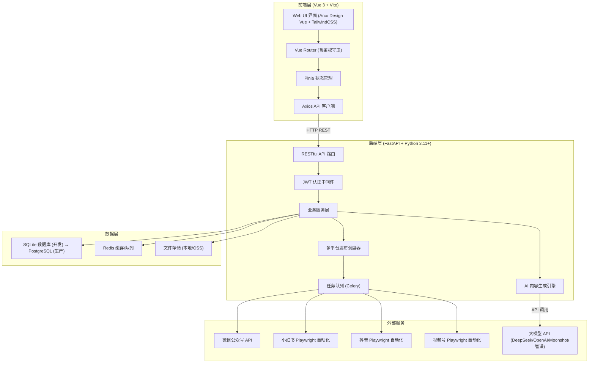
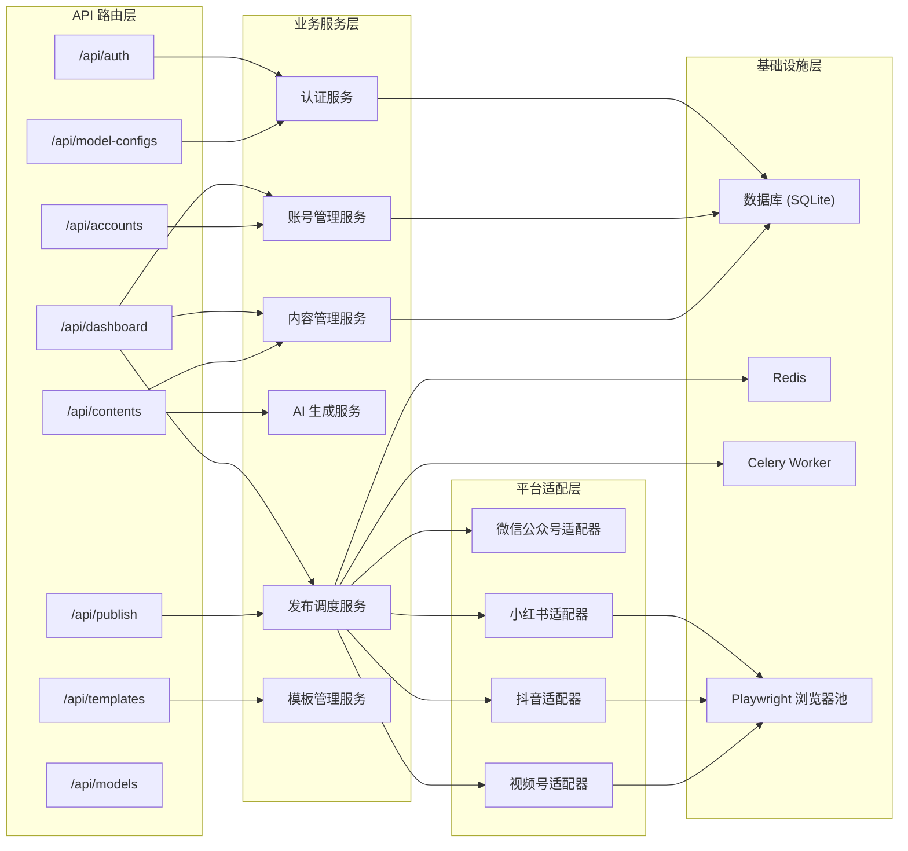

# 架构设计与技术选型

## 1. 系统架构



## 2. 后端服务架构



## 3. 技术栈总览

| 层级 | 技术选型 |
|------|----------|
| **前端框架** | Vue 3 + TypeScript + Vite 6 |
| **UI 组件库** | Arco Design Vue + 自定义组件 |
| **状态管理** | Pinia |
| **HTTP 客户端** | Axios（JWT 拦截器） |
| **后端框架** | Python 3.11+ / FastAPI |
| **ORM** | SQLAlchemy 2.0（异步模式）+ Alembic |
| **数据库** | SQLite（开发）→ PostgreSQL（生产） |
| **数据库 ID 规范** | 所有表主键使用 UUID VARCHAR(36)，超级管理员用户 ID 固定为 `"1"` |
| **任务队列** | Celery + Redis |
| **缓存** | Redis |
| **浏览器自动化** | Playwright |
| **AI 接入** | OpenAI 兼容 API（DeepSeek / OpenAI / Moonshot / 智谱 AI / 自定义） |
| **容器化** | Docker + Docker Compose |

## 4. 部署架构

```yaml
# docker-compose.yml 服务拓扑
services:
  frontend:
    build: docker/frontend/Dockerfile
    ports: ["5173:5173"]
    volumes: ["./frontend:/app"]
    depends_on: [backend]

  backend:
    build: docker/backend/Dockerfile
    ports: ["8000:8000"]
    volumes: ["./backend:/app"]
    environment: [DATABASE_URL, REDIS_URL, ...]
    depends_on: [redis]

  redis:
    image: redis:7-alpine
    ports: ["6379:6379"]

  celery-worker:
    build: docker/backend/Dockerfile
    command: celery -A app.celery_app worker
    environment: [DATABASE_URL, REDIS_URL, ...]
    depends_on: [redis, backend]
```
