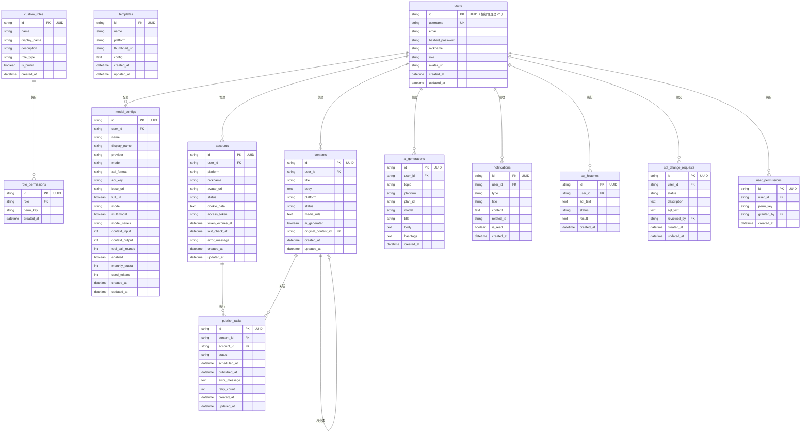

# 数据模型与数据库设计

## ER 图



## DDL

```sql
-- 数据库 ID 规范：所有主键使用 UUID VARCHAR(36)，唯一例外是超级管理员用户 ID 固定为 '1'

CREATE TABLE users (
    id VARCHAR(36) PRIMARY KEY,
    username VARCHAR(100) UNIQUE NOT NULL,
    email VARCHAR(255) UNIQUE NOT NULL,
    hashed_password VARCHAR(255) NOT NULL,
    nickname VARCHAR(100) NOT NULL,
    role VARCHAR(20) DEFAULT 'operator',
    avatar_url VARCHAR(500),
    created_at TIMESTAMP DEFAULT CURRENT_TIMESTAMP,
    updated_at TIMESTAMP DEFAULT CURRENT_TIMESTAMP
);

CREATE TABLE model_configs (
    id VARCHAR(36) PRIMARY KEY,
    user_id VARCHAR(36) NOT NULL REFERENCES users(id),
    name VARCHAR(200) NOT NULL,
    display_name VARCHAR(200),
    provider VARCHAR(50) NOT NULL DEFAULT 'openai',
    mode VARCHAR(20) DEFAULT 'provider',
    api_format VARCHAR(50) DEFAULT 'openai_chat',
    api_key VARCHAR(500) NOT NULL DEFAULT '',
    base_url VARCHAR(500) NOT NULL DEFAULT '',
    full_url BOOLEAN DEFAULT FALSE,
    model VARCHAR(200) NOT NULL DEFAULT '',
    multimodal BOOLEAN DEFAULT FALSE,
    model_series VARCHAR(100) DEFAULT 'default',
    context_input INTEGER DEFAULT 128000,
    context_output INTEGER DEFAULT 4096,
    tool_call_rounds INTEGER DEFAULT 200,
    enabled BOOLEAN DEFAULT FALSE,
    monthly_quota INTEGER DEFAULT 1000000,
    used_tokens INTEGER DEFAULT 0,
    created_at TIMESTAMP DEFAULT CURRENT_TIMESTAMP,
    updated_at TIMESTAMP DEFAULT CURRENT_TIMESTAMP
);

CREATE TABLE accounts (
    id VARCHAR(36) PRIMARY KEY,
    user_id VARCHAR(36) NOT NULL REFERENCES users(id),
    platform VARCHAR(50) NOT NULL,
    nickname VARCHAR(200) NOT NULL,
    avatar_url VARCHAR(500),
    status VARCHAR(20) DEFAULT 'active',
    cookie_data TEXT,
    access_token TEXT,
    token_expires_at TIMESTAMP,
    last_check_at TIMESTAMP,
    error_message TEXT,
    created_at TIMESTAMP DEFAULT CURRENT_TIMESTAMP,
    updated_at TIMESTAMP DEFAULT CURRENT_TIMESTAMP
);

CREATE TABLE contents (
    id VARCHAR(36) PRIMARY KEY,
    user_id VARCHAR(36) NOT NULL REFERENCES users(id),
    title VARCHAR(500) NOT NULL,
    body TEXT NOT NULL,
    platform VARCHAR(50) NOT NULL,
    status VARCHAR(20) DEFAULT 'draft',
    media_urls TEXT DEFAULT '[]',
    ai_generated BOOLEAN DEFAULT FALSE,
    original_content_id VARCHAR(36) REFERENCES contents(id),
    created_at TIMESTAMP DEFAULT CURRENT_TIMESTAMP,
    updated_at TIMESTAMP DEFAULT CURRENT_TIMESTAMP
);

CREATE TABLE publish_tasks (
    id VARCHAR(36) PRIMARY KEY,
    content_id VARCHAR(36) NOT NULL REFERENCES contents(id),
    account_id VARCHAR(36) NOT NULL REFERENCES accounts(id),
    status VARCHAR(20) DEFAULT 'pending',
    scheduled_at TIMESTAMP,
    published_at TIMESTAMP,
    error_message TEXT,
    retry_count INTEGER DEFAULT 0,
    created_at TIMESTAMP DEFAULT CURRENT_TIMESTAMP,
    updated_at TIMESTAMP DEFAULT CURRENT_TIMESTAMP
);

CREATE TABLE templates (
    id VARCHAR(36) PRIMARY KEY,
    name VARCHAR(200) NOT NULL,
    platform VARCHAR(50) NOT NULL,
    thumbnail_url VARCHAR(500),
    config TEXT NOT NULL DEFAULT '{}',
    created_at TIMESTAMP DEFAULT CURRENT_TIMESTAMP,
    updated_at TIMESTAMP DEFAULT CURRENT_TIMESTAMP
);

CREATE TABLE custom_roles (
    id VARCHAR(36) PRIMARY KEY,
    name VARCHAR(50) UNIQUE NOT NULL,
    display_name VARCHAR(100) NOT NULL,
    description TEXT,
    role_type VARCHAR(20) DEFAULT 'other',
    is_builtin BOOLEAN DEFAULT FALSE,
    created_at TIMESTAMP DEFAULT CURRENT_TIMESTAMP
);

CREATE TABLE role_permissions (
    id VARCHAR(36) PRIMARY KEY,
    role VARCHAR(50) NOT NULL REFERENCES custom_roles(name),
    perm_key VARCHAR(100) NOT NULL,
    created_at TIMESTAMP DEFAULT CURRENT_TIMESTAMP,
    UNIQUE(role, perm_key)
);

CREATE TABLE user_permissions (
    id VARCHAR(36) PRIMARY KEY,
    user_id VARCHAR(36) NOT NULL REFERENCES users(id),
    perm_key VARCHAR(100) NOT NULL,
    granted_by VARCHAR(36) REFERENCES users(id),
    created_at TIMESTAMP DEFAULT CURRENT_TIMESTAMP,
    UNIQUE(user_id, perm_key)
);

CREATE TABLE notifications (
    id VARCHAR(36) PRIMARY KEY,
    user_id VARCHAR(36) NOT NULL REFERENCES users(id),
    type VARCHAR(50) NOT NULL,
    title VARCHAR(200) NOT NULL,
    content TEXT,
    related_id VARCHAR(36),
    is_read BOOLEAN DEFAULT FALSE,
    created_at TIMESTAMP DEFAULT CURRENT_TIMESTAMP
);

CREATE TABLE ai_generations (
    id VARCHAR(36) PRIMARY KEY,
    user_id VARCHAR(36) NOT NULL REFERENCES users(id),
    topic VARCHAR(500) NOT NULL,
    platform VARCHAR(50) NOT NULL,
    plan_id VARCHAR(36),
    model VARCHAR(200),
    title VARCHAR(500) NOT NULL,
    body TEXT NOT NULL,
    hashtags TEXT DEFAULT '[]',
    created_at TIMESTAMP DEFAULT CURRENT_TIMESTAMP
);

CREATE TABLE sql_histories (
    id VARCHAR(36) PRIMARY KEY,
    user_id VARCHAR(36) NOT NULL REFERENCES users(id),
    sql_text TEXT NOT NULL,
    status VARCHAR(20) DEFAULT 'success',
    result TEXT,
    created_at TIMESTAMP DEFAULT CURRENT_TIMESTAMP
);

CREATE TABLE sql_change_requests (
    id VARCHAR(36) PRIMARY KEY,
    user_id VARCHAR(36) NOT NULL REFERENCES users(id),
    status VARCHAR(20) DEFAULT 'pending',
    description TEXT,
    sql_text TEXT,
    reviewed_by VARCHAR(36) REFERENCES users(id),
    created_at TIMESTAMP DEFAULT CURRENT_TIMESTAMP,
    updated_at TIMESTAMP DEFAULT CURRENT_TIMESTAMP
);

CREATE INDEX idx_accounts_user_id ON accounts(user_id);
CREATE INDEX idx_accounts_platform ON accounts(platform);
CREATE INDEX idx_contents_user_id ON contents(user_id);
CREATE INDEX idx_contents_platform ON contents(platform);
CREATE INDEX idx_contents_status ON contents(status);
CREATE INDEX idx_publish_tasks_status ON publish_tasks(status);
CREATE INDEX idx_publish_tasks_scheduled_at ON publish_tasks(scheduled_at);
CREATE INDEX idx_model_configs_user_id ON model_configs(user_id);
CREATE INDEX idx_model_configs_enabled ON model_configs(enabled);
CREATE INDEX idx_notifications_user_id ON notifications(user_id);
CREATE INDEX idx_notifications_is_read ON notifications(is_read);
CREATE INDEX idx_user_permissions_user_id ON user_permissions(user_id);
CREATE INDEX idx_sql_change_requests_status ON sql_change_requests(status);
```
