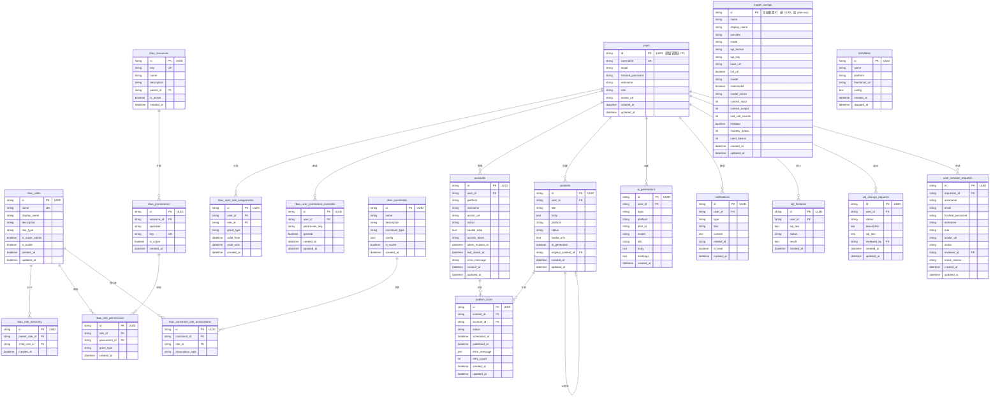

# 数据模型与数据库设计

## 1. ER 图


```mermaid
erDiagram
    users {
        string id PK "UUID（超级管理员='1'）"
        string username UK
        string email
        string hashed_password
        string nickname
        string role
        string avatar_url
        datetime created_at
        datetime updated_at
    }

    rbac_roles {
        string id PK "UUID"
        string name UK
        string display_name
        string description
        string role_type
        boolean is_super_admin
        boolean is_builtin
        datetime created_at
        datetime updated_at
    }

    rbac_resources {
        string id PK "UUID"
        string key UK
        string name
        string description
        string parent_id FK
        boolean is_active
        datetime created_at
    }

    rbac_permissions {
        string id PK "UUID"
        string resource_id FK
        string operation
        string key UK
        boolean is_active
        datetime created_at
    }

    rbac_role_hierarchy {
        string id PK "UUID"
        string parent_role_id FK
        string child_role_id FK
        datetime created_at
    }

    rbac_role_permissions {
        string id PK "UUID"
        string role_id FK
        string permission_id FK
        string grant_type
        datetime created_at
    }

    rbac_user_role_assignments {
        string id PK "UUID"
        string user_id FK
        string role_id FK
        string grant_type
        datetime valid_from
        datetime valid_until
        datetime created_at
    }

    rbac_user_permission_overrides {
        string id PK "UUID"
        string user_id FK
        string permission_key
        boolean granted
        datetime created_at
        datetime updated_at
    }

    rbac_constraints {
        string id PK "UUID"
        string name
        string description
        string constraint_type
        json config
        boolean is_active
        datetime created_at
    }

    rbac_constraint_role_associations {
        string id PK "UUID"
        string constraint_id FK
        string role_id FK
        string association_type
    }

    model_configs {
        string id PK "全局配置 ID（非 UUID，如 plan-xxx）"
        string name
        string display_name
        string provider
        string mode
        string api_format
        string api_key
        string base_url
        boolean full_url
        string model
        boolean multimodal
        string model_series
        int context_input
        int context_output
        int tool_call_rounds
        boolean enabled
        int monthly_quota
        int used_tokens
        datetime created_at
        datetime updated_at
    }

    accounts {
        string id PK "UUID"
        string user_id FK
        string platform
        string nickname
        string avatar_url
        string status
        text cookie_data
        string access_token
        datetime token_expires_at
        datetime last_check_at
        string error_message
        datetime created_at
        datetime updated_at
    }

    contents {
        string id PK "UUID"
        string user_id FK
        string title
        text body
        string platform
        string status
        text media_urls
        boolean ai_generated
        string original_content_id FK
        datetime created_at
        datetime updated_at
    }

    publish_tasks {
        string id PK "UUID"
        string content_id FK
        string account_id FK
        string status
        datetime scheduled_at
        datetime published_at
        text error_message
        int retry_count
        datetime created_at
        datetime updated_at
    }

    templates {
        string id PK "UUID"
        string name
        string platform
        string thumbnail_url
        text config
        datetime created_at
        datetime updated_at
    }

    notifications {
        string id PK "UUID"
        string user_id FK
        string type
        string title
        text content
        string related_id
        boolean is_read
        datetime created_at
    }

    ai_generations {
        string id PK "UUID"
        string user_id FK
        string topic
        string platform
        string plan_id
        string model
        string title
        text body
        text hashtags
        datetime created_at
    }

    sql_histories {
        string id PK "UUID"
        string user_id FK
        text sql_text
        string status
        text result
        datetime created_at
    }

    sql_change_requests {
        string id PK "UUID"
        string user_id FK
        string status
        text description
        text sql_text
        string reviewed_by FK
        datetime created_at
        datetime updated_at
    }

    user_creation_requests {
        string id PK "UUID"
        string requester_id FK
        string username
        string email
        string hashed_password
        string nickname
        string role
        string avatar_url
        string status
        string reviewer_id FK
        string reject_reason
        datetime created_at
        datetime updated_at
    }

    users ||--o{ rbac_user_role_assignments : "分配"
    users ||--o{ rbac_user_permission_overrides : "覆盖"
    rbac_roles ||--o{ rbac_role_hierarchy : "父/子"
    rbac_roles ||--o{ rbac_role_permissions : "拥有"
    rbac_resources ||--o{ rbac_permissions : "关联"
    rbac_permissions ||--o{ rbac_role_permissions : "授权"
    rbac_constraints ||--o{ rbac_constraint_role_associations : "关联"
    rbac_roles ||--o{ rbac_constraint_role_associations : "受约束"
    users ||--o{ accounts : "管理"
    users ||--o{ contents : "创建"
    users ||--o{ ai_generations : "生成"
    users ||--o{ notifications : "接收"
    users ||--o{ sql_histories : "执行"
    users ||--o{ sql_change_requests : "提交"
    users ||--o{ user_creation_requests : "申请"
    accounts ||--o{ publish_tasks : "执行"
    contents ||--o{ publish_tasks : "关联"
    contents ||--o| contents : "AI变体"
```

## 2. 表定义说明

### 2.1 RBAC3 权限中台表

#### rbac_roles（角色表）

| 字段           | 类型         | 约束                      | 说明                                      |
| -------------- | ------------ | ------------------------- | ----------------------------------------- |
| id             | VARCHAR(36)  | PK                        | UUID 主键                                 |
| name           | VARCHAR(50)  | UK, NOT NULL              | 角色标识名（如 admin、manager、operator） |
| display_name   | VARCHAR(100) | NOT NULL                  | 中文展示名                                |
| description    | TEXT         |                           | 角色描述                                  |
| role_type      | VARCHAR(20)  | DEFAULT 'other'           | 角色类型：admin / other                   |
| is_super_admin | BOOLEAN      | DEFAULT FALSE             | 是否为超级管理员                          |
| is_builtin     | BOOLEAN      | DEFAULT FALSE             | 是否为内置角色（不可删除）                |
| created_at     | TIMESTAMP    | DEFAULT CURRENT_TIMESTAMP | 创建时间                                  |
| updated_at     | TIMESTAMP    | DEFAULT CURRENT_TIMESTAMP | 更新时间                                  |

#### rbac_resources（资源表）

| 字段        | 类型         | 约束                      | 说明                                                |
| ----------- | ------------ | ------------------------- | --------------------------------------------------- |
| id          | VARCHAR(36)  | PK                        | UUID 主键                                           |
| key         | VARCHAR(100) | UK, NOT NULL              | 权限 key（如 dashboard:read、content:create:write） |
| name        | VARCHAR(100) | NOT NULL                  | 中文显示名称                                        |
| description | TEXT         |                           | 权限描述说明                                        |
| parent_id   | VARCHAR(36)  | FK → rbac_resources.id    | 父资源 ID，支持资源树                               |
| is_active   | BOOLEAN      | DEFAULT TRUE              | 是否启用                                            |
| created_at  | TIMESTAMP    | DEFAULT CURRENT_TIMESTAMP | 创建时间                                            |

**资源类型推断**：根据 key 格式自动推断，无需存储 type 字段。

- `{name}:read` 或 `{name}:write`（2 段式）→ `page`（页面权限）
- `{name}:{operation}:{read|write}`（3 段式）→ `action`（操作权限）

#### rbac_permissions（权限表）

| 字段        | 类型         | 约束                             | 说明                                                                           |
| ----------- | ------------ | -------------------------------- | ------------------------------------------------------------------------------ |
| id          | VARCHAR(36)  | PK                               | UUID 主键                                                                      |
| resource_id | VARCHAR(36)  | FK → rbac_resources.id, NOT NULL | 关联资源                                                                       |
| operation   | VARCHAR(50)  | NOT NULL                         | 操作类型：read / write / create / update / delete / approve / reject / execute |
| key         | VARCHAR(150) | UK, NOT NULL                     | 权限 key（如 content:create:write）                                            |
| is_active   | BOOLEAN      | DEFAULT TRUE                     | 是否启用                                                                       |
| created_at  | TIMESTAMP    | DEFAULT CURRENT_TIMESTAMP        | 创建时间                                                                       |

#### rbac_role_hierarchy（角色继承表）

| 字段           | 类型        | 约束                         | 说明      |
| -------------- | ----------- | ---------------------------- | --------- |
| id             | VARCHAR(36) | PK                           | UUID 主键 |
| parent_role_id | VARCHAR(36) | FK → rbac_roles.id, NOT NULL | 父角色    |
| child_role_id  | VARCHAR(36) | FK → rbac_roles.id, NOT NULL | 子角色    |
| created_at     | TIMESTAMP   | DEFAULT CURRENT_TIMESTAMP    | 创建时间  |

**约束**：禁止成环（parent 不能是 child 的后代，也不能等于 child）。

#### rbac_role_permissions（角色权限表）

| 字段          | 类型        | 约束                               | 说明                                        |
| ------------- | ----------- | ---------------------------------- | ------------------------------------------- |
| id            | VARCHAR(36) | PK                                 | UUID 主键                                   |
| role_id       | VARCHAR(36) | FK → rbac_roles.id, NOT NULL       | 角色 ID                                     |
| permission_id | VARCHAR(36) | FK → rbac_permissions.id, NOT NULL | 权限 ID                                     |
| grant_type    | VARCHAR(20) | DEFAULT 'direct'                   | 授权来源：direct（直接）/ inherited（继承） |
| created_at    | TIMESTAMP   | DEFAULT CURRENT_TIMESTAMP          | 创建时间                                    |

#### rbac_user_role_assignments（用户角色分配表）

| 字段        | 类型        | 约束                         | 说明                         |
| ----------- | ----------- | ---------------------------- | ---------------------------- |
| id          | VARCHAR(36) | PK                           | UUID 主键                    |
| user_id     | VARCHAR(36) | FK → users.id, NOT NULL      | 用户 ID                      |
| role_id     | VARCHAR(36) | FK → rbac_roles.id, NOT NULL | 角色 ID                      |
| grant_type  | VARCHAR(20) | DEFAULT 'direct'             | 分配类型：direct / inherited |
| valid_from  | TIMESTAMP   |                              | 生效时间                     |
| valid_until | TIMESTAMP   |                              | 失效时间                     |
| created_at  | TIMESTAMP   | DEFAULT CURRENT_TIMESTAMP    | 创建时间                     |

#### rbac_user_permission_overrides（用户权限覆盖表）

| 字段           | 类型         | 约束                                      | 说明                              |
| -------------- | ------------ | ----------------------------------------- | --------------------------------- |
| id             | VARCHAR(36)  | PK                                        | UUID 主键                         |
| user_id        | VARCHAR(36)  | FK → users.id ON DELETE CASCADE, NOT NULL | 用户 ID                           |
| permission_key | VARCHAR(150) | NOT NULL                                  | 权限 key                          |
| granted        | BOOLEAN      | NOT NULL                                  | 是否授予（true=授予，false=拒绝） |
| created_at     | TIMESTAMP    | DEFAULT CURRENT_TIMESTAMP                 | 创建时间                          |
| updated_at     | TIMESTAMP    | DEFAULT CURRENT_TIMESTAMP                 | 更新时间                          |

**唯一约束**：`(user_id, permission_key)`

#### rbac_constraints（约束表）

| 字段            | 类型         | 约束                      | 说明                                                    |
| --------------- | ------------ | ------------------------- | ------------------------------------------------------- |
| id              | VARCHAR(36)  | PK                        | UUID 主键                                               |
| name            | VARCHAR(100) | NOT NULL                  | 约束名称                                                |
| description     | TEXT         |                           | 约束描述                                                |
| constraint_type | VARCHAR(50)  | NOT NULL                  | 约束类型：mutual_exclusive / prerequisite / cardinality |
| config          | JSON         | DEFAULT '{}'              | 类型相关配置                                            |
| is_active       | BOOLEAN      | DEFAULT TRUE              | 是否启用                                                |
| created_at      | TIMESTAMP    | DEFAULT CURRENT_TIMESTAMP | 创建时间                                                |

**config 示例**：

- `mutual_exclusive`：`{"scope": "static"}`（同一用户不能同时拥有两个互斥角色）
- `prerequisite`：`{"require_all": true}`（拥有目标角色前必须先拥有先决角色）
- `cardinality`：`{"max_users": 3}`（某角色最多分配用户数）

#### rbac_constraint_role_associations（约束角色关联表）

| 字段             | 类型        | 约束                               | 说明                                      |
| ---------------- | ----------- | ---------------------------------- | ----------------------------------------- |
| id               | VARCHAR(36) | PK                                 | UUID 主键                                 |
| constraint_id    | VARCHAR(36) | FK → rbac_constraints.id, NOT NULL | 约束 ID                                   |
| role_id          | VARCHAR(36) | FK → rbac_roles.id, NOT NULL       | 角色 ID                                   |
| association_type | VARCHAR(50) | NOT NULL                           | 关联类型：subject / target / prerequisite |

### 2.2 业务表

#### users（用户表）

| 字段            | 类型         | 约束                         | 说明                              |
| --------------- | ------------ | ---------------------------- | --------------------------------- |
| id              | VARCHAR(36)  | PK                           | UUID 主键，超级管理员固定为 `"1"` |
| username        | VARCHAR(100) | UK, NOT NULL                 | 登录用户名                        |
| email           | VARCHAR(255) | UK                           | 邮箱                              |
| hashed_password | VARCHAR(255) | NOT NULL                     | bcrypt 哈希密码                   |
| nickname        | VARCHAR(100) | NOT NULL                     | 显示昵称                          |
| role            | VARCHAR(50)  | DEFAULT 'operator', NOT NULL | 角色名称（保留作标签/迁移用）     |
| avatar_url      | VARCHAR(500) |                              | 头像链接                          |
| created_at      | TIMESTAMP    | DEFAULT CURRENT_TIMESTAMP    | 创建时间                          |
| updated_at      | TIMESTAMP    | DEFAULT CURRENT_TIMESTAMP    | 更新时间                          |

#### accounts（平台账号表）

| 字段             | 类型         | 约束                      | 说明           |
| ---------------- | ------------ | ------------------------- | -------------- |
| id               | VARCHAR(36)  | PK                        | UUID 主键      |
| user_id          | VARCHAR(36)  | FK → users.id, NOT NULL   | 所属用户       |
| platform         | VARCHAR(50)  | NOT NULL                  | 平台类型       |
| nickname         | VARCHAR(200) | NOT NULL                  | 平台昵称       |
| avatar_url       | VARCHAR(500) |                           | 头像           |
| status           | VARCHAR(20)  | DEFAULT 'active'          | 状态           |
| cookie_data      | TEXT         |                           | Cookie 数据    |
| access_token     | TEXT         |                           | Access Token   |
| token_expires_at | TIMESTAMP    |                           | Token 过期时间 |
| last_check_at    | TIMESTAMP    |                           | 最后检查时间   |
| error_message    | TEXT         |                           | 错误信息       |
| created_at       | TIMESTAMP    | DEFAULT CURRENT_TIMESTAMP | 创建时间       |
| updated_at       | TIMESTAMP    | DEFAULT CURRENT_TIMESTAMP | 更新时间       |

#### contents（内容表）

| 字段                | 类型         | 约束                      | 说明                   |
| ------------------- | ------------ | ------------------------- | ---------------------- |
| id                  | VARCHAR(36)  | PK                        | UUID 主键              |
| user_id             | VARCHAR(36)  | FK → users.id, NOT NULL   | 创建者                 |
| title               | VARCHAR(500) | NOT NULL                  | 标题                   |
| body                | TEXT         | NOT NULL                  | 正文                   |
| platform            | VARCHAR(50)  | NOT NULL                  | 目标平台               |
| status              | VARCHAR(20)  | DEFAULT 'draft'           | 状态                   |
| media_urls          | TEXT         | DEFAULT '[]'              | 媒体 URL 列表（JSON）  |
| ai_generated        | BOOLEAN      | DEFAULT FALSE             | 是否 AI 生成           |
| original_content_id | VARCHAR(36)  | FK → contents.id          | 原始内容 ID（AI 变体） |
| created_at          | TIMESTAMP    | DEFAULT CURRENT_TIMESTAMP | 创建时间               |
| updated_at          | TIMESTAMP    | DEFAULT CURRENT_TIMESTAMP | 更新时间               |

#### publish_tasks（发布任务表）

| 字段          | 类型        | 约束                       | 说明         |
| ------------- | ----------- | -------------------------- | ------------ |
| id            | VARCHAR(36) | PK                         | UUID 主键    |
| content_id    | VARCHAR(36) | FK → contents.id, NOT NULL | 内容 ID      |
| account_id    | VARCHAR(36) | FK → accounts.id, NOT NULL | 账号 ID      |
| status        | VARCHAR(20) | DEFAULT 'pending'          | 任务状态     |
| scheduled_at  | TIMESTAMP   |                            | 计划发布时间 |
| published_at  | TIMESTAMP   |                            | 实际发布时间 |
| error_message | TEXT        |                            | 错误信息     |
| retry_count   | INTEGER     | DEFAULT 0                  | 重试次数     |
| created_at    | TIMESTAMP   | DEFAULT CURRENT_TIMESTAMP  | 创建时间     |
| updated_at    | TIMESTAMP   | DEFAULT CURRENT_TIMESTAMP  | 更新时间     |

#### model_configs（模型配置表）

全局模型配置表，不与特定用户绑定（无 user_id 字段）。

| 字段             | 类型          | 约束                                | 说明                              |
| ---------------- | ------------- | ----------------------------------- | --------------------------------- |
| id               | VARCHAR(64)   | PK                                  | 配置 ID（非 UUID，如 `plan-xxx`） |
| name             | VARCHAR(100)  | NOT NULL                            | 配置名称                          |
| display_name     | VARCHAR(100)  | NOT NULL                            | 展示名称                          |
| provider         | VARCHAR(20)   | NOT NULL                            | 提供商                            |
| mode             | VARCHAR(20)   | NOT NULL                            | 模式                              |
| api_format       | VARCHAR(50)   | NOT NULL, DEFAULT 'openai_chat'     | API 格式                          |
| api_key          | VARCHAR(500)  |                                     | API 密钥                          |
| base_url         | VARCHAR(500)  |                                     | 基础 URL                          |
| full_url         | BOOLEAN       | NOT NULL, DEFAULT FALSE             | 是否使用完整 URL                  |
| model            | VARCHAR(2000) | NOT NULL                            | 模型名称                          |
| multimodal       | BOOLEAN       | NOT NULL, DEFAULT FALSE             | 是否多模态                        |
| model_series     | VARCHAR(50)   | NOT NULL, DEFAULT 'default'         | 模型系列                          |
| context_input    | INTEGER       | NOT NULL, DEFAULT 128000            | 输入上下文长度                    |
| context_output   | INTEGER       | NOT NULL, DEFAULT 4096              | 输出上下文长度                    |
| tool_call_rounds | INTEGER       | NOT NULL, DEFAULT 200               | 工具调用轮数                      |
| enabled          | BOOLEAN       | NOT NULL, DEFAULT FALSE             | 是否启用                          |
| monthly_quota    | INTEGER       | NOT NULL, DEFAULT 1000000           | 月度配额                          |
| used_tokens      | INTEGER       | NOT NULL, DEFAULT 0                 | 已用 Token 数                     |
| created_at       | TIMESTAMP     | NOT NULL, DEFAULT CURRENT_TIMESTAMP | 创建时间                          |
| updated_at       | TIMESTAMP     | NOT NULL, DEFAULT CURRENT_TIMESTAMP | 更新时间                          |

#### user_creation_requests（用户创建审核表）

| 字段            | 类型         | 约束                      | 说明         |
| --------------- | ------------ | ------------------------- | ------------ |
| id              | VARCHAR(36)  | PK                        | UUID 主键    |
| requester_id    | VARCHAR(36)  | FK → users.id             | 申请人 ID    |
| username        | VARCHAR(100) | NOT NULL                  | 待创建用户名 |
| email           | VARCHAR(255) |                           | 待创建邮箱   |
| hashed_password | VARCHAR(255) | NOT NULL                  | 密码哈希     |
| nickname        | VARCHAR(100) | NOT NULL                  | 昵称         |
| role            | VARCHAR(50)  |                           | 角色         |
| avatar_url      | VARCHAR(500) |                           | 头像         |
| status          | VARCHAR(20)  | DEFAULT 'pending'         | 审核状态     |
| reviewer_id     | VARCHAR(36)  | FK → users.id             | 审批人       |
| reject_reason   | VARCHAR(500) |                           | 驳回原因     |
| created_at      | TIMESTAMP    | DEFAULT CURRENT_TIMESTAMP | 创建时间     |
| updated_at      | TIMESTAMP    | DEFAULT CURRENT_TIMESTAMP | 更新时间     |

## 3. DDL

```sql
-- 数据库 ID 规范：所有主键使用 UUID VARCHAR(36)，唯一例外是超级管理员用户 ID 固定为 '1'

-- ============================================
-- RBAC3 权限中台表
-- ============================================

CREATE TABLE rbac_roles (
    id VARCHAR(36) PRIMARY KEY,
    name VARCHAR(50) UNIQUE NOT NULL,
    display_name VARCHAR(100) NOT NULL,
    description TEXT,
    role_type VARCHAR(20) DEFAULT 'other',
    is_super_admin BOOLEAN DEFAULT FALSE,
    is_builtin BOOLEAN DEFAULT FALSE,
    created_at TIMESTAMP DEFAULT CURRENT_TIMESTAMP,
    updated_at TIMESTAMP DEFAULT CURRENT_TIMESTAMP
);

CREATE TABLE rbac_resources (
    id VARCHAR(36) PRIMARY KEY,
    key VARCHAR(100) UNIQUE NOT NULL,
    name VARCHAR(100) NOT NULL,
    description TEXT,
    parent_id VARCHAR(36) REFERENCES rbac_resources(id),
    is_active BOOLEAN DEFAULT TRUE,
    created_at TIMESTAMP DEFAULT CURRENT_TIMESTAMP
);

CREATE TABLE rbac_permissions (
    id VARCHAR(36) PRIMARY KEY,
    resource_id VARCHAR(36) NOT NULL REFERENCES rbac_resources(id),
    operation VARCHAR(50) NOT NULL,
    key VARCHAR(150) UNIQUE NOT NULL,
    is_active BOOLEAN DEFAULT TRUE,
    created_at TIMESTAMP DEFAULT CURRENT_TIMESTAMP
);

CREATE TABLE rbac_role_hierarchy (
    id VARCHAR(36) PRIMARY KEY,
    parent_role_id VARCHAR(36) NOT NULL REFERENCES rbac_roles(id),
    child_role_id VARCHAR(36) NOT NULL REFERENCES rbac_roles(id),
    created_at TIMESTAMP DEFAULT CURRENT_TIMESTAMP
);

CREATE TABLE rbac_role_permissions (
    id VARCHAR(36) PRIMARY KEY,
    role_id VARCHAR(36) NOT NULL REFERENCES rbac_roles(id),
    permission_id VARCHAR(36) NOT NULL REFERENCES rbac_permissions(id),
    grant_type VARCHAR(20) DEFAULT 'direct',
    created_at TIMESTAMP DEFAULT CURRENT_TIMESTAMP
);

CREATE TABLE rbac_user_role_assignments (
    id VARCHAR(36) PRIMARY KEY,
    user_id VARCHAR(36) NOT NULL REFERENCES users(id),
    role_id VARCHAR(36) NOT NULL REFERENCES rbac_roles(id),
    grant_type VARCHAR(20) DEFAULT 'direct',
    valid_from TIMESTAMP,
    valid_until TIMESTAMP,
    created_at TIMESTAMP DEFAULT CURRENT_TIMESTAMP
);

CREATE TABLE rbac_user_permission_overrides (
    id VARCHAR(36) PRIMARY KEY,
    user_id VARCHAR(36) NOT NULL REFERENCES users(id) ON DELETE CASCADE,
    permission_key VARCHAR(150) NOT NULL,
    granted BOOLEAN NOT NULL,
    created_at TIMESTAMP DEFAULT CURRENT_TIMESTAMP,
    updated_at TIMESTAMP DEFAULT CURRENT_TIMESTAMP,
    UNIQUE(user_id, permission_key)
);

CREATE TABLE rbac_constraints (
    id VARCHAR(36) PRIMARY KEY,
    name VARCHAR(100) NOT NULL,
    description TEXT,
    constraint_type VARCHAR(50) NOT NULL,
    config JSON DEFAULT '{}',
    is_active BOOLEAN DEFAULT TRUE,
    created_at TIMESTAMP DEFAULT CURRENT_TIMESTAMP
);

CREATE TABLE rbac_constraint_role_associations (
    id VARCHAR(36) PRIMARY KEY,
    constraint_id VARCHAR(36) NOT NULL REFERENCES rbac_constraints(id),
    role_id VARCHAR(36) NOT NULL REFERENCES rbac_roles(id),
    association_type VARCHAR(50) NOT NULL
);

-- ============================================
-- 业务表
-- ============================================

CREATE TABLE users (
    id VARCHAR(36) PRIMARY KEY,
    username VARCHAR(100) UNIQUE NOT NULL,
    email VARCHAR(255) UNIQUE,
    hashed_password VARCHAR(255) NOT NULL,
    nickname VARCHAR(100) NOT NULL,
    role VARCHAR(50) DEFAULT 'operator' NOT NULL,
    avatar_url VARCHAR(500),
    created_at TIMESTAMP DEFAULT CURRENT_TIMESTAMP,
    updated_at TIMESTAMP DEFAULT CURRENT_TIMESTAMP
);

CREATE TABLE model_configs (
    id VARCHAR(64) PRIMARY KEY,
    name VARCHAR(100) NOT NULL,
    display_name VARCHAR(100) NOT NULL,
    provider VARCHAR(20) NOT NULL,
    mode VARCHAR(20) NOT NULL,
    api_format VARCHAR(50) NOT NULL DEFAULT 'openai_chat',
    api_key VARCHAR(500),
    base_url VARCHAR(500),
    full_url BOOLEAN NOT NULL DEFAULT FALSE,
    model VARCHAR(2000) NOT NULL,
    multimodal BOOLEAN NOT NULL DEFAULT FALSE,
    model_series VARCHAR(50) NOT NULL DEFAULT 'default',
    context_input INTEGER NOT NULL DEFAULT 128000,
    context_output INTEGER NOT NULL DEFAULT 4096,
    tool_call_rounds INTEGER NOT NULL DEFAULT 200,
    enabled BOOLEAN NOT NULL DEFAULT FALSE,
    monthly_quota INTEGER NOT NULL DEFAULT 1000000,
    used_tokens INTEGER NOT NULL DEFAULT 0,
    created_at TIMESTAMP NOT NULL DEFAULT CURRENT_TIMESTAMP,
    updated_at TIMESTAMP NOT NULL DEFAULT CURRENT_TIMESTAMP
);

CREATE TABLE accounts (
    id VARCHAR(36) PRIMARY KEY,
    user_id VARCHAR(36) NOT NULL REFERENCES users(id),
    platform VARCHAR(50) NOT NULL,
    nickname VARCHAR(200) NOT NULL,
    avatar_url VARCHAR(500),
    status VARCHAR(20) DEFAULT 'active',
    cookie_data TEXT,
    access_token TEXT,
    token_expires_at TIMESTAMP,
    last_check_at TIMESTAMP,
    error_message TEXT,
    created_at TIMESTAMP DEFAULT CURRENT_TIMESTAMP,
    updated_at TIMESTAMP DEFAULT CURRENT_TIMESTAMP
);

CREATE TABLE contents (
    id VARCHAR(36) PRIMARY KEY,
    user_id VARCHAR(36) NOT NULL REFERENCES users(id),
    title VARCHAR(500) NOT NULL,
    body TEXT NOT NULL,
    platform VARCHAR(50) NOT NULL,
    status VARCHAR(20) DEFAULT 'draft',
    media_urls TEXT DEFAULT '[]',
    ai_generated BOOLEAN DEFAULT FALSE,
    original_content_id VARCHAR(36) REFERENCES contents(id),
    created_at TIMESTAMP DEFAULT CURRENT_TIMESTAMP,
    updated_at TIMESTAMP DEFAULT CURRENT_TIMESTAMP
);

CREATE TABLE publish_tasks (
    id VARCHAR(36) PRIMARY KEY,
    content_id VARCHAR(36) NOT NULL REFERENCES contents(id),
    account_id VARCHAR(36) NOT NULL REFERENCES accounts(id),
    status VARCHAR(20) DEFAULT 'pending',
    scheduled_at TIMESTAMP,
    published_at TIMESTAMP,
    error_message TEXT,
    retry_count INTEGER DEFAULT 0,
    created_at TIMESTAMP DEFAULT CURRENT_TIMESTAMP,
    updated_at TIMESTAMP DEFAULT CURRENT_TIMESTAMP
);

CREATE TABLE templates (
    id VARCHAR(36) PRIMARY KEY,
    name VARCHAR(200) NOT NULL,
    platform VARCHAR(50) NOT NULL,
    thumbnail_url VARCHAR(500),
    config TEXT NOT NULL DEFAULT '{}',
    created_at TIMESTAMP DEFAULT CURRENT_TIMESTAMP,
    updated_at TIMESTAMP DEFAULT CURRENT_TIMESTAMP
);

CREATE TABLE notifications (
    id VARCHAR(36) PRIMARY KEY,
    user_id VARCHAR(36) NOT NULL REFERENCES users(id),
    type VARCHAR(50) NOT NULL,
    title VARCHAR(200) NOT NULL,
    content TEXT,
    related_id VARCHAR(36),
    is_read BOOLEAN DEFAULT FALSE,
    created_at TIMESTAMP DEFAULT CURRENT_TIMESTAMP
);

CREATE TABLE ai_generations (
    id VARCHAR(36) PRIMARY KEY,
    user_id VARCHAR(36) NOT NULL REFERENCES users(id),
    topic VARCHAR(500) NOT NULL,
    platform VARCHAR(50) NOT NULL,
    plan_id VARCHAR(36),
    model VARCHAR(200),
    title VARCHAR(500) NOT NULL,
    body TEXT NOT NULL,
    hashtags TEXT DEFAULT '[]',
    created_at TIMESTAMP DEFAULT CURRENT_TIMESTAMP
);

CREATE TABLE sql_histories (
    id VARCHAR(36) PRIMARY KEY,
    user_id VARCHAR(36) NOT NULL REFERENCES users(id),
    sql_text TEXT NOT NULL,
    status VARCHAR(20) DEFAULT 'success',
    result TEXT,
    created_at TIMESTAMP DEFAULT CURRENT_TIMESTAMP
);

CREATE TABLE sql_change_requests (
    id VARCHAR(36) PRIMARY KEY,
    user_id VARCHAR(36) NOT NULL REFERENCES users(id),
    status VARCHAR(20) DEFAULT 'pending',
    description TEXT,
    sql_text TEXT,
    reviewed_by VARCHAR(36) REFERENCES users(id),
    created_at TIMESTAMP DEFAULT CURRENT_TIMESTAMP,
    updated_at TIMESTAMP DEFAULT CURRENT_TIMESTAMP
);

CREATE TABLE user_creation_requests (
    id VARCHAR(36) PRIMARY KEY,
    requester_id VARCHAR(36) REFERENCES users(id),
    username VARCHAR(100) NOT NULL,
    email VARCHAR(255),
    hashed_password VARCHAR(255) NOT NULL,
    nickname VARCHAR(100) NOT NULL,
    role VARCHAR(50),
    avatar_url VARCHAR(500),
    status VARCHAR(20) DEFAULT 'pending',
    reviewer_id VARCHAR(36) REFERENCES users(id),
    reject_reason VARCHAR(500),
    created_at TIMESTAMP DEFAULT CURRENT_TIMESTAMP,
    updated_at TIMESTAMP DEFAULT CURRENT_TIMESTAMP
);

-- ============================================
-- 索引
-- ============================================

CREATE INDEX idx_accounts_user_id ON accounts(user_id);
CREATE INDEX idx_accounts_platform ON accounts(platform);
CREATE INDEX idx_contents_user_id ON contents(user_id);
CREATE INDEX idx_contents_platform ON contents(platform);
CREATE INDEX idx_contents_status ON contents(status);
CREATE INDEX idx_publish_tasks_status ON publish_tasks(status);
CREATE INDEX idx_publish_tasks_scheduled_at ON publish_tasks(scheduled_at);
CREATE INDEX idx_model_configs_enabled ON model_configs(enabled);
CREATE INDEX idx_notifications_user_id ON notifications(user_id);
CREATE INDEX idx_notifications_is_read ON notifications(is_read);
CREATE INDEX idx_user_permissions_user_id ON rbac_user_permission_overrides(user_id);
CREATE INDEX idx_rbac_user_role_assignments_user_id ON rbac_user_role_assignments(user_id);
CREATE INDEX idx_rbac_user_role_assignments_role_id ON rbac_user_role_assignments(role_id);
CREATE INDEX idx_rbac_role_permissions_role_id ON rbac_role_permissions(role_id);
CREATE INDEX idx_rbac_role_hierarchy_parent ON rbac_role_hierarchy(parent_role_id);
CREATE INDEX idx_rbac_role_hierarchy_child ON rbac_role_hierarchy(child_role_id);
CREATE INDEX idx_sql_change_requests_status ON sql_change_requests(status);
```
