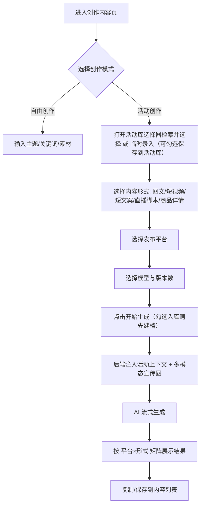

# 活动文案创作功能 PRD

> 模块：AI 内容工坊 · 活动驱动创作
> 状态：PRD 草案（待评审）
> 关联页面：创作内容（ContentCreate.vue）、活动管理（CampaignManage.vue）、活动编辑（CampaignEdit.vue）、活动详情（CampaignDetail.vue）、内容列表（ContentList.vue）
> 关联后端：backend-go/controllers/campaigns\_controller.go、backend-go/controllers/contents\_controller.go、backend-go/services/ai\_service.go

---

## 1. 需求概述

### 1.1 背景与目标

当前「创作内容」页面已支持：输入主题/关键词/参考素材 → 选择平台 → AI 流式生成多平台文案。但当用户需要围绕一场具体活动（如品牌发布会、线下市集、节日促销）批量创作文案时，仍需反复把活动名称、时间、地点、卖点手动粘贴进主题框，宣传图也要重复上传。

本需求目标是：**在现有创作链路中增加「活动驱动」模式**，让用户可以直接选择或录入一场活动，由 AI 基于活动描述与宣传图自动创作符合活动调性的多平台文案。

同时，随着活动库中活动数量增长，「找到正确活动」成为高频操作。因此本需求**同步强化活动库（活动管理页 + 创作页选择器）的搜索与筛选能力**，保证用户能快速定位目标活动。

### 1.2 核心用户故事

| 编号 | 角色   | 用户故事                                                                                                                           |
| ---- | ------ | ---------------------------------------------------------------------------------------------------------------------------------- |
| US-1 | 运营者 | 我参加了一场线下活动，拿到活动官方描述和 3 张宣传图，希望在系统里快速生成小红书/抖音/公众号/视频号/微博适配文案                    |
| US-2 | 运营者 | 我已在活动库中维护好活动信息，在创作页快速检索到它后一键关联，AI 自动把活动背景、卖点、宣发图融入生成结果                          |
| US-3 | 运营者 | 我需要同一活动生成「图文笔记/推文」「短视频脚本」「短文案/标题」「直播脚本」「商品详情页文案」等多种形式的文案，供不同发布场景使用 |
| US-4 | 运营者 | 活动文案生成后，我可以保存到内容列表，并保留与活动的关联，方便后续按活动筛选和发布                                                 |
| US-5 | 运营者 | 我的活动库有成百上千条活动，我要能按关键词、平台、状态、地点、创建时间快速筛选，找到要用的那一场                                   |
| US-6 | 运营者 | 我临时录入的一场活动后续还会复用，勾选「保存到活动库」后一键存进 campaigns 表，下次直接搜索选用                                    |

### 1.3 功能范围

**本期包含：**

- 在创作内容页新增「活动驱动」创作模式切换（自由创作 / 活动创作）

- 活动创作模式下支持两种输入来源：

  - **选择已有活动**：通过「活动库选择器」（弹窗）检索并选取活动

  - **临时录入活动**：在创作页直接填写活动名称、活动描述、上传宣传图；支持勾选「保存到活动库」（可选持久化到 campaigns 表）

- 支持内容形式多选（5 种）：图文笔记/推文、短视频脚本、短文案/标题、直播脚本、商品详情页文案

- 多平台适配：小红书、抖音、微信公众号、微信视频号、微博（沿用现有 platformChoices）

- 活动库搜索与筛选增强（**两处**）：

  - 活动管理列表页：在已有「关键词（名称）／平台／状态」基础上，扩展描述搜索、新增地点与创建时间范围筛选

  - 创作页活动选择器：由简单下拉升级为弹窗式活动库选择器，支持搜索、筛选、分页

- AI Prompt 自动注入活动描述、地点、宣传图（视觉模型支持时）；**活动「面向平台」仅作为前端快捷勾选平台的元数据，不作为 Prompt 注入**

- 生成结果按「平台 × 内容形式」矩阵展示，支持版本切换

- 单次生成请求组合总数上限 6（平台 × 形式 × 版本）；后端采用「全量合并 + 自动分批」方式，一次模型调用批量产出多组合，公共上下文与宣传图每批只付一次，降低 Token 消耗

- 保存内容时记录 `campaign_id`（已有活动 / 已入库临时活动）或 `event_meta`（未入库的临时活动）

- 内容列表支持按活动筛选

**本期不包含：**

- 活动本身的字段级 CRUD 改造（沿用活动管理页现有能力，仅增强列表查询）

- 基于活动发布任务的自动化批量发布

- AI 对宣传图中文字/Logo 的 OCR 提取（仅作为多模态视觉参考）

- 活动文案的协同审批流

- 活动库的高级排序/自定义列/批量操作

---

## 2. 术语与数据模型

### 2.1 术语

| 术语             | 说明                                                                                 |
| ---------------- | ------------------------------------------------------------------------------------ |
| 活动（Campaign） | 已在活动库中维护的营销/品牌/线下活动实体，包含名称、描述、宣发图、地点、面向平台     |
| 活动库           | 活动管理页所管理的全部活动的集合（数据源为 campaigns 表）                            |
| 活动描述         | 活动的官方介绍文字，用于 AI 理解活动背景、调性、卖点                                 |
| 宣传图           | 活动的海报/主视觉/现场图，作为多模态输入注入 AI                                      |
| 内容形式         | 本次生成的文案形态：图文笔记/推文、短视频脚本、短文案/标题、直播脚本、商品详情页文案 |
| 活动库选择器     | 创作内容页中用于检索并选择已有活动的弹窗组件                                         |
| 自由创作         | 现有创作模式：仅主题 + 关键词 + 素材，不关联活动                                     |
| 活动创作         | 新模式：以活动描述 + 宣传图为核心输入，主题可作为补充卖点/角度                       |
| 临时活动         | 未在活动库中建档、仅随本次创作请求提交的活动信息；可勾选一键保存到 campaigns 表      |

### 2.2 复用数据模型

**campaigns 表**（已存在，见 `backend-go/models/campaign.go`）：

| 字段        | 类型                     | 说明                                              |
| ----------- | ------------------------ | ------------------------------------------------- |
| id          | VARCHAR(36) PK           | 活动 ID                                           |
| user\_id    | VARCHAR(36)              | 归属用户                                          |
| name        | VARCHAR(200)             | 活动名称                                          |
| description | TEXT                     | 活动描述（会注入 AI Prompt）                      |
| media\_urls | TEXT (JSON 数组)         | 宣传图 URL 列表（视觉模型下注入 AI）              |
| location    | VARCHAR(200)             | 活动地点（会注入 AI Prompt）                      |
| platforms   | VARCHAR(100) (JSON 数组) | 面向平台（**仅用于前端快捷勾选，不注入 Prompt**） |
| status      | VARCHAR(20)              | active / archived                                 |
| created\_at | DATETIME                 | 创建时间（按此排序与时间范围筛选）                |

**contents 表**（已存在 `campaign_id` 字段，本期新增 `event_meta`）：

| 字段         | 类型             | 说明                                                    |
| ------------ | ---------------- | ------------------------------------------------------- |
| campaign\_id | VARCHAR(36) NULL | 关联活动 ID（选择已有活动 / 已入库的临时活动）          |
| event\_meta  | TEXT JSON NULL   | 未入库临时活动的元信息：`{name, description, location}` |

### 2.3 新增请求/状态字段

**前端状态（ContentCreate.vue）：**

```ts
// 创作模式
const creationMode = ref<'free' | 'event'>('free')

// 活动输入（两种来源）
const selectedCampaignId = ref<string>('') // 选择已有活动（活动库选择器回填）
const saveCampaignStore = ref(false) // 临时活动「保存到活动库」复选框
const eventTitle = ref<string>('') // 临时活动名称
const eventDescription = ref<string>('') // 临时活动描述
const eventLocation = ref<string>('') // 临时活动地点
const eventMediaFiles = ref<FileItem[]>([]) // 临时宣传图（前端本地文件对象）

// 活动库选择器（弹窗）状态
const campaignPickerVisible = ref(false) // 弹窗开关
const campaignPickerList = ref<Campaign[]>([]) // 当前页活动
const campaignPickerTotal = ref(0) // 筛选后总数
const pickerKeyword = ref('') // 关键词（名称/描述）
const pickerPlatform = ref<string | undefined>() // 平台
const pickerStatus = ref<'active' | 'archived'>('active') // 默认仅进行中
const pickerLocation = ref('') // 地点
const pickerDateRange = ref<[string, string] | undefined>() // 创建时间范围
const pickerPage = ref(1)
const pickerPageSize = ref(10)

// 内容形式（多选）
const contentForms = ref<Array<'post' | 'script' | 'snippet' | 'live_script' | 'product_detail'>>([
  'post',
])

// 平台选择沿用现有 selectedPlatforms
```

**AI 流式生成请求体扩展（`POST /api/contents/ai-generate-stream`）：**

```json
{
  "topic": "补充卖点/角度（可选）",
  "platforms": ["xiaohongshu", "douyin"],
  "content_forms": ["post", "script", "snippet", "live_script", "product_detail"],
  "plan_id": "...",
  "model_id": "...",
  "generate_version": 2,
  "campaign_id": "existing-campaign-id",
  "event_context": {
    "name": "临时活动名称",
    "description": "临时活动描述",
    "location": "临时活动地点",
    "media_files": [{ "data": "base64", "mime_type": "image/jpeg" }]
  }
}
```

> 说明：`campaign_id` 与 `event_context` 二选一。若临时活动勾选「保存到活动库」且建档成功，则以返回的 `campaign_id` 提交；否则提交 `event_context`。

---

## 3. 产品流程

### 3.1 交互流程



### 3.2 活动创作模式详细流程

1. **模式切换**：输入区顶部增加分段控制器（SegmentedControl）：「自由创作」「活动创作」。默认「自由创作」。
2. **选择已有活动（活动库选择器）**：

   - 输入区提供「选择活动」按钮，点击打开活动库选择器弹窗

   - 弹窗顶部提供搜索与筛选：关键词（名称/描述）、平台、状态、地点、创建时间范围

   - 默认仅展示「进行中」活动；列表支持分页；点击活动行即选中（单选高亮）

   - 底部「确定」回填 `selectedCampaignId`，输入区展示活动摘要卡片

3. **临时录入活动**：

   - 输入区提供「临时录入活动」入口，展开临时活动表单

   - 字段：活动名称（必填）、活动描述（必填，多行文本）、活动地点（可选）、宣传图上传（复用 AttachmentInputArea，最多 9 张，仅图片）

   - 表单底部提供复选框「保存到活动库」（可选持久化到 campaigns 表，需 `campaign:create:write` 权限）：勾选后，于点击「开始生成」时执行 4.1.5 入库流程，建档成功后再发起 AI 生成；建档失败则提示，允许取消勾选后继续以临时活动生成

   - 未勾选时：活动信息仅作为 `event_context` 随本次请求传输，不写入 campaigns 表

4. **内容形式选择**：

   - 使用复选框组，选项：图文笔记/推文、短视频脚本、短文案/标题、直播脚本、商品详情页文案

   - 至少选择 1 项（默认图文笔记/推文）

5. **平台选择**：

   - 沿用现有 PlatformChip 多选组件

   - 活动「面向平台」（campaigns.platforms）**仅用于前端快捷勾选**：选择已有活动后，若活动已配置面向平台，自动勾选这些平台；用户可手动增删。最终生成哪些平台以用户实际勾选为准

   - 勾选「保存到活动库」入库时，campaigns.platforms 写入当前已勾选的发布平台（作为该活动日后被选择时的快捷勾选数据）

   - 约束：campaigns.platforms **不作为 AI Prompt 上下文注入**

6. **主题补充**（可选）：

   - 在活动模式下，主题输入框 placeholder 变为「补充卖点/切入角度（可选）」

   - 如果用户填写，追加到活动背景之后作为补充指令

7. **生成**：

   - 校验：内容形式 ≥1、平台 ≥1、模型已选

   - 组合总数校验：`platforms × content_forms × generate_version ≤ 6`，超出则阻止并发起，并提示调整建议（减少平台/形式/版本）

   - 「开始生成」按钮旁展示预计产出提示（如「将生成 6 篇（约 2 批）」）

   - 若勾选「保存到活动库」：先执行 4.1.5 入库流程取得 `campaign_id`，再携带 `campaign_id` + `content_forms` 发起生成

   - 否则请求体携带 `event_context` + `content_forms`

   - 生成请求中的 `platforms` 以用户勾选为准（来自活动快捷勾选或手动选择），该参数同时决定 Prompt 中要求适配的平台风格

8. **结果展示**：

   - 预览区增加「内容形式」维度：顶部分段切换

   - 每个内容形式下，按平台 Tab 展示生成结果

   - 单平台若生成多版本，保留现有版本 Tab 切换

---

## 4. 功能详细设计

### 4.1 创作内容页改造（ContentCreate.vue）

#### 4.1.1 输入区新增元素

| 元素         | 类型               | 说明                                                                        |
| ------------ | ------------------ | --------------------------------------------------------------------------- |
| 创作模式切换 | SegmentedControl   | free / event                                                                |
| 活动库选择器 | a-modal + 活动列表 | 弹窗内搜索/筛选/分页，单选回填                                              |
| 临时录入入口 | a-button / a-link  | 点击展开临时活动录入表单                                                    |
| 活动摘要卡片 | a-card             | 选择活动后展示名称、描述、地点、平台、缩略图，可跳详情/更换/清除            |
| 临时活动表单 | 表单区             | 名称、描述、地点、宣传图上传                                                |
| 保存到活动库 | a-checkbox         | 「保存到活动库」复选框（可选持久化到 campaigns 表），无创建权限时禁用并提示 |
| 内容形式选择 | a-checkbox-group   | 图文笔记/推文、短视频脚本、短文案/标题、直播脚本、商品详情页文案            |
| 主题补充输入 | a-textarea         | 可选，用于补充卖点或切入角度                                                |

#### 4.1.2 内容形式定义

| 内容形式       | 枚举值           | 输出结构                                                                  | 平台适配说明                                           |
| -------------- | ---------------- | ------------------------------------------------------------------------- | ------------------------------------------------------ |
| 图文笔记/推文  | `post`           | 标题 + 正文 + 话题标签                                                    | 小红书笔记、公众号推文、微博长文等长文本形态           |
| 短视频脚本     | `script`         | 标题 + 分镜脚本/口播稿 + 建议话题标签                                     | 抖音、视频号短视频脚本，含开场钩子、中间卖点、结尾 CTA |
| 短文案/标题    | `snippet`        | 短文案 + 备选标题（3-5 条）+ 话题标签                                     | 朋友圈、微博短文案、小红书标题、视频号标题             |
| 直播脚本       | `live_script`    | 直播主题 + 开场话术 + 产品讲解节奏 + 互动节奏 + 促单话术 + 下播收尾       | 抖音/视频号等带货直播脚本，强调实时互动与转化节奏      |
| 商品详情页文案 | `product_detail` | 商品主标题 + 卖点清单 + 使用场景描述 + 规格/参数说明 + 购买引导与信任背书 | 电商详情页、小程序商品页，突出卖点与信任感             |

#### 4.1.3 预览区改造

现有预览区是「平台 Tab + 版本 Tab」两层结构。活动创作模式下增加一层「内容形式 Tab」：

```
┌─────────────────────────────────────────────────────────────┐
│  [图文笔记/推文] [短视频脚本] [短文案/标题] [直播脚本] [商品详情页] │
├─────────────────────────────────────────────────────────────┤
│  [小红书] [抖音] [公众号] [视频号] [微博]                     │
├─────────────────────────────────────────────────────────────┤
│  版本 1 / 版本 2 / 版本 3                                    │
├─────────────────────────────────────────────────────────────┤
│  标题：...                                                   │
│  正文：...                                                   │
│  话题标签：...                                               │
├─────────────────────────────────────────────────────────────┤
│  [复制] [保存为内容]                                         │
└─────────────────────────────────────────────────────────────┘
```

自由创作模式下，内容形式固定为 `post`，不显示形式切换器。

#### 4.1.4 数据校验规则

| 场景         | 校验规则                                        |
| ------------ | ----------------------------------------------- |
| 活动创作模式 | 必须选择已有活动 或 填写临时活动名称+描述       |
| 内容形式     | 至少选择 1 项                                   |
| 平台         | 至少选择 1 个平台                               |
| 模型         | 必须选择已启用模型配置                          |
| 临时宣传图   | 单张 ≤5MB，最多 9 张，仅图片                    |
| 主题补充     | 可选，长度 ≤2000 字                             |
| 活动库选择器 | 平台/状态/地点/时间筛选为可选；关键词 1-50 字符 |

**组合总数上限**：单次请求的 `platforms × content_forms × generate_version ≤ 6`（即一次「开始生成」最多产出 6 篇内容）。超出时前端阻止发起并提示用户减少平台/形式/版本；后端同样校验，超限返回 400。

#### 4.1.5 临时活动「一键入库」流程

用户勾选「保存到活动库」复选框后，点击「开始生成」时的入库时序：

1. **前端校验**：活动名称、活动描述非空（沿用 4.1.4 规则）

2. **宣传图转 URL**：将临时表单中 dataURL 格式的本地宣传图依次调用 `POST /api/uploads` 上传得到 URL（复用 CampaignEdit 现有 `uploadDataUrls` 逻辑，见 `frontend/src/pages/CampaignEdit.vue`）；已是 http(s) URL 的直接使用；任一张上传失败 → 中止入库并提示

3. **建档**：调用 `POST /api/campaigns/`，body：

   ```json
   {
     "name": "临时活动名称",
     "description": "临时活动描述",
     "media_urls": ["上传后的 URL 列表"],
     "location": "临时活动地点",
     "platforms": ["xiaohongshu", "douyin"]
   }
   ```

4. **建档成功**：以返回的 `campaign_id` 回填 `selectedCampaignId`，收起临时活动表单，随后按「已有活动」链路发起 AI 生成（内容自动关联该活动）

5. **建档失败**：Message 提示失败原因，复选框自动取消勾选；用户可继续以 `event_context` 作为临时活动发起生成（不阻断创作流程）

**platforms 同步规则**：新建活动的 `platforms` 取「开始生成」时创作页已勾选的发布平台，作为该活动日后被选择时的快捷勾选数据（前端自动勾选用）；若勾选入库时尚未选择任何平台，则 platforms 写入空数组；该字段不注入 AI Prompt，后续可在活动管理中修改。

### 4.2 活动库搜索与筛选设计（两处）

#### 4.2.1 活动管理列表页增强（CampaignManage.vue）

**现状**：仅支持「关键词（活动名称）」「状态」「平台」+ 分页。

**增强目标**：筛选维度覆盖 关键词（名称+描述）、平台、状态、地点、创建时间。

**页面布局（筛选工具栏）：**

```
┌────────────────────────────────────────────────────────────────────┐
│ [ 搜索活动名称/描述 🔍 ]  [ 状态 ▾ ]  [ 平台 ▾ ]                     │
│ [ 地点：________ ]  [ 创建时间 起~止 ]  [重置]                       │
├────────────────────────────────────────────────────────────────────┤
│ 活动列表表格（宣发图 / 活动名+描述摘要 / 地点 / 面向平台 / 状态 / 创建时间 / 操作）│
├────────────────────────────────────────────────────────────────────┤
│ 分页（共 N 条）                                                      │
└────────────────────────────────────────────────────────────────────┘
```

**交互说明：**

| 筛选器   | 组件                   | 规则                                                                    |
| -------- | ---------------------- | ----------------------------------------------------------------------- |
| 关键词   | a-input-search         | 占位符更新为「搜索活动名称 / 描述」；输入后回车或点击搜索触发；支持清除 |
| 状态     | a-select               | 全部 / 进行中 / 已归档（沿用现有）                                      |
| 平台     | a-select               | 全部 / 6 大平台（沿用现有）                                             |
| 地点     | a-input（allow-clear） | 按活动地点模糊匹配；回车触发                                            |
| 创建时间 | a-range-picker         | 日期范围，换算为 created\_at >= 起始日 00:00:00 且 <= 结束日 23:59:59   |

- 多条件组合为 **AND** 关系

- 任意条件变化 → 重置 `page=1` 重新查询

- 提供「重置」按钮一键清空全部筛选

- 结果集实时展示 `total`，空结果展示空状态与清除筛选引导

**前端状态（CampaignManage.vue）新增：**

```ts
const locationFilter = ref('') // 地点
const dateRangeFilter = ref<[string, string] | undefined>() // 创建时间范围
```

**请求参数：**

```ts
const params = {
  page,
  page_size,
  ...(keyword.value ? { keyword: keyword.value } : {}),
  ...(statusFilter.value ? { status: statusFilter.value } : {}),
  ...(platformFilter.value ? { platform: platformFilter.value } : {}),
  ...(locationFilter.value ? { location: locationFilter.value } : {}),
  ...(dateRangeFilter.value
    ? { start_date: dateRangeFilter.value[0], end_date: dateRangeFilter.value[1] }
    : {}),
}
```

#### 4.2.2 创作页活动库选择器（ContentCreate.vue）

**升级动机**：现有 `a-select` 下拉 + `/campaigns/options` 一次性全量拉取 active 活动，活动量增大后无法快速定位。升级为**弹窗式活动库选择器**。

**页面布局（弹窗）：**

```
┌─────────────── 从活动库选择 ───────────────┐
│ [ 搜索活动名称/描述 🔍 ]                    │
│ [ 平台 ▾ ] [ 状态 ▾(默认进行中) ] [ 地点 __ ]│
│ [ 创建时间 起~止 ]                         │
├───────────────────────────────────────────┤
│ ○ 活动A · 地点 · 平台图标 · 缩略图          │
│   描述摘要… · 创建时间                      │
│ ○ 活动B …                                 │
│ ○ 活动C …                                 │
├───────────────────────────────────────────┤
│ 共 N 条 · 分页                    [取消][确定]│
└───────────────────────────────────────────┘
```

**交互说明：**

| 行为       | 规则                                                                                        |
| ---------- | ------------------------------------------------------------------------------------------- |
| 打开       | 点击输入区「选择活动」按钮；已有关联时默认定位当前活动并在列表中高亮                        |
| 搜索/筛选  | 关键词（名称/描述）、平台、状态（默认「进行中」）、地点、创建时间范围；变更即重置页码查询   |
| 数据源     | `GET /api/campaigns/options`（增强：支持与列表一致的筛选参数 + 分页，强制 `status=active`） |
| 列表项展示 | 单选用例：名称、地点、面向平台图标、宣发图缩略图（取首张）、描述摘要、创建时间              |
| 选择       | 点击行切换选中（radio 样式高亮），再次点击取消；单次仅可确认 1 个                           |
| 确认       | 底部「确定」关闭弹窗并回填 `selectedCampaignId`，输入区展示活动摘要卡片                     |
| 空状态     | 「未找到匹配活动」+ 快捷按钮「临时录入」，点击后关闭弹窗并展开临时录入表单                  |
| 权限       | 依赖 `campaign:read`；无权限不展示入口                                                      |

**选中行信息结构（options 列表项字段）：**

```ts
interface CampaignOption {
  id: string
  name: string
  location: string
  platforms: string[]
  description: string // 增强：用于列表项摘要
  media_urls: string[] // 增强：用于缩略图
  created_at: string // 增强：用于列表项展示与排序
}
```

#### 4.2.3 后端查询参数（统一）

`GET /api/campaigns/`（列表页）与 `GET /api/campaigns/options`（创作页选择器）共用同一套筛选参数；`options` 额外强制 `status=active`。

| 参数        | 类型               | 说明                                                                     |
| ----------- | ------------------ | ------------------------------------------------------------------------ |
| keyword     | string             | 对活动名称、活动描述做模糊匹配（name OR description icontains）          |
| platform    | string             | 面向平台 JSON 中匹配平台值（沿用现有 platforms icontains，用于检索活动） |
| status      | string             | 状态精确匹配（active / archived）；options 接口强制 active               |
| location    | string             | 活动地点模糊匹配（location icontains）                                   |
| start\_date | string(YYYY-MM-DD) | created\_at >= 当日 00:00:00                                             |
| end\_date   | string(YYYY-MM-DD) | created\_at <= 当日 23:59:59                                             |
| page        | int                | 页码，默认 1                                                             |
| page\_size  | int                | 每页条数，默认 10，最大 50                                               |

- 多条件 AND 组合；排序统一按 `created_at DESC`

- 建议后端抽取公共函数 `applyCampaignFilters(qs, query)`，List 与 Options 复用

- 响应：List 返回 `{items, total, page, page_size}`；Options 返回相同分页结构（字段见 4.2.2）

### 4.3 后端 AI 集成（backend-go/services/ai\_service.go）

#### 4.3.1 请求体扩展

在 `aiGenerateStreamRequest` 中新增：

```go
type aiGenerateStreamRequest struct {
    Topic          string                  `json:"topic"`
    Platforms      []string                `json:"platforms"`
    ContentForms   []string                `json:"content_forms"`   // 新增
    Style          string                  `json:"style"`
    Keywords       []string                `json:"keywords"`
    PlanID         string                  `json:"plan_id"`
    ModelID        string                  `json:"model_id"`
    Files          []services.UploadedFile `json:"files"`
    GenerateVersion int                    `json:"generate_version"`
    CampaignID     string                  `json:"campaign_id"`     // 已有
    EventContext   *eventContext           `json:"event_context"`   // 新增
}

type eventContext struct {
    Name        string                  `json:"name"`
    Description string                  `json:"description"`
    Location    string                  `json:"location"`
    MediaFiles  []services.UploadedFile `json:"media_files"`
}
```

#### 4.3.2 活动上下文装配

新增函数：

```go
func resolveEventContext(req aiGenerateStreamRequest) (contextText string, files []UploadedFile, eventName string, err error)
```

逻辑：

1. 若 `CampaignID` 非空：

   - 从 campaigns 表读取活动（校验归属当前用户）

   - 构造 `contextText`：仅包含活动名称、活动描述、活动地点；**不包含面向平台字段**

   - 加载 `media_urls` 中的图片为 `UploadedFile`

2. 若 `EventContext` 非空：

   - 直接使用 `EventContext.Name/Description/Location`

   - 使用 `EventContext.MediaFiles` 作为多模态输入

3. 合并 files：用户上传素材 + 活动宣传图
4. 若模型不支持 vision 且存在图片，降级为仅文本注入并输出日志

> 注意：面向平台（campaigns.platforms）只在前端用于自动勾选平台（见 3.2 步骤 5），后端装配活动上下文与 Prompt 时**一律不携带该字段**。

#### 4.3.3 Prompt 工程

在活动创作模式下，System Prompt 不变，用户 Prompt 中追加活动背景与内容形式要求。

**活动背景注入模板（不含面向平台）：**

```text
【活动背景】
活动名称：{eventName}
活动介绍：{eventDescription}
活动地点：{eventLocation}

请围绕以上活动背景进行创作，内容需贴合活动调性、卖点与目标受众。
{topicSupplement}
```

**内容形式注入模板：**

```text
【内容形式要求】
{contentFormInstructions}
```

其中 `contentFormInstructions` 根据选择的形式组合：

- `post`：「生成图文笔记/推文形态的内容，包含完整标题、正文、推荐话题标签。」

- `script`：「生成短视频脚本，包含标题、分镜/口播稿、建议话题标签，脚本需有开场钩子、产品卖点、结尾行动号召。」

- `snippet`：「生成短文案/标题形态，包含 1 条核心短文案 + 3-5 条备选标题 + 推荐话题标签。」

- `live_script`：「生成直播脚本，包含直播主题、开场话术、产品讲解节奏、互动节奏、促单话术、下播收尾。」

- `product_detail`：「生成电商商品详情页文案，包含商品主标题、卖点清单、使用场景描述、规格参数说明、购买引导与信任背书。」

**最终 Prompt 结构：**

```text
请为以下主题生成一篇适合{platform}发布的内容。
风格要求：{platformStyle}{keywordsStr}

主题：{subject}

【活动背景】...
【内容形式要求】...
{fileHint}

请直接调用 submit_content_variant 工具提交结果...
```

> 说明：`{platform}` 与平台风格取自请求参数 `platforms`（用户实际勾选，可能受活动快捷勾选影响），来自活动的面向平台仅体现在「前端默认勾选」，不会直接拼接进 Prompt 的活动背景。

#### 4.3.4 组合限制与合并分批生成策略

**组合总数上限（前后端双重校验）：**

- 单次请求总组合数 = `len(platforms) × len(content_forms) × generate_version`，**上限 6**

- 前端：「开始生成」前预计算并展示「将生成 N 篇（约 M 批）」，超限禁止发起并提示减少平台/形式/版本

- 后端：controller 校验，超限返回 400

**合并分批调用（降低 Token 消耗的核心手段）：**

- 后端不再「每平台一次调用」，而是把本次请求的全部组合展开为任务列表，再按**单批输出预算**自动合并为若干批次，每批仅**一次模型调用**即输出该批内的全部组合

- 每批共享同一份系统 Prompt、活动背景、主题与宣传图（多模态输入），公共上下文与图片 Token **每批只付一次**，不再随平台数、形式数重复消耗（现行多平台串行时宣传图会被重复编码 N 次）

- 分批规则：

  - 每个展开的组合 = 一个生成任务（平台 × 内容形式 × 版本，各产出一篇）

  - 按预估输出长度累计，达单批预算即截止并开启新批；预算可配置（默认单批 ≤ 4 篇 或 ≤ 4000 输出 token，取先达者；长文本形式 `script`/`product_detail` 权重更高）

  - 批次在单个请求内顺序执行，不跨请求

- SSE 事件：

  - `log`：每批开始输出「正在生成第 i / N 批…」

  - `done`：**每产出一篇推送一条**（一个批次内会连续推送多条 done）

  - `error`：某批失败仅影响该批，记录后继续执行下一批

- AIGenerationRecord：每条 done 变体独立入库（platform、content\_form、版本序号均可追溯）

SSE done 事件扩展：

```json
event: done
data: {
  "platform": "xiaohongshu",
  "content_form": "post",
  "variant": { "title": "...", "body": "...", "hashtags": [...] },
  "variant_index": 0,
  "score": 82,
  "batch_index": 0,
  "batch_total": 2
}
```

字段说明：

- `content_form`：当前变体对应的内容形式（新增）

- `variant_index`：当前变体在其组合内的版本序号（0 \~ generate\_version-1）

- `batch_index` / `batch_total`：当前变体所属批次序号与总批次数（新增，供前端展示批次进度）

#### 4.3.5 保存内容

选择已有活动时，`POST /api/contents/` 携带 `campaign_id`。

临时活动时：

- 若用户勾选了「保存到活动库」且建档成功：后续按已有活动处理，携带 `campaign_id`

- 若未勾选或建档失败：不携带 `campaign_id`，携带 `event_meta` JSON 字段记录临时活动名称、描述、地点，便于后续追溯与展示

**推荐方案**：`contents` 表新增 `event_meta` 字段（JSON，可空），仅用于未持久化的临时活动。

---

## 5. API 变更

### 5.1 流式生成接口

`POST /api/contents/ai-generate-stream`

请求体扩展字段：

| 字段                        | 类型            | 必填             | 说明                                   |
| --------------------------- | --------------- | ---------------- | -------------------------------------- |
| content\_forms              | string\[]       | 否               | 内容形式，默认 `["post"]`              |
| event\_context              | object          | 否               | 临时活动上下文，与 campaign\_id 二选一 |
| event\_context.name         | string          | 是（临时活动时） | 临时活动名称                           |
| event\_context.description  | string          | 是（临时活动时） | 临时活动描述                           |
| event\_context.location     | string          | 否               | 临时活动地点                           |
| event\_context.media\_files | UploadedFile\[] | 否               | 临时宣传图 Base64                      |

SSE `done` 事件扩展字段：

| 字段          | 类型   | 说明               |
| ------------- | ------ | ------------------ |
| content\_form | string | 结果对应的内容形式 |

### 5.2 内容保存接口

`POST /api/contents/`

请求体新增字段：

| 字段        | 类型   | 必填 | 说明                                        |
| ----------- | ------ | ---- | ------------------------------------------- |
| event\_meta | object | 否   | 临时活动元信息（name/description/location） |

### 5.3 内容列表接口

`GET /api/contents/`

已有 `campaign_id` 查询参数，本期无需新增。临时活动产生的内容通过 `event_meta` 字段展示「临时活动」标签。

### 5.4 活动列表接口（查询参数增强）

`GET /api/campaigns/`

| 参数              | 类型   | 必填 | 说明                                         |
| ----------------- | ------ | ---- | -------------------------------------------- |
| keyword           | string | 否   | 活动名称或描述模糊匹配（原仅名称，本期扩展） |
| platform          | string | 否   | 面向平台筛选（沿用，用于检索活动）           |
| status            | string | 否   | active / archived（沿用）                    |
| location          | string | 否   | 活动地点模糊匹配（新增）                     |
| start\_date       | string | 否   | 创建时间起（YYYY-MM-DD，含当天）（新增）     |
| end\_date         | string | 否   | 创建时间止（YYYY-MM-DD，含当天）（新增）     |
| page / page\_size | int    | 否   | 分页（沿用）                                 |

### 5.5 活动选项接口（增强）

`GET /api/campaigns/options`

- 支持与列表一致的筛选参数（keyword/platform/location/start\_date/end\_date/page/page\_size）

- 强制仅返回 `status=active`（本期保持）

- 返回由「数组」改为分页结构 `{items, total, page, page_size}`

- 列表项字段由 `{id,name,location,platforms}` 扩展为 `{id,name,location,platforms,description,media_urls,created_at}`

> 兼容说明：options 原返回裸数组。前端活动库选择器为唯一调用方，随本期一并改造；无历史兼容负担。若保留旧调用方则考虑版本字段或双端点。

---

## 6. 前端页面详细设计

### 6.1 创作内容页 · 输入区布局

```
┌──────────────────────────────────────────────────────────────────┐
│ PageHeader: 创作内容                                              │
├──────────────────────────────────────────────────────────────────┤
│ 创作模式：[自由创作 | 活动创作]                                    │
├──────────────────────────────────────────────────────────────────┤
│ 活动创作模式下：                                                  │
│   关联活动：[选择活动（活动库）]  [临时录入活动]                    │
│   ─────────────────────────────────────────────────────────────  │
│   活动摘要卡片（选择已有活动后显示）：                              │
│   ┌─────────────────────────────────────────────────────────┐   │
│   │ 活动名称  ·  地点  ·  [平台图标]      [更换] [清除]       │   │
│   │ 描述摘要...                                              │   │
│   │ [缩略图1] [缩略图2]                                       │   │
│   └─────────────────────────────────────────────────────────┘   │
│   临时活动表单（临时录入时显示）：                                  │
│   · 活动名称 *                                                 │
│   · 活动描述 *                                                 │
│   · 活动地点                                                   │
│   · 宣传图 [AttachmentInputArea image-only max=9]              │
│   ☑ 保存到活动库（可选，需活动创建权限）                            │
├──────────────────────────────────────────────────────────────────┤
│ 内容形式：[☑ 图文笔记/推文] [☑ 短视频脚本] [☐ 短文案/标题]         │
│          [☐ 直播脚本] [☐ 商品详情页文案]                          │
├──────────────────────────────────────────────────────────────────┤
│ 发布平台：[小红书] [抖音] [公众号] [视频号] [微博]                │
├──────────────────────────────────────────────────────────────────┤
│ 补充角度（可选）：…                                              │
├──────────────────────────────────────────────────────────────────┤
│ 模型选择 + 版本数 + [开始生成]                                    │
└──────────────────────────────────────────────────────────────────┘
```

### 6.2 创作内容页 · 预览区布局

活动创作模式：

```
┌──────────────────────────────────────────────────────────────────┐
│ [图文笔记/推文] [短视频脚本] [短文案/标题] [直播脚本] [商品详情页]   │
│ [小红书] [抖音] [公众号] [视频号] [微博]                          │
│ 版本 1  版本 2  版本 3                                           │
├──────────────────────────────────────────────────────────────────┤
│ 标题：[...]                                                      │
│ 正文：[...]                                                      │
│ 话题标签：[...]                                                  │
├──────────────────────────────────────────────────────────────────┤
│ [复制] [保存为内容]                                               │
└──────────────────────────────────────────────────────────────────┘
```

### 6.3 自由创作模式保持现状

不显示内容形式切换器，默认 `post`，预览区与现有完全一致，确保向后兼容。

### 6.4 活动库搜索与筛选 UI（详见 4.2.1 / 4.2.2）

- 活动管理列表页：筛选工具栏新增「地点」「创建时间」，关键词占位扩展为「搜索活动名称 / 描述」，增加「重置」按钮

- 创作页活动库选择器：弹窗式组件，内置 搜索框 + 平台/状态/地点 + 时间范围 + 分页列表

---

## 7. 权限设计

复用现有权限：

| 操作                                  | 权限键                |
| ------------------------------------- | --------------------- |
| 进入创作内容页                        | content:read          |
| AI 生成                               | content:create:write  |
| 保存内容                              | content:create:write  |
| 活动库搜索/筛选/选择（列表 + 选择器） | campaign:read         |
| 临时活动保存到活动库                  | campaign:create:write |

- 活动库搜索筛选为 `campaign:read` 的能力延伸，不新增权限点

- 临时活动录入本身不依赖 `campaign:create:write`；仅当勾选「保存到活动库」时才需要该权限。无权限时复选框禁用并提示「无活动创建权限」

---

## 8. 实施计划

### 8.0 阶段总览

| 阶段  | 任务                                | 交付物                                                                                                                                            |
| ----- | ----------------------------------- | ------------------------------------------------------------------------------------------------------------------------------------------------- |
| Day 1 | 后端活动查询增强                    | campaigns List/Options 支持 keyword(名称+描述)/location/时间范围，Options 改分页结构                                                              |
| Day 2 | 后端内容生成扩展                    | 流式接口支持 content\_forms / event\_context，SSE done 扩展（含 content\_form / batch），组合总数校验与合并分批生成，活动上下文装配与 Prompt 注入 |
| Day 3 | 后端保存与内容列表                  | contents 新增 event\_meta 字段，保存与列表透出                                                                                                    |
| Day 4 | 活动管理页筛选增强                  | 列表页新增地点/时间筛选、关键词扩展、重置                                                                                                         |
| Day 5 | 创作页改造（输入区 + 活动库选择器） | 模式切换、弹窗选择器、临时录入+一键入库、内容形式多选                                                                                             |
| Day 6 | 创作页预览区改造                    | 内容形式维度、结果分组展示、保存兼容                                                                                                              |
| Day 7 | 全链路验证与回归                    | 双模式回归、多平台多形式生成、筛选链路测试                                                                                                        |

### 8.1 Day 1 · 后端活动查询增强

| ID   | 任务                                           | 验收标准                                                  |
| ---- | ---------------------------------------------- | --------------------------------------------------------- |
| D1-1 | List 支持 keyword 匹配名称+描述（OR）          | 搜索描述命中可返回                                        |
| D1-2 | List 支持 location、start\_date、end\_date     | 各参数生效且 AND 组合                                     |
| D1-3 | 抽取 applyCampaignFilters 供 List/Options 复用 | 无重复查询逻辑                                            |
| D1-4 | Options 支持筛选参数 + 分页 + 富字段返回       | 仅 active、字段完整、结构为 {items,total,page,page\_size} |
| D1-5 | `go build ./...` 通过                          | 无编译错误                                                |

### 8.2 Day 2 · 后端内容生成扩展

| ID   | 任务                                                                                                                  | 验收标准                                          |
| ---- | --------------------------------------------------------------------------------------------------------------------- | ------------------------------------------------- |
| D2-1 | `aiGenerateStreamRequest` 增加 content\_forms / event\_context                                                        | 编译通过                                          |
| D2-2 | 参数校验：活动模式下 campaign\_id 与 event\_context 至少一个；总组合数 platforms×content\_forms×generate\_version ≤ 6 | 空输入返回 400                                    |
| D2-3 | SSE done 增加 content\_form                                                                                           | 前端能正确识别                                    |
| D2-4 | resolveEventContext 支持两种来源                                                                                      | 文本与图片均正确装配                              |
| D2-5 | Prompt 注入活动背景（名称/描述/地点，**不含面向平台**）与内容形式要求（5 种）                                         | 输出贴合活动调性；Prompt 不含 campaigns.platforms |
| D2-6 | 多组合合并分批生成（拆批 + 每批一次模型调用）                                                                         | 日志显示每批任务及各组合产出                      |

### 8.3 Day 3 · 内容保存与列表扩展

| ID   | 任务                                               | 验收标准       |
| ---- | -------------------------------------------------- | -------------- |
| D3-1 | contents 表新增 event\_meta JSON 字段（幂等迁移）  | 迁移成功       |
| D3-2 | contentCreateRequest 增加 event\_meta              | 保存接口可接收 |
| D3-3 | 内容列表返回 event\_meta，前端展示「临时活动」标签 | 列表渲染正确   |

### 8.4 Day 4 · 活动管理页筛选增强

| ID   | 任务                     | 验收标准               |
| ---- | ------------------------ | ---------------------- |
| D4-1 | 关键词占位更新并可搜描述 | 名称/描述均可命中      |
| D4-2 | 地点筛选框               | 地点模糊命中           |
| D4-3 | 创建时间范围筛选         | 区间命中，边界含当天   |
| D4-4 | 「重置」按钮             | 一键清空全部条件并刷新 |
| D4-5 | eslint + vue-tsc 通过    | 无新增错误             |

### 8.5 Day 5 · 创作页输入区与活动库选择器

| ID   | 任务                                                     | 验收标准                                                                                   |
| ---- | -------------------------------------------------------- | ------------------------------------------------------------------------------------------ |
| D5-1 | 创作模式 SegmentedControl 切换                           | 自由/活动模式 UI 正确切换                                                                  |
| D5-2 | 活动库选择器弹窗（搜索/筛选/分页/单选/空状态）           | 检索到并正确回填                                                                           |
| D5-3 | 活动摘要卡片（更换/清除/跳详情）                         | 选择后正确展示                                                                             |
| D5-4 | 平台快捷勾选：选择活动后自动勾选其 platforms，可手动增删 | 勾选结果作为生成 platforms                                                                 |
| D5-5 | 临时活动表单 + 宣传图上传 + 「保存到活动库」复选框       | 勾选入库：先传宣传图→POST /campaigns/→以 campaign\_id 生成；未勾选：以 event\_context 生成 |
| D5-6 | 内容形式多选（5 项，至少 1 项）                          | 校验正确                                                                                   |
| D5-7 | 请求体构造兼容两种来源                                   | campaign\_id / event\_context 正确                                                         |

### 8.6 Day 6 · 创作页预览区

| ID   | 任务                                           | 验收标准                   |
| ---- | ---------------------------------------------- | -------------------------- |
| D6-1 | 预览区增加内容形式 Tab                         | 活动模式显示，自由模式隐藏 |
| D6-2 | 结果按 platform × content\_form 分组存储与展示 | 切换正确                   |
| D6-3 | 保存兼容 campaign\_id 与 event\_meta           | 请求体正确                 |
| D6-4 | eslint + vue-tsc 通过                          | 无新增错误                 |

### 8.7 Day 7 · 验证

| ID   | 任务                            | 验收标准                                                                                |
| ---- | ------------------------------- | --------------------------------------------------------------------------------------- |
| D7-1 | 活动库搜索筛选全链路            | 多条件组合命中正确、分页正常                                                            |
| D7-2 | 已有活动创作全链路              | 选择器检索 → 关联（platforms 快捷勾选生效）→ 生成 → 保存 → 列表筛选                     |
| D7-3 | 临时活动创作全链路              | 临时录入 → 生成 → 保存展示 event\_meta；勾选入库后以 campaign\_id 关联且 platforms 同步 |
| D7-4 | 自由创作回归                    | 不选活动行为与改造前一致                                                                |
| D7-5 | Prompt 校验                     | 活动上下文注入不含面向平台字段；平台适配仅来自请求 platforms                            |
| D7-6 | 多平台 × 多内容形式组合（分批） | 组合≤6 校验生效；分批调用（含 batch 事件）与按平台×形式归位展示正确                     |

---

## 9. 风险与注意事项

| 风险                                             | 影响                                 | 缓解措施                                                                                              |
| ------------------------------------------------ | ------------------------------------ | ----------------------------------------------------------------------------------------------------- |
| 宣传图 Base64 过大导致请求体超限                 | 生成失败                             | 前端压缩（maxWidth 1920、quality 0.8），后端限制单次总大小 ≤10MB                                      |
| 多形式×多平台组合规模失控（输出过长/耗时不可控） | 生成时间变长、Token 消耗增加         | 总量上限≤6（前后端双重校验）；后端全量合并+按预算自动分批，公共上下文与宣传图每批仅付一次             |
| options 返回结构变更（数组→分页结构）            | 调用方报错                           | 仅前端活动库选择器一个调用方，随本期同步改造；发布前全局搜索确认无其他调用                            |
| 活动量增长后查询变慢                             | 列表/选择器卡顿                      | name/description/location 文本索引（或 LIKE 前缀），created\_at 索引；options 强制 active 减少扫描    |
| 内容形式对模型理解不一致                         | 输出格式不符合预期                   | Prompt 明确结构化要求，复用 Function Calling 工具约束                                                 |
| 面向平台被误注入 Prompt                          | 生成平台受活动字段干扰、偏离用户选择 | 前端选择活动仅自动勾选平台，不改变生成参数语义；后端装配上下文时排除 platforms 字段（见 4.3.2/4.3.3） |
| 自由创作模式回退                                 | 影响现有用户                         | 默认自由创作模式，活动模式为可选切换                                                                  |
| 勾选入库后生成失败                               | 产生孤立活动                         | 先建档成功再生成；失败给出提示，允许改为不入库继续                                                    |

---

## 10. 验收标准

### 10.1 功能验收

- [ ] 创作页可在「自由创作」与「活动创作」模式间切换

- [ ] 活动库选择器：关键词/平台/状态/地点/创建时间组合筛选 + 分页 + 单选回填 + 空状态引导

- [ ] 活动管理列表页：关键词可搜名称与描述，支持地点与创建时间范围筛选、一键重置

- [ ] 选择已有活动后，其面向平台自动勾选到发布平台（可手动增删），生成请求 platforms 以勾选为准

- [ ] 活动创作模式下可临时录入活动信息并上传宣传图

- [ ] 勾选「保存到活动库」后点击生成：宣传图转 URL → 写入 campaigns 表 → 以 campaign\_id 关联生成；platforms 同步已选发布平台

- [ ] 临时活动未入库保存后，内容列表显示「临时活动」标签并可查看元信息

- [ ] 组合总数（平台×形式×版本）>6 时阻止生成并提示拆分建议

- [ ] 生成按「合并分批」调用完成（log 展示批次进度、done 含 batch 字段），结果按「内容形式 → 平台 → 版本」正确归位展示

- [ ] 可选择 1-5 种内容形式（图文笔记/推文、短视频脚本、短文案/标题、直播脚本、商品详情页文案）

- [ ] 可生成小红书、抖音、公众号、视频号、微博适配文案

- [ ] 预览区按「内容形式 → 平台 → 版本」三层展示结果

- [ ] 选择已有活动保存后，内容列表可筛选该活动下的内容

- [ ] 活动 Prompt 上下文不含 campaigns.platforms 字段

- [ ] 自由创作模式行为与改造前完全一致

### 10.2 非功能验收

- [ ] 后端 `go build ./...` 通过

- [ ] 前端 `npx eslint src/pages/ContentCreate.vue src/pages/CampaignManage.vue` 无新增错误

- [ ] 前端 `npx vue-tsc -b` 无新增类型错误

- [ ] 接口测试覆盖新增筛选参数与校验

- [ ] PRD 文档随实现更新保持一致

---

## 11. 附录

### 11.1 内容形式 Prompt 模板（中文）

**图文笔记/推文：**

```text
请生成图文笔记/推文形态的内容，包含完整标题、正文、推荐话题标签。正文需自然流畅，适合直接发布到图文平台。
```

**短视频脚本：**

```text
请生成短视频脚本，包含标题、分镜/口播稿、建议话题标签。脚本需包含：
1. 开场钩子（前 3 秒吸引注意）
2. 中间卖点展示
3. 结尾行动号召（引导点赞/关注/评论/购买）
```

**短文案/标题：**

```text
请生成短文案/标题形态的内容，包含：
1. 一条核心短文案（30-80 字，适合朋友圈/微博/标题）
2. 3-5 条备选标题
3. 推荐话题标签 3-5 个
```

**直播脚本：**

```text
请生成直播脚本，包含：
1. 直播主题
2. 开场话术（自我介绍 + 福利预告 + 停留引导）
3. 产品讲解节奏（每款商品 3-5 分钟，含卖点、使用场景、价格优势）
4. 互动节奏（点赞、评论、抽奖、福袋等互动节点）
5. 促单话术（限时优惠、库存紧张、下单引导）
6. 下播收尾（感谢 + 关注引导 + 下次预告）
```

**商品详情页文案：**

```text
请生成电商商品详情页文案，包含：
1. 商品主标题（20-30 字，突出核心卖点）
2. 卖点清单（3-5 个核心卖点，每个配一句场景化描述）
3. 使用场景描述
4. 规格/参数说明
5. 购买引导与信任背书（售后保障、限时优惠等）
```

### 11.2 平台风格映射（沿用现有）

| 平台          | 风格描述                                             |
| ------------- | ---------------------------------------------------- |
| xiaohongshu   | 小红书风格：活泼、种草、使用 emoji、段落短小、口语化 |
| douyin        | 抖音风格：吸引眼球、节奏快、有悬念感、适合短视频文案 |
| wechat\_mp    | 微信公众号风格：专业、深度、结构清晰、适合长文阅读   |
| wechat\_video | 视频号风格：简洁、正能量、适合中年受众、有温度       |
| weibo         | 微博风格：年轻活泼、高互动、强话题性                 |
