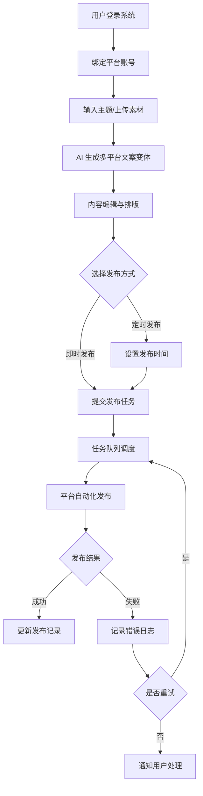
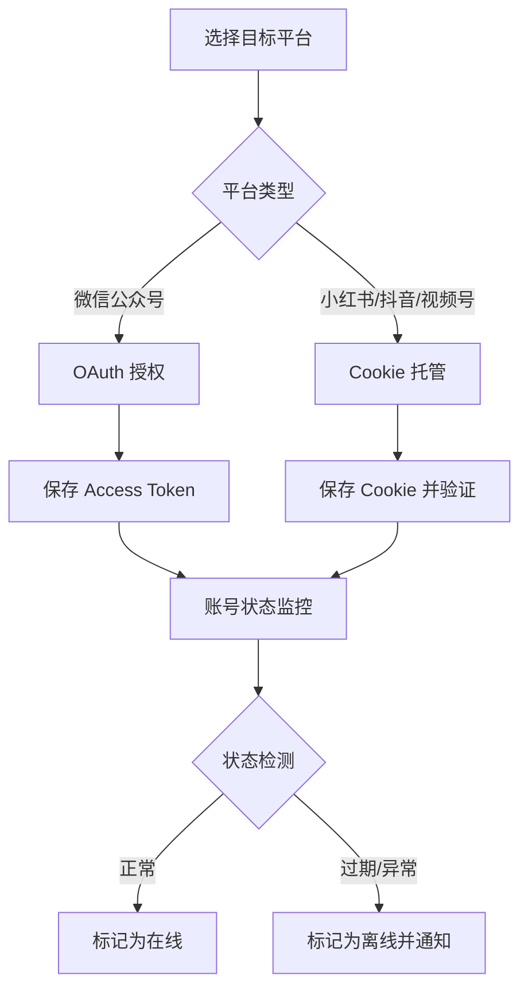

## 1. 产品概述

多平台矩阵管理与自动化发布系统 —— 一站式内容创作与分发平台，支持小红书、抖音、微信视频号、微信公众号等主流社交媒体账号的统一管理、AI 驱动的内容变体生成、智能排版以及多平台一键发布/定时发布。

- 解决内容运营团队在多平台管理中效率低下、重复操作繁琐的痛点
- 目标用户：内容运营团队、自媒体从业者、MCN 机构、品牌营销人员
- 核心价值：通过 AI 赋能 + 自动化引擎，将内容生产效率提升 10 倍

## 2. 核心功能

### 2.1 用户角色

| 角色     | 注册方式   | 核心权限                         |
| -------- | ---------- | -------------------------------- |
| 管理员   | 邮箱注册   | 系统管理、全部功能权限、账号分配 |
| 运营人员 | 管理员邀请 | 内容创建、发布管理、账号使用     |
| 审核人员 | 管理员邀请 | 内容审核、发布审批               |

### 2.2 功能模块

1. **仪表盘（Dashboard）**：数据概览、发布统计、账号状态监控
2. **账号矩阵管理**：多平台账号授权、Cookie 管理、状态监控
3. **AI 内容工坊**：主题输入 → AI 多平台文案变体生成
4. **内容编辑器**：富文本编辑、图片/视频上传、平台预览
5. **发布管理中心**：一键发布、定时发布、发布历史、状态追踪
6. **模板中心**：图文模板管理、平台尺寸适配规则

### 2.3 页面详情

| 页面名称 | 模块名称     | 功能描述                                                   |
| -------- | ------------ | ---------------------------------------------------------- |
| 仪表盘   | 数据概览卡片 | 展示总账号数、今日发布数、待处理任务数、AI 生成次数        |
| 仪表盘   | 发布趋势图   | 按日/周/月展示各平台发布数量趋势                           |
| 仪表盘   | 账号状态面板 | 实时展示各平台账号的在线/离线/异常状态                     |
| 仪表盘   | 最近发布记录 | 展示最近 10 条发布记录及状态                               |
| 账号管理 | 账号列表     | 表格展示所有已绑定账号，含平台图标、昵称、状态标签         |
| 账号管理 | 添加账号     | 弹窗/抽屉表单，选择平台 → 填写授权信息/Cookie → 验证连通性 |
| 账号管理 | 账号详情     | 展示账号详细信息、历史发布统计、Cookie 有效期              |
| 内容工坊 | AI 生成面板  | 输入主题/关键词 → 选择目标平台 → AI 生成多版本适配文案     |
| 内容工坊 | 内容列表     | 展示所有已创建内容，支持按平台/状态/时间筛选               |
| 内容工坊 | 内容编辑器   | 富文本编辑 + 素材上传 + 多平台实时预览                     |
| 发布管理 | 发布任务队列 | 展示待发布/发布中/已完成/失败的任务列表                    |
| 发布管理 | 新建发布任务 | 选择内容 → 选择目标账号 → 设置发布时间 → 提交              |
| 发布管理 | 发布日志     | 展示每次发布的详细日志，含成功/失败原因                    |
| 模板中心 | 模板列表     | 按平台分类展示可用模板，支持预览和编辑                     |
| 模板中心 | 模板编辑器   | 可视化模板编辑，设置图片尺寸、文案占位、样式               |

## 3. 核心流程

### 3.1 内容创作与发布主流程

用户登录系统后，首先在账号管理中绑定各平台账号。然后在内容工坊中输入主题或上传素材，AI 引擎自动生成适配不同平台风格的文案变体。用户通过内容编辑器进行微调和排版，最后选择目标平台和账号，设置即时或定时发布。

### 3.2 账号授权与管理流程

## 4. 用户界面设计

### 4.1 设计风格

- **整体风格**：现代 SaaS 后台管理界面，简洁专业，信息密度适中
- **主色调**：深蓝 (#1E293B) 作为侧边栏和主导航，搭配亮蓝 (#3B82F6) 作为功能强调色
- **辅助色**：成功绿 (#10B981)、警告橙 (#F59E0B)、错误红 (#EF4444)
- **背景色**：浅灰 (#F8FAFC) 作为页面背景，白色 (#FFFFFF) 作为卡片背景
- **按钮风格**：圆角矩形 (8px)，主按钮实心填充，次按钮描边样式
- **字体**：系统字体栈（-apple-system, BlinkMacSystemFont, "Segoe UI", Roboto），中文优先 PingFang SC
- **布局风格**：左侧固定导航 + 顶部面包屑 + 右侧内容区，卡片式内容组织
- **图标风格**：线性图标 (Lucide Icons)，2px 描边

### 4.2 页面设计概览

| 页面名称 | 模块名称 | UI 元素                                      |
| -------- | -------- | -------------------------------------------- |
| 仪表盘   | 数据概览 | 4 个统计卡片（带图标和趋势百分比），渐变背景 |
| 仪表盘   | 趋势图   | 折线图/柱状图，支持日/周/月切换              |
| 仪表盘   | 账号状态 | 平台图标网格，绿色/红色状态指示灯            |
| 账号管理 | 账号列表 | 数据表格 + 平台图标 + 状态标签 + 操作按钮    |
| 账号管理 | 添加账号 | 步骤条引导（选平台 → 填信息 → 验证 → 完成）  |
| 内容工坊 | AI 生成  | 左侧输入面板 + 右侧多平台预览面板            |
| 内容工坊 | 内容编辑 | 富文本工具栏 + 素材拖拽区 + 底部平台预览 Tab |
| 发布管理 | 任务队列 | 看板视图（待发布/进行中/已完成/失败）        |
| 发布管理 | 发布日志 | 时间线组件，含状态图标和错误详情             |
| 模板中心 | 模板列表 | 卡片网格，缩略图预览 + 平台标签 + 使用按钮   |

### 4.3 响应式策略

- 桌面端优先设计（最小宽度 1280px）
- 侧边导航在 1024px 以下折叠为汉堡菜单
- 数据表格在移动端转为卡片列表
- 统计卡片自适应网格布局（桌面 4 列 → 平板 2 列 → 手机 1 列）
