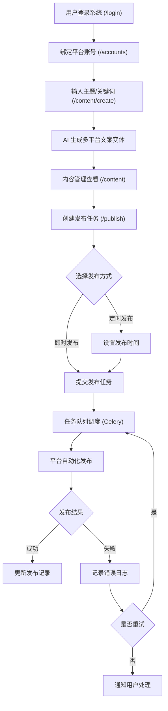
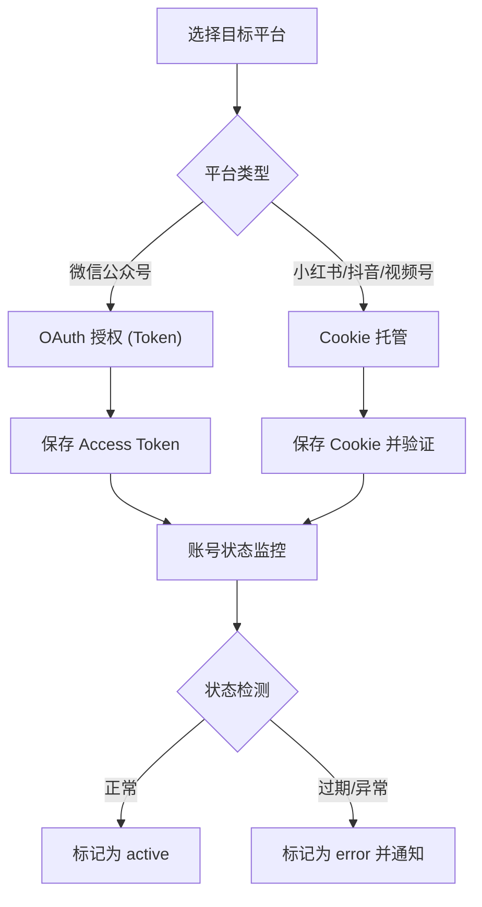

## 1. 产品概述

多平台矩阵管理与自动化发布系统 —— 一站式内容创作与分发平台，支持小红书、抖音、微信视频号、微信公众号等主流社交媒体账号的统一管理、AI 驱动的内容变体生成、智能排版以及多平台一键发布/定时发布。

- 解决内容运营团队在多平台管理中效率低下、重复操作繁琐的痛点
- 目标用户：内容运营团队、自媒体从业者、MCN 机构、品牌营销人员
- 核心价值：通过 AI 赋能 + 自动化引擎，将内容生产效率提升 10 倍

### 1.1 当前阶段状态

项目处于 **MVP 开发阶段**，已具备以下核心能力：
- 管理员邮箱登录（admin@admin.com / admin123）
- JWT 认证与路由鉴权守卫
- 仪表盘实时数据统计（总账号数、今日发布、待处理任务、AI 生成次数）
- 多平台账号管理（微信公众号、小红书、抖音、视频号）
- AI 内容生成（主题输入 → 多平台文案变体生成）
- 发布任务管理（创建、重试、状态追踪）
- 模板管理中心
- 模型配置管理（支持 OpenAI / DeepSeek / Moonshot / 智谱 AI 切换）
- Swagger API 在线文档

## 2. 核心功能

### 2.1 用户角色

| 角色     | 注册方式   | 核心权限                         |
| -------- | ---------- | -------------------------------- |
| 管理员   | 邮箱注册   | 系统管理、全部功能权限、账号分配 |
| 运营人员 | 管理员邀请 | 内容创建、发布管理、账号使用     |
| 审核人员 | 管理员邀请 | 内容审核、发布审批               |

### 2.2 功能模块

1. **仪表盘（Dashboard）**：数据概览（总账号数、今日发布、待处理任务、AI 生成次数）、平台账号健康度、最近发布记录
2. **账号矩阵管理**：多平台账号添加/删除/状态检查，支持 Cookie 授权管理
3. **AI 内容工坊**：主题输入 → AI 多平台文案变体生成（公众号/小红书/抖音/视频号）
4. **内容管理**：已生成内容列表查看、删除管理
5. **发布管理中心**：创建发布任务、任务状态队列（待发布/发布中/已发布/失败）、重试失败任务
6. **模板中心**：内容模板管理，支持按平台分类查看
7. **模型配置**：AI 模型提供方管理（OpenAI/DeepSeek/Moonshot/智谱 AI/自定义），支持 API Key、Base URL 配置
8. **API 文档**：内嵌 Swagger UI，在线查看和调试所有 API 接口

### 2.3 页面路由

| 路由                       | 页面名称     | 功能描述                                                   |
| -------------------------- | ------------ | ---------------------------------------------------------- |
| /login                     | 登录页       | 管理员邮箱登录，Apple 风格毛玻璃卡片设计                    |
| /                          | 仪表盘       | 展示总账号数、今日发布数、待处理任务数、AI 生成次数的统计卡片 |
| /                          | 仪表盘       | 账号健康度面板，实时展示各平台账号的在线占比                 |
| /                          | 仪表盘       | 最近发布记录，展示最近 5 条发布记录及状态                    |
| /accounts                  | 账号管理     | 卡片式展示所有已绑定账号，含平台图标、昵称、状态标签         |
| /accounts                  | 账号管理     | 弹窗表单添加新账号：选择平台 → 填写昵称 → 粘贴 Cookie/Token  |
| /accounts                  | 账号管理     | 账号状态刷新、删除账号                                      |
| /content                   | 内容管理     | 列表展示所有已创建内容，支持按平台筛选，支持删除              |
| /content/create            | 内容创建     | 输入主题/关键词 → 选择目标平台 → AI 生成多版本适配文案       |
| /publish                   | 发布管理     | 按平台筛选展示发布任务队列（待发布/发布中/已发布/失败）       |
| /publish                   | 发布管理     | 创建发布任务：选择内容 → 选择账号 → 设定计划时间              |
| /publish                   | 发布管理     | 重试失败任务                                                |
| /templates                 | 模板中心     | 按平台分类展示可用模板列表                                   |
| /settings/token-plan       | 模型配置     | 管理 AI 模型提供方，支持启用/禁用、编辑、删除                |
| /developer/docs            | API 文档     | 内嵌 Swagger UI，在线浏览和测试所有后端 API                  |

## 3. 核心流程

### 3.1 内容创作与发布主流程

用户登录系统后，首先在账号管理中绑定各平台账号。然后在内容创建页面中输入主题或关键词，AI 引擎自动生成适配不同平台风格的文案变体。选择目标内容和平台账号，设置即时或定时发布任务。

### 3.2 账号授权与管理流程

## 4. 用户界面设计

### 4.1 设计风格

- **整体风格**：现代 Apple 风格 SaaS 后台管理界面，毛玻璃效果 (backdrop-blur)，极简专业
- **主色调**：iOS 风格系统蓝 (#007AFF)，搭配深紫 (#5856D6)、翠绿 (#34C759)、橙色 (#FF9500)、天蓝 (#5AC8FA)
- **背景色**：浅灰 (#F5F5F7) 作为页面背景，白色毛玻璃面板 (#FFFFFF/80) 作为卡片和侧边栏
- **侧边栏**：白色毛玻璃 + 细微边框，支持折叠/展开，移动端汉堡菜单
- **登录页**：居中毛玻璃卡片设计，模糊渐变背景光斑，密码输入框 + 登录按钮
- **按钮风格**：圆角 (10-12px)，主按钮实心蓝色填充
- **字体**：系统字体栈 (-apple-system, BlinkMacSystemFont, "PingFang SC", "Helvetica Neue")
- **布局风格**：左侧固定导航 + 顶部面包屑 + 右侧内容区，响应式设计（桌面 → 平板 → 移动端）
- **图标风格**：Arco Design Vue 图标组件
- **UI 组件库**：Arco Design Vue + 自定义组件（StatCard、StatusBadge、PlatformIcon、Modal、SegmentedControl）

### 4.2 页面设计概览

| 页面名称     | 模块名称     | UI 元素                                                       |
| ------------ | ------------ | ------------------------------------------------------------- |
| 登录页       | 登录卡片     | 居中毛玻璃卡片，渐变光斑背景，Logo、邮箱/密码输入框、登录按钮 |
| 仪表盘       | 数据概览     | 4 个统计卡片（带图标和趋势百分比），渐入动画                   |
| 仪表盘       | 账号健康度   | 各平台在线比例进度条 + 平台图标                                |
| 仪表盘       | 最近发布     | 列表项 + 平台图标 + 状态标签 + 发布时间                        |
| 账号管理     | 账号卡片     | 卡片网格，平台图标 + 昵称 + 状态标签 + 操作按钮（刷新/删除）  |
| 账号管理     | 添加账号弹窗 | 电台选择 + 昵称输入 + Cookie 粘贴（带安全提示）               |
| 内容工坊     | AI 生成      | 左侧主题/关键词输入面板 + 平台多选 + 右侧多 Tab 预览面板       |
| 内容管理     | 内容列表     | 数据表格，平台筛选 + 删除操作                                  |
| 发布管理     | 任务列表     | Tab 维度（全部/待发布/已发布/失败）+ 创建弹窗 + 重试按钮       |
| 模板中心     | 模板列表     | 卡片网格，按平台分类，平台标签                                  |
| 模型配置     | 配置管理     | 提供方 Radio 选择 + API 配置表单 + 用量统计 + 启用/禁用开关    |
| API 文档     | Swagger UI   | iframe 内嵌后端 Swagger 文档页面                               |

### 4.3 响应式策略

- 桌面端优先设计（最小宽度 1280px）
- 侧边导航在 768px 以下折叠为移动端抽屉菜单（遮罩 + 滑动）
- 数据表格在移动端可水平滚动
- 统计卡片自适应网格布局（桌面 4 列 → 平板 2 列 → 手机 1 列）

## 5. 技术实现状态

### 5.1 已完成功能

- 管理员登录认证（JWT）
- 路由鉴权守卫（未登录 → /login，已登录 → /）
- 全页面真实后端 API 数据驱动（无 Mock 数据）
- 仪表盘实时聚合统计
- 账号 CRUD + 状态检测
- 内容 AI 生成 + 列表管理
- 发布任务创建与管理
- 模板列表查看
- 模型配置 CRUD
- Docker 容器化部署
- 空数据状态提示（各页面无数据时显示友好提示）

### 5.2 待开发功能

- 内容富文本编辑器
- 定时发布与即时发布区分（目前创建任务均走 Celery 调度）
- 图片/视频素材上传
- 发布历史时间线
- 发布详细日志查看
- 注册/邀请用户功能
- 内容审核工作流

### 5.3 已知技术债

- Celery Worker 容器偶发重启（缺少实际平台适配器实现触发）
- 发布任务创建接口当前为单账号模式（文档规划为多账号）
- 前端部分缺失数据字段需后端补齐（如账号粉丝数、内容媒体 URL）
