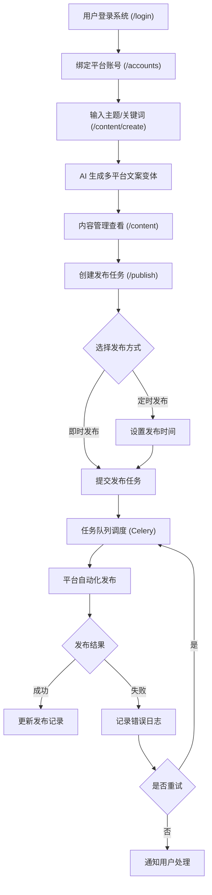
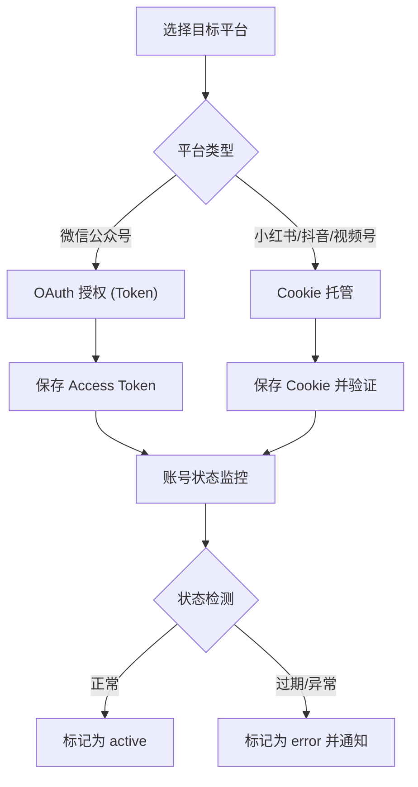

## 1. 产品概述

多平台矩阵管理与自动化发布系统 —— 一站式内容创作与分发平台，支持小红书、抖音、微信视频号、微信公众号等主流社交媒体账号的统一管理、AI 驱动的内容变体生成、智能排版以及多平台一键发布/定时发布。

- 解决内容运营团队在多平台管理中效率低下、重复操作繁琐的痛点
- 目标用户：内容运营团队、自媒体从业者、MCN 机构、品牌营销人员
- 核心价值：通过 AI 赋能 + 自动化引擎，将内容生产效率提升 10 倍

### 1.1 当前阶段状态

项目处于 **MVP 迭代阶段**，核心框架与权限中台已完成，已具备以下能力：
- 多角色 JWT 认证与基于权限表达式的路由鉴权守卫
- RBAC3 权限中台（角色继承、职责分离约束、权限表达式、用户自定义权限覆盖）
- 仪表盘实时数据统计（总账号数、今日发布、待处理任务、AI 生成次数）
- 多平台账号管理（微信公众号、小红书、抖音、视频号）
- AI 内容生成（主题输入 → 多平台文案变体生成）
- 发布任务管理（创建、重试、状态追踪）
- 内容审核工作流（提交/通过/驳回）
- 用户注册审核（非管理员创建用户需审批）
- SQL 变更审核（2 人审批通过后自动执行）
- 数据库控制台（SQL 执行 + 历史记录）
- 模板管理中心
- 模型配置管理（支持 OpenAI / DeepSeek / Moonshot / 智谱 AI 切换）
- Swagger API 在线文档

## 2. 核心功能

### 2.1 用户角色

| 角色 | 注册方式 | 核心权限 |
|------|----------|----------|
| 超级管理员 (admin) | 系统内置 | 全部权限，ID 固定为 "1" |
| 管理员 (manager) | 系统内置 | 系统管理、用户管理、权限配置（不含数据库权限） |
| 运营者 (operator) | 管理员创建 / 注册审核 | 内容创建、发布管理、平台账号使用 |
| 审核员 (reviewer) | 管理员创建 / 注册审核 | 内容审核、SQL 变更审核、模板管理 |

### 2.2 功能模块

1. **仪表盘（Dashboard）**：数据概览、平台账号健康度、最近发布记录
2. **平台账号管理**：多平台账号添加/删除/状态检查，支持 Cookie/Token 授权管理
3. **AI 内容工坊**：主题输入 → AI 多平台文案变体生成
4. **内容管理**：已生成内容列表查看、编辑、删除管理
5. **发布管理中心**：创建发布任务、任务状态队列、重试失败任务
6. **模板中心**：内容模板管理，支持按平台分类查看
7. **内容审核**：待审核内容列表、提交/通过/驳回审核
8. **SQL 变更审核**：SQL 变更申请提交、双人审批、自动执行
9. **用户注册审核**：非管理员用户创建申请的审批流程
10. **RBAC3 权限中台**：
    - 用户管理（创建、编辑、角色分配、自定义权限覆盖、密码管理）
    - 角色管理（CRUD、角色继承父子关系）
    - 权限管理（资源树、角色权限配置、权限枚举编辑）
    - 约束管理（互斥/先决/基数约束）
11. **数据库控制台**：SQL 执行、执行历史查看
12. **模型配置**：AI 模型提供方管理（OpenAI/DeepSeek/Moonshot/智谱 AI/自定义）
13. **API 文档**：内嵌 Swagger UI，在线查看和调试所有 API 接口
14. **通知中心**：系统通知的接收与已读标记

### 2.3 页面路由

| 路由 | 页面名称 | 功能描述 | 权限 Key |
|------|----------|----------|----------|
| /login | 登录页 | 邮箱登录，Apple 风格毛玻璃卡片 | 公开 |
| / | 仪表盘 | 数据统计、账号健康度、最近发布 | dashboard:read |
| /platforms | 平台管理 | 多平台账号 CRUD、状态检测 | platforms:read |
| /content | 内容列表 | 内容列表查看、筛选、删除 | content:read |
| /content/create | 创作内容 | AI 生成多平台文案变体 | content:read |
| /publish | 发布管理 | 发布任务队列、创建、重试 | publish:read |
| /review | 内容审核 | 待审核内容、通过/驳回 | review:read |
| /sql-review | SQL 审核 | SQL 变更申请列表、审批 | sql_review:read |
| /templates | 模板管理 | 按平台分类的模板列表 | templates:read |
| /settings/token-plan | Token 方案 | AI 模型配置管理 | token_plan:read |
| /settings/user-creation-review | 用户注册审核 | 用户创建申请的审批 | review:read |
| /developer/docs | API 文档 | 内嵌 Swagger UI | api_docs:read |
| /developer/database | 数据库控制台 | SQL 执行与历史记录 | db:read |
| /rbac/users | 用户管理 | 用户列表、角色分配入口 | users:read |
| /rbac/users/create | 创建用户 | 创建新用户（管理员直接创建/非管理员走审核） | users:create:write |
| /rbac/users/:id/edit | 编辑用户 | 编辑用户基本信息和角色 | users:update:read \|\| isSelf(id) |
| /rbac/users/:id/password | 修改密码 | 修改用户密码 | users:change_password:write \|\| isSelf(id) |
| /rbac/users/:id/permissions | 自定义权限 | 用户级权限覆盖配置 | users:custom_permissions:read \|\| isSelf(id) |
| /rbac/roles | 角色管理 | 角色 CRUD、父子关系配置 | roles:read |
| /rbac/permissions | 权限管理 | 按资源树配置角色权限 | permissions:read |
| /rbac/permissions/enum | 权限字典管理 | 超级管理员专用：权限枚举编辑 | permissions:manage:read |
| /rbac/permissions/enum/create | 新增权限字典 | 创建新的资源与权限枚举 | permissions:manage:write |
| /rbac/permissions/enum/edit/:resourceId | 编辑权限字典 | 编辑指定资源的权限枚举 | permissions:manage:write |
| /rbac/constraints | 约束管理 | 互斥/先决/基数约束 | constraints:read |
| /profile | 个人中心 | 当前用户信息查看与编辑 | 登录即可 |
| /403 | 无权限页 | 权限不足提示页 | 无条件放行 |

> **权限表达式说明**：部分路由的 `permKey` 使用权限表达式而非单一权限 key（如 `users:update:read || isSelf(id)`）。表达式支持以下运算符与内置函数：
> - 运算符：`||`（或）、`&`（与）、`!`（非）、`()`（分组）
> - 内置函数：`isSelf(id)`（是否本人）、`isAdmin()`（是否管理员）、`isSuperAdmin()`、`isBuiltInAdmin(id)`、`isOwnAccount(account)`、`isOwnContent(content)`、`hasSameRole(target_user)` 等
> - 路由守卫在 `hasPerm` 中将 `to.query` 与 `to.params` 合并为上下文传入 `permStore.hasPermission(keyOrExpr, ctx)`，由前端表达式解析器求值；后端 `require_permission` 通过 `is_expression()` 判断后调用 `evaluate_permission` 求值。

## 3. 核心流程

### 3.1 内容创作与发布主流程

用户登录系统后，首先在账号管理中绑定各平台账号。然后在内容创建页面中输入主题或关键词，AI 引擎自动生成适配不同平台风格的文案变体。选择目标内容和平台账号，设置即时或定时发布任务。

```mermaid
flowchart TD
    A["用户登录系统 (/login)"] --> B["绑定平台账号 (/accounts)"]
    B --> C["输入主题/关键词 (/content/create)"]
    C --> D["AI 生成多平台文案变体"]
    D --> E["内容管理查看 (/content)"]
    E --> F["创建发布任务 (/publish)"]
    F --> G{"选择发布方式"}
    G -->|"即时发布"| H["提交发布任务"]
    G -->|"定时发布"| I["设置发布时间"]
    I --> H
    H --> J["任务队列调度 (Celery)"]
    J --> K["平台自动化发布"]
    K --> L{"发布结果"}
    L -->|"成功"| M["更新发布记录"]
    L -->|"失败"| N["记录错误日志"]
    N --> O{"是否重试"}
    O -->|"是"| J
    O -->|"否"| P["通知用户处理"]
```

### 3.2 账号授权与管理流程

```mermaid
flowchart TD
    A["选择目标平台"] --> B{"平台类型"}
    B -->|"微信公众号"| C["OAuth 授权 (Token)"]
    B -->|"小红书/抖音/视频号"| D["Cookie 托管"]
    C --> E["保存 Access Token"]
    D --> F["保存 Cookie 并验证"]
    E --> G["账号状态监控"]
    F --> G
    G --> H{"状态检测"}
    H -->|"正常"| I["标记为 active"]
    H -->|"过期/异常"| J["标记为 error 并通知"]
```

## 4. 用户界面设计

### 4.1 设计风格

- **整体风格**：现代 Apple 风格 SaaS 后台管理界面，毛玻璃效果 (backdrop-blur)，极简专业
- **主色调**：iOS 风格系统蓝 (#007AFF)，搭配深紫 (#5856D6)、翠绿 (#34C759)、橙色 (#FF9500)、天蓝 (#5AC8FA)
- **背景色**：浅灰 (#F5F5F7) 作为页面背景，白色毛玻璃面板 (#FFFFFF/80) 作为卡片和侧边栏
- **侧边栏**：白色毛玻璃 + 细微边框，支持折叠/展开，移动端汉堡菜单
- **登录页**：居中毛玻璃卡片设计，模糊渐变背景光斑，密码输入框 + 登录按钮
- **按钮风格**：圆角 (10-12px)，主按钮实心蓝色填充
- **字体**：系统字体栈 (-apple-system, BlinkMacSystemFont, "PingFang SC", "Helvetica Neue")
- **布局风格**：左侧固定导航 + 顶部面包屑 + 右侧内容区，响应式设计（桌面 → 平板 → 移动端）
- **图标风格**：Arco Design Vue 图标组件
- **UI 组件库**：Arco Design Vue + 自定义组件（StatCard、StatusBadge、PlatformIcon、Modal、SegmentedControl）

### 4.2 页面设计概览

| 页面名称     | 模块名称     | UI 元素                                                       |
| ------------ | ------------ | ------------------------------------------------------------- |
| 登录页       | 登录卡片     | 居中毛玻璃卡片，渐变光斑背景，Logo、邮箱/密码输入框、登录按钮 |
| 仪表盘       | 数据概览     | 4 个统计卡片（带图标和趋势百分比），渐入动画                   |
| 仪表盘       | 账号健康度   | 各平台在线比例进度条 + 平台图标                                |
| 仪表盘       | 最近发布     | 列表项 + 平台图标 + 状态标签 + 发布时间                        |
| 账号管理     | 账号卡片     | 卡片网格，平台图标 + 昵称 + 状态标签 + 操作按钮（刷新/删除）  |
| 账号管理     | 添加账号弹窗 | 电台选择 + 昵称输入 + Cookie 粘贴（带安全提示）               |
| 内容工坊     | AI 生成      | 左侧主题/关键词输入面板 + 平台多选 + 右侧多 Tab 预览面板       |
| 内容管理     | 内容列表     | 数据表格，平台筛选 + 删除操作                                  |
| 发布管理     | 任务列表     | Tab 维度（全部/待发布/已发布/失败）+ 创建弹窗 + 重试按钮       |
| 模板中心     | 模板列表     | 卡片网格，按平台分类，平台标签                                  |
| 模型配置     | 配置管理     | 提供方 Radio 选择 + API 配置表单 + 用量统计 + 启用/禁用开关    |
| API 文档     | Swagger UI   | iframe 内嵌后端 Swagger 文档页面                               |

### 4.3 响应式策略

- 桌面端优先设计（最小宽度 1280px）
- 侧边导航在 768px 以下折叠为移动端抽屉菜单（遮罩 + 滑动）
- 数据表格在移动端可水平滚动
- 统计卡片自适应网格布局（桌面 4 列 → 平板 2 列 → 手机 1 列）

## 5. 技术实现状态

### 5.1 已完成功能

- 多角色 JWT 认证与基于权限表达式的路由鉴权守卫
- RBAC3 权限中台（角色继承、约束、权限表达式、用户自定义权限覆盖）
- 权限表达式 DSL（前后端统一的 `||`、`&`、`!`、`()` 运算符 + isSelf/isAdmin 等内置函数，前端 `utils/permExpression.ts` + 后端 `services/perm_expression.py`）
- 权限字典编辑页（`/rbac/permissions/enum/create` 与 `/rbac/permissions/enum/edit/:resourceId`，资源与权限枚举的增删改）
- 角色继承关系可视化（`RoleInheritanceTree.vue` 组件 + `/api/v2/roles/{id}/inheritance` 接口，展示祖先链与后代树及各层级直接权限）
- 权限覆盖预览（`/api/v2/roles/{id}/permissions/preview/{parent_role_id}` 预览添加父角色后继承的权限）
- 仪表盘实时聚合统计（账号数、发布数、待处理任务、AI 生成次数）
- 平台账号 CRUD + 状态检测（微信公众号、小红书、抖音、视频号）
- 内容 AI 生成 + 列表管理
- 发布任务创建与管理（待发布/发布中/已发布/失败/重试）
- 内容审核工作流（提交/通过/驳回）
- 用户注册审核（非管理员创建用户需审批）
- SQL 变更审核（双人审批通过后自动执行）
- 数据库控制台（SQL 执行 + 历史记录）
- 模板列表查看
- 模型配置 CRUD（OpenAI / DeepSeek / Moonshot / 智谱 AI / 自定义）
- 通知中心（未读计数、已读标记）
- Docker 容器化部署
- 空数据状态提示

### 5.2 待开发功能

- 内容富文本编辑器
- 定时发布与即时发布区分（目前创建任务均走 Celery 调度）
- 图片/视频素材上传与管理
- 发布历史时间线
- 发布详细日志查看
- 平台适配器实际发布实现（目前为模拟发布）

### 5.3 已知技术债

- Celery Worker 容器偶发重启（缺少实际平台适配器实现触发）
- 发布任务创建接口当前为单账号模式（文档规划为多账号）
- 前端部分缺失数据字段需后端补齐（如账号粉丝数、内容媒体 URL）
