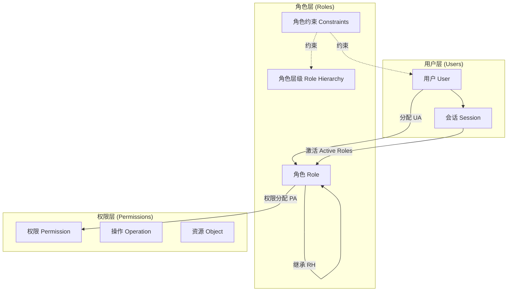
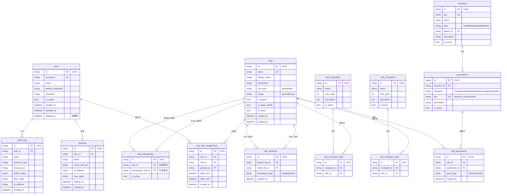

# RBAC3 权限与账号管理系统技术设计文档

## 1. 概述

### 1.1 设计目标

构建一套符合 **RBAC3（Role-Based Access Control 3）** 标准的权限与账号管理系统，支持：

- **角色继承（RBAC1）**：通过角色层级实现权限的自动继承与聚合
- **职责分离（RBAC2）**：通过静态/动态约束防止权限过度集中与利益冲突
- **用户-角色-权限关联（RBAC0）**：基础授权三元组
- **会话级动态授权（RBAC3）**：用户可在会话中选择性激活角色子集

### 1.2 RBAC3 模型组成



### 1.3 术语表

| 术语 | 英文 | 说明 |
|------|------|------|
| 用户 | User | 系统的使用者实体 |
| 角色 | Role | 一组权限的命名集合，代表岗位或职责 |
| 权限 | Permission | 对某资源执行某操作的许可，支持读/写分离 |
| 操作 | Operation | 对资源的具体动作，如 create/read/update/delete/execute |
| 资源 | Resource | 受保护的实体或功能模块 |
| 会话 | Session | 用户登录后的上下文，可激活角色子集 |
| 角色层级 | Role Hierarchy | 角色之间的父子继承关系 |
| SSD | Static Separation of Duties | 静态职责分离：角色不可同时授予同一用户 |
| DSD | Dynamic Separation of Duties | 动态职责分离：角色不可在同一会话中同时激活 |
| 基数约束 | Cardinality Constraint | 限制角色可分配的用户数、角色可继承的子角色数等 |
| 先决条件 | Prerequisite Role | 获得某角色前必须先拥有某角色 |

---

## 2. 核心模型设计

### 2.1 实体关系图



### 2.2 模型详细说明

#### 2.2.1 用户（users）

| 字段 | 类型 | 说明 |
|------|------|------|
| id | UUID | 主键 |
| username | string | 登录名，唯一 |
| email | string | 邮箱，唯一，可空 |
| hashed_password | string | bcrypt 哈希密码 |
| nickname | string | 显示名称 |
| is_active | boolean | 是否启用 |
| created_at | datetime | 创建时间 |
| updated_at | datetime | 更新时间 |
| deleted_at | datetime | 软删除时间 |

**设计要点**：
- 删除用户时采用软删除，保留审计记录
- 用户本身不直接拥有权限，权限完全通过角色和会话派生

#### 2.2.2 角色（roles）

| 字段 | 类型 | 说明 |
|------|------|------|
| id | UUID | 主键 |
| name | string | 角色标识，唯一 |
| display_name | string | 显示名称 |
| description | text | 描述 |
| role_type | enum | `admin` 管理类型 / `other` 其他类型 |
| scope | enum | `system` 系统级 / `tenant` 租户级 |
| is_system | boolean | 是否为系统内置角色（不可删除） |
| is_super_admin | boolean | 是否为超级管理员角色 |
| is_active | boolean | 是否启用 |

**系统内置角色**：

| 角色名 | 显示名 | role_type | 说明 |
|--------|--------|-----------|------|
| super_admin | 超级管理员 | admin | 系统唯一，拥有所有权限，不可编辑 |
| admin | 管理员 | admin | 系统管理，可配置所有权限 |
| manager | 业务管理员 | admin | 业务管理，通常不接触数据库敏感权限 |
| operator | 运营者 | other | 日常运营操作 |
| reviewer | 审核员 | other | 内容/数据审核 |
| auditor | 审计员 | other | 只读查看日志与数据，用于合规 |

#### 2.2.3 角色层级（role_hierarchy）

| 字段 | 类型 | 说明 |
|------|------|------|
| id | UUID | 主键 |
| parent_role_id | UUID | 父角色 |
| child_role_id | UUID | 子角色 |
| inheritance_type | enum | `implicit` 隐式继承 / `explicit` 显式继承 |

**继承规则**：
- 子角色自动拥有父角色的所有权限
- 支持多级继承（传递闭包）
- 禁止循环继承（通过有向无环图 DAG 校验）

**示例层级**：

```
super_admin
    └─ admin
        ├─ manager
        │   └─ team_lead
        │       └─ operator
        └─ auditor
```

#### 2.2.4 资源（resources）

| 字段 | 类型 | 说明 |
|------|------|------|
| id | UUID | 主键 |
| key | string | 资源标识，唯一 |
| name | string | 显示名称 |
| type | enum | `module`/`page`/`api`/`data`/`action` |
| parent_id | UUID | 父资源，支持树形结构 |
| description | text | 描述 |

**资源分类示例**：

| type | 示例 |
|------|------|
| module | `content_module`, `publish_module`, `system_module` |
| page | `dashboard_page`, `accounts_page` |
| api | `accounts_api`, `contents_api` |
| data | `user_data`, `account_data` |
| action | `publish_action`, `review_action` |

#### 2.2.5 权限（permissions）

| 字段 | 类型 | 说明 |
|------|------|------|
| id | UUID | 主键 |
| resource_id | UUID | 关联资源 |
| operation | enum | `create`/`read`/`update`/`delete`/`execute`/`approve`/`reject` |
| key | string | 权限键，如 `accounts:read`, `accounts:create` |
| description | text | 描述 |

**权限键格式**：

```
{resource_key}:{operation}
```

示例：
- `accounts:create` — 创建平台账号
- `users:update` — 编辑用户
- `db:execute` — 执行 SQL
- `review:approve` — 审核通过

#### 2.2.6 角色权限关联（role_permissions）

| 字段 | 类型 | 说明 |
|------|------|------|
| id | UUID | 主键 |
| role_id | UUID | 角色 |
| permission_id | UUID | 权限 |
| grant_type | enum | `direct` 直接分配 / `inherited` 继承而来 |

**设计要点**：
- 直接分配的权限可单独撤销
- 继承权限随层级关系自动变化，不可单独撤销
- 查询角色权限时聚合 direct + inherited

#### 2.2.7 用户角色分配（user_role_assignments）

| 字段 | 类型 | 说明 |
|------|------|------|
| id | UUID | 主键 |
| user_id | UUID | 用户 |
| role_id | UUID | 角色 |
| granted_by | UUID | 授权人 |
| valid_from | datetime | 生效时间 |
| valid_until | datetime | 过期时间（可空，表示永久） |
| created_at | datetime | 创建时间 |

**设计要点**：
- 支持时间窗口控制（valid_from / valid_until）
- 支持临时授权与自动过期
- 删除用户或角色时保留历史分配记录（用于审计）

#### 2.2.8 会话（sessions）

| 字段 | 类型 | 说明 |
|------|------|------|
| id | UUID | 主键 |
| user_id | UUID | 用户 |
| token | string | JWT 令牌 |
| active_role_ids | jsonb | 当前会话激活的角色 ID 列表 |
| ip_address | string | 登录 IP |
| user_agent | string | 浏览器 UA |
| expires_at | datetime | 过期时间 |
| created_at | datetime | 创建时间 |

**设计要点**：
- 用户登录后可选择激活部分已分配角色（受 DSD 约束限制）
- 会话中的权限 = 激活角色权限的并集
- 默认激活所有无冲突的角色

---

## 3. 职责分离与约束机制

### 3.1 静态职责分离（SSD）

**定义**：限制同一用户不能同时被分配某些角色集合中的过多角色。

| 字段 | 说明 |
|------|------|
| name | 约束名称 |
| max_roles | 该约束组中一个用户最多可拥有的角色数 |
| roles | 受约束的角色列表 |

**典型场景**：

| 约束名 | 角色集合 | max_roles | 说明 |
|--------|----------|-----------|------|
| ssd_finance | 财务审批员、财务执行员 | 1 | 同一人不能既审批又执行 |
| ssd_content | 内容创作者、内容审核员 | 1 | 同一人不能既创作又审核 |
| ssd_db | 数据库管理员、数据库审计员 | 1 | 同一人不能既管理又审计 |

**校验时机**：
- 给用户分配角色时
- 修改角色层级时（可能导致用户通过继承违反 SSD）

### 3.2 动态职责分离（DSD）

**定义**：限制同一用户在同一个会话中不能同时激活某些角色集合中的过多角色。

| 字段 | 说明 |
|------|------|
| name | 约束名称 |
| max_roles | 该约束组中一个会话最多可激活的角色数 |
| roles | 受约束的角色列表 |

**典型场景**：

| 约束名 | 角色集合 | max_roles | 说明 |
|--------|----------|-----------|------|
| dsd_review | 内容提交员、内容审核员 | 1 | 同一登录会话不能同时提交和审核 |
| dsd_admin | 系统管理员、审计员 | 1 | 同一登录会话不能同时管理和审计 |

**校验时机**：
- 用户登录激活角色时
- 会话中切换/激活角色时
- 角色分配变更影响已有会话时

### 3.3 基数约束

| 约束对象 | 说明 | 默认值 |
|----------|------|--------|
| 角色最大用户数 | 某角色最多分配给多少用户 | 无限制 |
| 用户最大角色数 | 一个用户最多拥有多少角色 | 50 |
| 角色最大子角色数 | 一个角色最多有多少直接子角色 | 20 |
| 角色最大父角色数 | 一个角色最多有多少直接父角色 | 5 |
| 会话最大角色数 | 一个会话最多激活多少角色 | 10 |

### 3.4 先决条件约束

**定义**：用户必须已经拥有某角色（先决角色），才能被分配目标角色。

| 目标角色 | 先决角色 | 说明 |
|----------|----------|------|
| admin | manager | 必须先有 manager 才能分配 admin |
| manager | operator | 必须先有 operator 才能分配 manager |
| db_admin | admin | 必须先有 admin 才能分配数据库管理员 |

**校验时机**：
- 创建用户角色分配时
- 创建角色层级时

### 3.5 角色类型约束

保留现有系统的 `role_type` 概念：

| role_type | 可分配权限范围 |
|-----------|----------------|
| admin | 全部权限，包括数据库、系统管理、权限管理等敏感权限 |
| other | 只能分配业务操作权限，不可分配数据库、系统管理类权限 |

---

## 4. 权限解析算法

### 4.1 用户有效权限计算

```python
async def get_user_effective_permissions(
    user_id: str,
    session_id: Optional[str] = None
) -> Dict[str, PermissionAccess]:
    """
    计算用户在当前上下文中的有效权限。
    """
    # 1. 获取用户已分配的角色（含时间窗口校验）
    assigned_roles = await get_assigned_roles(user_id, at_time=now())

    # 2. 如果指定了会话，则只取会话中激活的角色
    if session_id:
        active_role_ids = await get_session_active_roles(session_id)
        # DSD 校验
        await validate_dsd(active_role_ids)
        roles = [r for r in assigned_roles if r.id in active_role_ids]
    else:
        roles = assigned_roles

    # 3. 展开角色层级，获取每个角色的所有祖先角色
    all_role_ids = set()
    for role in roles:
        all_role_ids.add(role.id)
        ancestors = await get_role_ancestors(role.id)
        all_role_ids.update([a.id for a in ancestors])

    # 4. 查询这些角色的直接权限和继承权限
    permissions = await get_permissions_by_roles(all_role_ids)

    # 5. 按权限键聚合，读/写权限取并集
    result = {}
    for perm in permissions:
        key = perm.resource_key + ":" + perm.operation
        if key not in result:
            result[key] = PermissionAccess(read=False, write=False)
        if perm.operation in ("read", "execute"):
            result[key].read = True
        if perm.operation in ("create", "update", "delete", "approve", "reject", "execute"):
            result[key].write = True

    # 6. 超级管理员短路返回所有权限
    if await is_super_admin(user_id):
        return get_all_permissions_with_full_access()

    return result
```

### 4.2 角色祖先展开算法

```python
async def get_role_ancestors(role_id: str) -> List[Role]:
    """
    获取某角色的所有祖先角色（通过层级关系向上递归）。
    使用 DFS + visited 集合防止循环。
    """
    ancestors = []
    visited = set()
    stack = [role_id]

    while stack:
        current_id = stack.pop()
        if current_id in visited:
            continue
        visited.add(current_id)

        parents = await db.execute(
            select(Role)
            .join(RoleHierarchy, Role.id == RoleHierarchy.parent_role_id)
            .where(RoleHierarchy.child_role_id == current_id)
        )
        for parent in parents.scalars().all():
            ancestors.append(parent)
            stack.append(parent.id)

    return ancestors
```

### 4.3 SSD 校验算法

```python
async def validate_ssd(user_id: str, new_role_id: Optional[str] = None) -> None:
    """
    校验静态职责分离约束。
    """
    user_role_ids = set(await get_user_role_ids(user_id))
    if new_role_id:
        user_role_ids.add(new_role_id)

    constraints = await db.execute(select(SSDConstraint).where(SSDConstraint.is_active == True))
    for constraint in constraints.scalars().all():
        role_ids_in_constraint = set(await get_constraint_role_ids(constraint.id))
        count = len(user_role_ids & role_ids_in_constraint)
        if count > constraint.max_roles:
            raise SSDViolationError(
                f"违反静态职责分离约束 {constraint.name}: "
                f"用户在该角色集合中最多只能拥有 {constraint.max_roles} 个角色"
            )
```

### 4.4 DSD 校验算法

```python
async def validate_dsd(active_role_ids: List[str]) -> None:
    """
    校验动态职责分离约束。
    """
    constraints = await db.execute(select(DSDConstraint).where(DSDConstraint.is_active == True))
    for constraint in constraints.scalars().all():
        role_ids_in_constraint = set(await get_constraint_role_ids(constraint.id))
        count = len(set(active_role_ids) & role_ids_in_constraint)
        if count > constraint.max_roles:
            raise DSDViolationError(
                f"违反动态职责分离约束 {constraint.name}: "
                f"当前会话在该角色集合中最多只能激活 {constraint.max_roles} 个角色"
            )
```

---

## 5. API 接口设计

### 5.1 用户管理

| 方法 | 路径 | 说明 | 权限 |
|------|------|------|------|
| GET | /api/v2/users | 用户列表 | users:read |
| POST | /api/v2/users | 创建用户 | users:create |
| GET | /api/v2/users/{id} | 用户详情 | users:read |
| PUT | /api/v2/users/{id} | 更新用户 | users:update |
| DELETE | /api/v2/users/{id} | 删除用户（软删除） | users:delete |
| POST | /api/v2/users/{id}/roles | 分配角色 | user_roles:assign |
| DELETE | /api/v2/users/{id}/roles/{role_id} | 撤销角色 | user_roles:revoke |
| GET | /api/v2/users/{id}/permissions | 用户有效权限 | users:read |

### 5.2 角色管理

| 方法 | 路径 | 说明 | 权限 |
|------|------|------|------|
| GET | /api/v2/roles | 角色列表 | roles:read |
| POST | /api/v2/roles | 创建角色 | roles:create |
| GET | /api/v2/roles/{id} | 角色详情 | roles:read |
| PUT | /api/v2/roles/{id} | 更新角色 | roles:update |
| DELETE | /api/v2/roles/{id} | 删除角色 | roles:delete |
| GET | /api/v2/roles/{id}/permissions | 角色权限 | roles:read |
| PUT | /api/v2/roles/{id}/permissions | 更新角色权限 | roles:update |
| POST | /api/v2/roles/{id}/parents | 添加父角色 | roles:hierarchy:manage |
| DELETE | /api/v2/roles/{id}/parents/{parent_id} | 移除父角色 | roles:hierarchy:manage |
| GET | /api/v2/roles/{id}/ancestors | 祖先角色 | roles:read |
| GET | /api/v2/roles/{id}/descendants | 后代角色 | roles:read |

### 5.3 权限管理

| 方法 | 路径 | 说明 | 权限 |
|------|------|------|------|
| GET | /api/v2/permissions | 权限列表 | permissions:read |
| POST | /api/v2/permissions | 创建权限 | permissions:create |
| GET | /api/v2/permissions/{id} | 权限详情 | permissions:read |
| PUT | /api/v2/permissions/{id} | 更新权限 | permissions:update |
| DELETE | /api/v2/permissions/{id} | 删除权限 | permissions:delete |
| GET | /api/v2/resources | 资源列表 | permissions:read |
| POST | /api/v2/resources | 创建资源 | permissions:create |

### 5.4 约束管理

| 方法 | 路径 | 说明 | 权限 |
|------|------|------|------|
| GET | /api/v2/constraints/ssd | SSD 约束列表 | constraints:read |
| POST | /api/v2/constraints/ssd | 创建 SSD 约束 | constraints:create |
| PUT | /api/v2/constraints/ssd/{id} | 更新 SSD 约束 | constraints:update |
| DELETE | /api/v2/constraints/ssd/{id} | 删除 SSD 约束 | constraints:delete |
| GET | /api/v2/constraints/dsd | DSD 约束列表 | constraints:read |
| POST | /api/v2/constraints/dsd | 创建 DSD 约束 | constraints:create |
| PUT | /api/v2/constraints/dsd/{id} | 更新 DSD 约束 | constraints:update |
| DELETE | /api/v2/constraints/dsd/{id} | 删除 DSD 约束 | constraints:delete |

### 5.5 会话管理

| 方法 | 路径 | 说明 | 权限 |
|------|------|------|------|
| POST | /api/v2/sessions | 创建会话（登录） | 公开 |
| DELETE | /api/v2/sessions/{id} | 销毁会话（登出） | 本人 |
| PUT | /api/v2/sessions/{id}/roles | 切换会话激活角色 | 本人 |
| GET | /api/v2/sessions/{id}/permissions | 会话有效权限 | 本人 |

---

## 6. 前端权限控制设计

### 6.1 权限中心状态

```typescript
interface PermissionState {
  // 用户拥有的全部角色
  roles: Role[]
  // 当前会话激活的角色
  activeRoleIds: string[]
  // 当前有效权限映射
  permissions: Record<string, PermissionAccess>
  // 是否超级管理员
  isSuperAdmin: boolean
}

interface PermissionAccess {
  read: boolean
  write: boolean
}
```

### 6.2 权限检查函数

```typescript
// 检查是否有某权限（读/写）
function hasPermission(key: string, mode: 'read' | 'write' = 'read'): boolean

// 检查是否有任一权限
function hasAnyPermission(keys: string[], mode?: 'read' | 'write'): boolean

// 检查是否有所有权限
function hasAllPermissions(keys: string[], mode?: 'read' | 'write'): boolean

// 检查是否属于某角色
function hasRole(roleName: string): boolean

// 检查会话中是否激活某角色
function hasActiveRole(roleName: string): boolean
```

### 6.3 路由守卫

```typescript
router.beforeEach(async (to, from, next) => {
  const requiresAuth = to.meta.requiresAuth !== false
  const requiredPermissions = to.meta.permissions as string[] | undefined

  if (requiresAuth && !isAuthenticated()) {
    return next('/login')
  }

  if (requiredPermissions && requiredPermissions.length > 0) {
    const hasAccess = requiredPermissions.some(key => hasPermission(key, 'read'))
    if (!hasAccess) {
      return next('/403')
    }
  }

  next()
})
```

### 6.4 组件级权限指令

```vue
<!-- 有写权限才显示 -->
<button v-permission="'accounts:create'">添加账号</button>

<!-- 读权限显示，写权限可编辑 -->
<permission-wrapper perm-key="accounts" mode="write">
  <input v-model="form.name" />
</permission-wrapper>
```

---

## 7. 与现有系统的兼容设计

### 7.1 迁移路径

现有系统使用简化版 RBAC0 + 自定义角色 + 用户权限覆盖。迁移到 RBAC3 采用双轨并行策略：

| 阶段 | 工作 | 说明 |
|------|------|------|
| 阶段 1 | 数据模型扩展 | 新增 `role_hierarchy`、`ssd_constraints`、`dsd_constraints`、`role_prerequisites`、`sessions` 等表 |
| 阶段 2 | 兼容层实现 | 保留现有 `users.role` 字段，通过触发器/迁移脚本生成 RBAC3 结构中的角色分配 |
| 阶段 3 | API 双版本 | 现有 `/api/*` 继续工作，新增 `/api/v2/*` 提供 RBAC3 完整能力 |
| 阶段 4 | 前端渐进升级 | 新增 RBAC3 权限管理页面，逐步替换旧页面 |
| 阶段 5 | 下线旧系统 | 完成迁移后，移除兼容层和旧 API |

### 7.2 现有数据映射

| 现有模型 | 映射到 RBAC3 |
|----------|--------------|
| users.role | user_role_assignments 中指向内置角色 |
| custom_roles | roles（is_system=false） |
| role_permissions | role_permissions（grant_type=direct） |
| user_permissions | 通过创建一个用户专属角色或保留用户级覆盖层实现 |

### 7.3 兼容层 API

```python
# 保留现有 API 行为
GET /api/permissions/all  →  调用 RBAC3 权限解析，返回兼容格式
PUT /api/permissions/role/{role}  →  同步更新 role_permissions
GET /api/permissions/user/{user_id}  →  返回 effective + custom 权限
```

---

## 8. 安全设计

### 8.1 最小权限原则

- 默认只给用户分配必要角色
- 会话默认只激活无冲突的角色子集
- 敏感操作需要 `write` 权限

### 8.2 审计日志

| 事件 | 记录内容 |
|------|----------|
| 用户创建/删除 | 操作人、时间、IP、变更前后值 |
| 角色分配/撤销 | 被操作人、角色、授权人、时间 |
| 权限变更 | 角色、权限变化、操作人 |
| 角色层级变更 | 父角色、子角色、操作人 |
| 登录/登出 | 用户、IP、UA、时间 |
| SSD/DSD 违规尝试 | 用户、尝试操作、约束名 |

### 8.3 防御措施

- 所有角色层级变更前进行 DAG 校验，禁止循环继承
- 所有角色分配前进行 SSD 校验
- 所有会话激活前进行 DSD 校验
- 所有权限变更受 `permissions:update` 写权限保护
- 超级管理员角色不可删除、不可编辑权限、不可分配给新用户

---

## 9. 实现路线图

| 阶段 | 周期 | 交付物 |
|------|------|--------|
| 阶段 1 | 1 周 | 数据库模型扩展、角色层级表、约束表 |
| 阶段 2 | 1 周 | RBAC3 权限解析服务、约束校验服务 |
| 阶段 3 | 1 周 | `/api/v2/*` API 接口、兼容层 |
| 阶段 4 | 1 周 | 前端权限管理页面、角色层级编辑器、约束配置器 |
| 阶段 5 | 1 周 | 审计日志、集成测试、迁移脚本 |
| 阶段 6 | 1 周 | 灰度切换、旧系统下线 |

---

## 10. 附录

### 10.1 内置权限清单

| 资源键 | 操作 | 权限键 | 说明 |
|--------|------|--------|------|
| users | create | users:create | 创建用户 |
| users | read | users:read | 查看用户 |
| users | update | users:update | 编辑用户 |
| users | delete | users:delete | 删除用户 |
| roles | create | roles:create | 创建角色 |
| roles | read | roles:read | 查看角色 |
| roles | update | roles:update | 编辑角色 |
| roles | delete | roles:delete | 删除角色 |
| permissions | create | permissions:create | 创建权限 |
| permissions | read | permissions:read | 查看权限 |
| permissions | update | permissions:update | 编辑权限 |
| permissions | delete | permissions:delete | 删除权限 |
| constraints | create | constraints:create | 创建约束 |
| constraints | read | constraints:read | 查看约束 |
| constraints | update | constraints:update | 编辑约束 |
| constraints | delete | constraints:delete | 删除约束 |
| sessions | read | sessions:read | 查看会话 |
| sessions | delete | sessions:delete | 销毁会话 |
| audit_logs | read | audit_logs:read | 查看审计日志 |

### 10.2 关键决策

1. **为什么不直接替换现有系统？** 现有业务已依赖简化 RBAC，采用双轨兼容可平滑迁移，避免业务中断。
2. **为什么保留用户级权限覆盖？** 部分场景需要临时给用户单独加权限，可通过创建"用户专属动态角色"或保留 user_permissions 覆盖层实现。
3. **为什么角色 ID 使用 UUID？** 与现有系统保持一致，支持多租户和分布式部署。
4. **为什么权限操作不只有 CRUD？** 引入 approve/reject/execute 以支持审核、SQL 执行等特殊业务动作。
