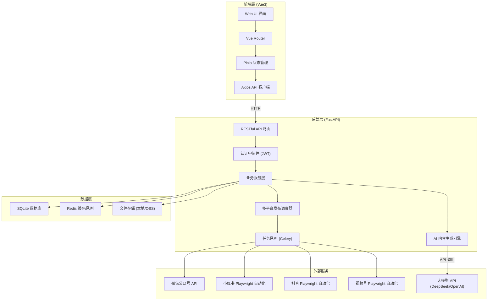
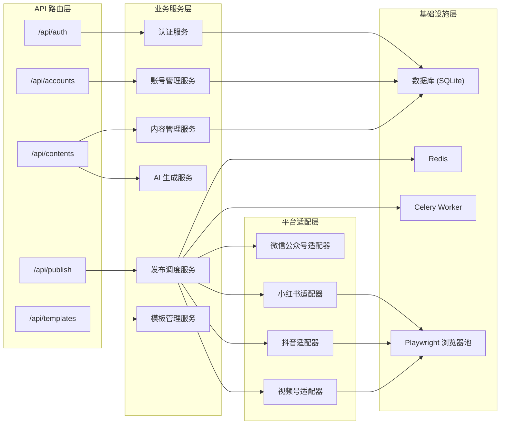
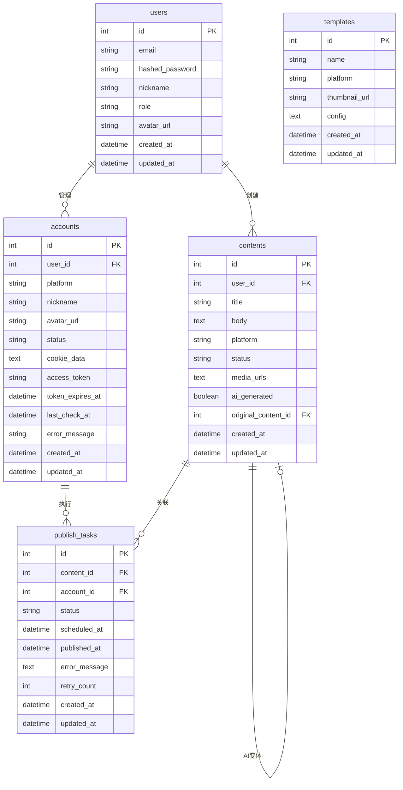

## 1. 架构设计



## 2. 技术说明

- **前端**：Vue 3 + TypeScript + TailwindCSS + Vite ^8
- **前端初始化**：`pnpm create vite@latest . --template vue-ts --force`
- **UI 组件库**：自定义组件（基于 TailwindCSS）,Arco Design Vue，后续可集成 Semi Design
- **状态管理**：Pinia（Vue 3 官方推荐）
- **后端**：Python 3.11+ / FastAPI
- **数据库**：SQLite（开发阶段）→ PostgreSQL（生产阶段）
- **ORM**：SQLAlchemy 2.0 + Alembic（数据库迁移）
- **任务队列**：Celery + Redis
- **缓存**：Redis
- **自动化**：Playwright（浏览器自动化）
- **AI 接入**：OpenAI 兼容 API（支持 DeepSeek / OpenAI 切换）
- **容器化**：Docker + Docker Compose

## 3. 路由定义

| 路由              | 用途                  |
| ----------------- | --------------------- |
| /                 | 仪表盘（数据概览）    |
| /accounts         | 账号矩阵管理          |
| /accounts/add     | 添加新平台账号        |
| /content          | 内容列表              |
| /content/create   | 创建新内容（AI 生成） |
| /content/edit/:id | 编辑已有内容          |
| /publish          | 发布管理中心          |
| /publish/create   | 新建发布任务          |
| /publish/history  | 发布历史记录          |
| /templates        | 模板中心              |

## 4. API 定义

### 4.1 认证相关

```typescript
interface LoginRequest {
  email: string
  password: string
}

interface LoginResponse {
  access_token: string
  token_type: string
  user: UserInfo
}

interface UserInfo {
  id: number
  email: string
  nickname: string
  role: 'admin' | 'operator' | 'reviewer'
  avatar_url?: string
}
```

### 4.2 账号管理

```typescript
interface Account {
  id: number
  platform: 'wechat_mp' | 'xiaohongshu' | 'douyin' | 'wechat_video'
  nickname: string
  avatar_url?: string
  status: 'active' | 'inactive' | 'error'
  cookie_data?: string
  access_token?: string
  token_expires_at?: string
  created_at: string
  updated_at: string
}

interface CreateAccountRequest {
  platform: string
  nickname: string
  cookie_data?: string
  access_token?: string
}

interface AccountStatusResponse {
  id: number
  platform: string
  status: 'active' | 'inactive' | 'error'
  last_check_at: string
  error_message?: string
}
```

### 4.3 内容管理

```typescript
interface Content {
  id: number
  title: string
  body: string
  platform: string
  status: 'draft' | 'ready' | 'published'
  media_urls: string[]
  ai_generated: boolean
  original_content_id?: number
  created_at: string
  updated_at: string
}

interface AIGenerateRequest {
  topic: string
  keywords?: string[]
  target_platforms: string[]
  style?: string
  reference_content?: string
}

interface AIGenerateResponse {
  variants: Array<{
    platform: string
    title: string
    body: string
    hashtags: string[]
    suggested_image_ratio: string
  }>
}
```

### 4.4 发布管理

```typescript
interface PublishTask {
  id: number
  content_id: number
  account_id: number
  status: 'pending' | 'publishing' | 'published' | 'failed'
  scheduled_at?: string
  published_at?: string
  error_message?: string
  retry_count: number
  created_at: string
}

interface CreatePublishTaskRequest {
  content_id: number
  account_ids: number[]
  scheduled_at?: string
}

interface PublishStatusResponse {
  task_id: number
  status: string
  progress?: number
  result?: string
  error?: string
}
```

### 4.5 模板管理

```typescript
interface Template {
  id: number
  name: string
  platform: string
  thumbnail_url?: string
  config: TemplateConfig
  created_at: string
}

interface TemplateConfig {
  image_ratio: string
  title_max_length: number
  body_max_length: number
  layout: string
  styles: Record<string, string>
}
```

## 5. 后端服务架构



## 6. 数据模型

### 6.1 数据模型定义



### 6.2 数据定义语言

```sql
CREATE TABLE users (
    id INTEGER PRIMARY KEY AUTOINCREMENT,
    email VARCHAR(255) UNIQUE NOT NULL,
    hashed_password VARCHAR(255) NOT NULL,
    nickname VARCHAR(100) NOT NULL,
    role VARCHAR(20) DEFAULT 'operator',
    avatar_url VARCHAR(500),
    created_at TIMESTAMP DEFAULT CURRENT_TIMESTAMP,
    updated_at TIMESTAMP DEFAULT CURRENT_TIMESTAMP
);

CREATE TABLE accounts (
    id INTEGER PRIMARY KEY AUTOINCREMENT,
    user_id INTEGER NOT NULL REFERENCES users(id),
    platform VARCHAR(50) NOT NULL,
    nickname VARCHAR(200) NOT NULL,
    avatar_url VARCHAR(500),
    status VARCHAR(20) DEFAULT 'active',
    cookie_data TEXT,
    access_token TEXT,
    token_expires_at TIMESTAMP,
    last_check_at TIMESTAMP,
    error_message TEXT,
    created_at TIMESTAMP DEFAULT CURRENT_TIMESTAMP,
    updated_at TIMESTAMP DEFAULT CURRENT_TIMESTAMP
);

CREATE TABLE contents (
    id INTEGER PRIMARY KEY AUTOINCREMENT,
    user_id INTEGER NOT NULL REFERENCES users(id),
    title VARCHAR(500) NOT NULL,
    body TEXT NOT NULL,
    platform VARCHAR(50) NOT NULL,
    status VARCHAR(20) DEFAULT 'draft',
    media_urls TEXT DEFAULT '[]',
    ai_generated BOOLEAN DEFAULT FALSE,
    original_content_id INTEGER REFERENCES contents(id),
    created_at TIMESTAMP DEFAULT CURRENT_TIMESTAMP,
    updated_at TIMESTAMP DEFAULT CURRENT_TIMESTAMP
);

CREATE TABLE publish_tasks (
    id INTEGER PRIMARY KEY AUTOINCREMENT,
    content_id INTEGER NOT NULL REFERENCES contents(id),
    account_id INTEGER NOT NULL REFERENCES accounts(id),
    status VARCHAR(20) DEFAULT 'pending',
    scheduled_at TIMESTAMP,
    published_at TIMESTAMP,
    error_message TEXT,
    retry_count INTEGER DEFAULT 0,
    created_at TIMESTAMP DEFAULT CURRENT_TIMESTAMP,
    updated_at TIMESTAMP DEFAULT CURRENT_TIMESTAMP
);

CREATE TABLE templates (
    id INTEGER PRIMARY KEY AUTOINCREMENT,
    name VARCHAR(200) NOT NULL,
    platform VARCHAR(50) NOT NULL,
    thumbnail_url VARCHAR(500),
    config TEXT NOT NULL DEFAULT '{}',
    created_at TIMESTAMP DEFAULT CURRENT_TIMESTAMP,
    updated_at TIMESTAMP DEFAULT CURRENT_TIMESTAMP
);

CREATE INDEX idx_accounts_user_id ON accounts(user_id);
CREATE INDEX idx_accounts_platform ON accounts(platform);
CREATE INDEX idx_contents_user_id ON contents(user_id);
CREATE INDEX idx_contents_platform ON contents(platform);
CREATE INDEX idx_contents_status ON contents(status);
CREATE INDEX idx_publish_tasks_status ON publish_tasks(status);
CREATE INDEX idx_publish_tasks_scheduled_at ON publish_tasks(scheduled_at);
```
