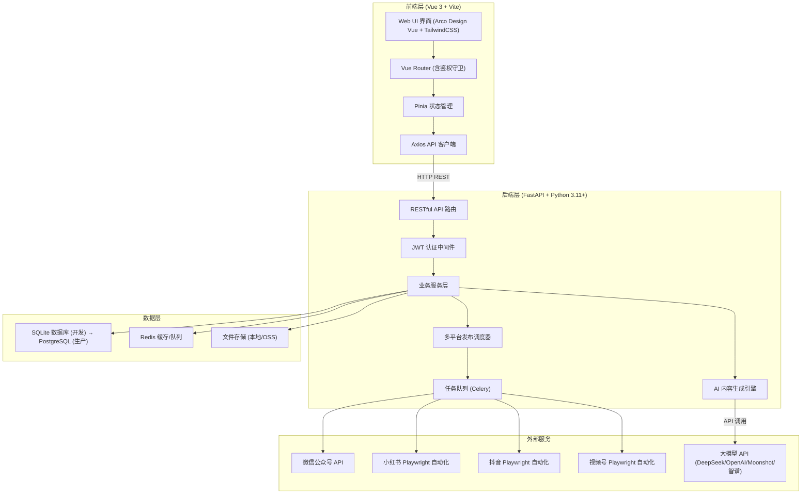
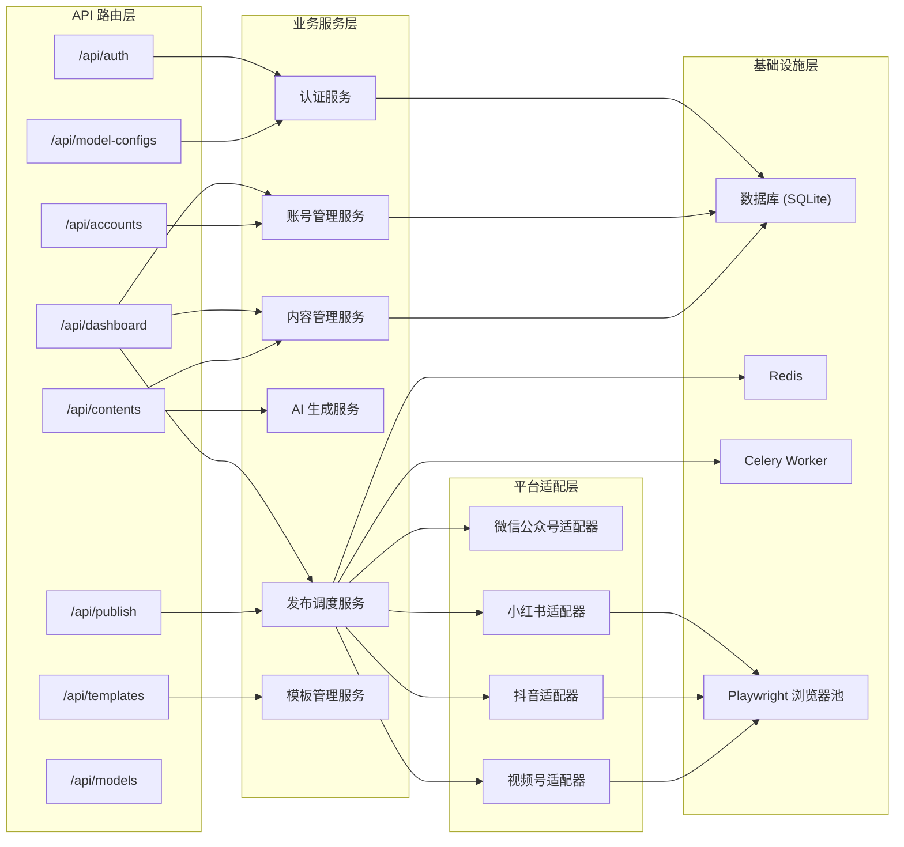
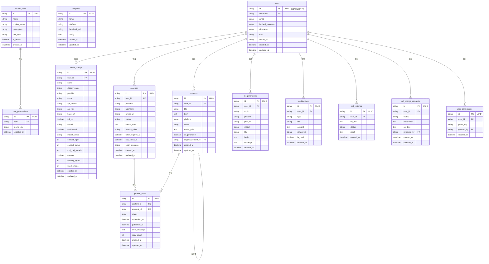

## 1. 架构设计



## 2. 技术说明

- **前端**：Vue 3 + TypeScript + TailwindCSS + Vite 6
- **前端初始化**：`npm create vite@latest . --template vue-ts`
- **UI 组件库**：Arco Design Vue + 自定义组件（StatCard、StatusBadge、PlatformIcon、Modal、SegmentedControl）
- **状态管理**：Pinia（Vue 3 官方推荐）
- **状态存储**：user store（登录/用户信息）、tokenPlan store（模型配置管理与 API 同步）
- **HTTP 客户端**：Axios（带请求拦截器自动注入 JWT Token、401 响应拦截器自动跳转登录页）
- **后端**：Python 3.11+ / FastAPI
- **数据库**：SQLite（开发阶段）→ PostgreSQL（生产阶段）
- **数据库 ID 规范**：所有表的主键 ID 必须使用 UUID 字符串（`VARCHAR(36)`），唯一例外是超级管理员用户 ID 固定为字符串 `"1"`
- **ORM**：SQLAlchemy 2.0（异步模式）+ Alembic（数据库迁移）
- **任务队列**：Celery + Redis
- **缓存**：Redis
- **自动化**：Playwright（浏览器自动化）
- **AI 接入**：OpenAI 兼容 API（支持 OpenAI / DeepSeek / Moonshot / 智谱 AI / 自定义端点切换）
- **容器化**：Docker + Docker Compose（4 服务：frontend、backend、redis、celery-worker）

## 3. 前端路由定义

| 路由                        | 名称           | 组件                      | 鉴权 | 说明                       |
| --------------------------- | -------------- | ------------------------- | ---- | -------------------------- |
| /login                      | Login          | Login.vue                 | 公开 | 管理员登录页               |
| /                           | Dashboard      | Dashboard.vue             | 需鉴权 | 仪表盘（数据概览）         |
| /accounts                   | Accounts       | Accounts.vue              | 需鉴权 | 账号矩阵管理               |
| /content                    | ContentList    | ContentList.vue           | 需鉴权 | 内容列表                   |
| /content/create             | ContentCreate  | ContentCreate.vue         | 需鉴权 | AI 内容生成                |
| /publish                    | Publish        | Publish.vue               | 需鉴权 | 发布管理中心               |
| /templates                  | Templates      | Templates.vue             | 需鉴权 | 模板中心                   |
| /settings/token-plan        | TokenPlan      | TokenPlan.vue             | 需鉴权 | AI 模型配置                |
| /settings/roles             | RoleManage     | RoleManage.vue            | 需鉴权 | 角色管理（管理员）         |
| /settings/permissions       | PermissionManage | PermissionManage.vue    | 需鉴权 | 权限管理（管理员）         |
| /developer/docs             | ApiDocs        | ApiDocs.vue               | 需鉴权 | Swagger API 文档           |

### 3.1 路由守卫

- `router.beforeEach`：未登录用户访问需鉴权页面 → 重定向到 `/login`
- `router.beforeEach`：已登录用户访问 `/login` → 重定向到 `/`
- 鉴权依据：localStorage 中的 JWT token

## 4. 后端 API 路由定义

### 4.1 路由模块总览

| 路由前缀                    | 模块文件                   | 说明                        |
| --------------------------- | -------------------------- | --------------------------- |
| /api/auth                   | routers/auth.py            | 认证（登录、注册、用户信息） |
| /api/accounts               | routers/accounts.py        | 账号管理 CRUD + 状态检查     |
| /api/contents               | routers/contents.py        | 内容管理 CRUD + AI 生成      |
| /api/dashboard              | routers/dashboard.py       | 仪表盘聚合统计               |
| /api/model-configs          | routers/model_configs.py   | AI 模型配置管理              |
| /api/models                 | routers/models.py          | 可用模型列表查询             |
| /api/publish                | routers/publish.py         | 发布任务管理                 |
| /api/templates              | routers/templates.py       | 模板管理                     |
| /api/roles                  | routers/roles.py           | 角色管理（内置+自定义）      |
| /api/permissions            | routers/permissions.py     | 角色权限与用户权限管理       |
| /api/users                  | routers/users.py           | 用户管理（管理员功能）       |
| /api/notifications          | routers/notifications.py   | 通知消息管理                 |
| /api/reviews                | routers/reviews.py         | 内容审核管理                 |
| /api/db-changes             | routers/db_changes.py      | 数据库变更请求管理           |

### 4.2 认证相关

| 方法   | 路径             | 说明         | 鉴权   |
| ------ | ---------------- | ------------ | ------ |
| POST   | /api/auth/login  | 用户登录     | 否     |
| POST   | /api/auth/register | 用户注册   | 否     |
| GET    | /api/auth/me     | 获取当前用户 | 是     |

```typescript
interface LoginRequest {
  email: string
  password: string
}

interface LoginResponse {
  access_token: string
  token_type: string
  user: UserInfo
}

interface UserInfo {
  id: string
  email: string
  username: string
  nickname: string
  role: 'admin' | 'manager' | 'operator' | 'reviewer'
  avatar_url?: string | null
  created_at: string
}
```

### 4.3 仪表盘

| 方法 | 路径                     | 说明                 | 鉴权 |
| ---- | ------------------------ | -------------------- | ---- |
| GET  | /api/dashboard/stats     | 获取仪表盘聚合统计   | 是   |

```typescript
interface DashboardStats {
  total_accounts: number
  today_published: number
  pending_tasks: number
  ai_generated_count: number
  platform_stats: PlatformStat[]
  recent_publishes: RecentPublish[]
}

interface PlatformStat {
  platform: Platform
  name: string        // 平台中文名
  accounts: number    // 总账号数
  active: number      // 在线账号数
  articles: number    // 内容数量
}

interface RecentPublish {
  id: string
  title: string
  platform: Platform
  account: string
  status: PublishStatus
  time: string
}
```

### 4.4 账号管理

| 方法   | 路径                     | 说明           | 鉴权 |
| ------ | ------------------------ | -------------- | ---- |
| GET    | /api/accounts/           | 获取账号列表   | 是   |
| POST   | /api/accounts/           | 添加新账号     | 是   |
| DELETE | /api/accounts/{id}       | 删除账号       | 是   |
| POST   | /api/accounts/{id}/check | 检查账号状态   | 是   |

```typescript
type Platform = 'wechat_mp' | 'xiaohongshu' | 'douyin' | 'wechat_video'
type AccountStatus = 'active' | 'inactive' | 'error'

interface Account {
  id: string
  user_id: string
  platform: Platform
  nickname: string
  avatar_url: string | null
  status: AccountStatus
  cookie_data: string | null
  access_token: string | null
  token_expires_at: string | null
  last_check_at: string | null
  error_message: string | null
  created_at: string
  updated_at: string
}

interface CreateAccountRequest {
  platform: string
  nickname: string
  cookie_data?: string
  access_token?: string
}
```

### 4.5 内容管理

| 方法   | 路径                          | 说明             | 鉴权 |
| ------ | ----------------------------- | ---------------- | ---- |
| GET    | /api/contents/                | 获取内容列表     | 是   |
| POST   | /api/contents/ai-generate     | AI 生成内容      | 是   |
| DELETE | /api/contents/{id}            | 删除内容         | 是   |

```typescript
interface Content {
  id: string
  user_id: string
  title: string
  body: string
  platform: string
  status: 'draft' | 'ready' | 'published'
  media_urls: string[]
  ai_generated: boolean
  original_content_id?: string
  created_at: string
  updated_at: string
}

interface AIGenerateRequest {
  topic: string
  platform: string
  count: number
  plan_id: string
  keywords?: string[]
}

interface AIGenerateResponse {
  variants: Array<{
    title: string
    body: string
    hashtags: string[]
    suggested_image_ratio: string
  }>
}
```

### 4.6 发布管理

| 方法   | 路径                         | 说明             | 鉴权 |
| ------ | ---------------------------- | ---------------- | ---- |
| GET    | /api/publish/tasks           | 获取发布任务列表 | 是   |
| POST   | /api/publish/tasks           | 创建发布任务     | 是   |
| POST   | /api/publish/tasks/{id}/retry | 重试失败任务    | 是   |

```typescript
type PublishTaskStatus = 'pending' | 'publishing' | 'published' | 'failed'

interface PublishTask {
  id: string
  content_id: string
  account_id: string
  status: PublishTaskStatus
  scheduled_at?: string | null
  published_at?: string | null
  error_message?: string | null
  retry_count: number
  created_at: string
  updated_at: string
}

interface CreatePublishTaskRequest {
  content_id: string
  account_id: string
  scheduled_at?: string
}
```

### 4.7 模板管理

| 方法   | 路径                   | 说明           | 鉴权 |
| ------ | ---------------------- | -------------- | ---- |
| GET    | /api/templates/        | 获取模板列表   | 是   |

```typescript
interface Template {
  id: string
  name: string
  platform: string
  thumbnail_url?: string | null
  config?: string | null
  created_at: string
  updated_at: string
}
```

### 4.8 模型配置

| 方法   | 路径                       | 说明             | 鉴权 |
| ------ | -------------------------- | ---------------- | ---- |
| GET    | /api/model-configs         | 获取配置列表     | 是   |
| POST   | /api/model-configs         | 创建模型配置     | 是   |
| PUT    | /api/model-configs/{id}    | 更新模型配置     | 是   |
| DELETE | /api/model-configs/{id}    | 删除模型配置     | 是   |

### 4.9 可用模型

| 方法 | 路径           | 说明             | 鉴权 |
| ---- | -------------- | ---------------- | ---- |
| GET  | /api/models    | 获取可用模型列表 | 是   |

### 4.10 角色管理

| 方法   | 路径                   | 说明                | 鉴权           |
| ------ | ---------------------- | ------------------- | -------------- |
| GET    | /api/roles/            | 获取角色列表        | 是（管理员）   |
| POST   | /api/roles/custom      | 创建自定义角色      | 是（管理员）   |
| PUT    | /api/roles/custom/{name} | 更新自定义角色    | 是（管理员）   |
| DELETE | /api/roles/custom/{name} | 删除自定义角色    | 是（管理员）   |

```typescript
interface RoleDef {
  name: string
  display_name: string
  description?: string
  is_builtin: boolean
  is_super_admin: boolean
  role_type: 'admin' | 'other'
}

interface CustomRole extends RoleDef {
  id: string
  created_at: string
}
```

内置角色定义（按排序）：
1. **超级管理员 (admin)** — 系统最高权限，ID=1，不可编辑，`role_type: "admin"`
2. **管理员 (manager)** — 管理系统配置，`role_type: "admin"`
3. **运营者 (operator)** — 日常内容运营，`role_type: "other"`
4. **审核员 (reviewer)** — 内容审核，`role_type: "other"`

### 4.11 权限管理

| 方法 | 路径                                | 说明                   | 鉴权             |
| ---- | ----------------------------------- | ---------------------- | ---------------- |
| GET  | /api/permissions/role/{role}        | 获取角色权限配置       | 是（管理员）     |
| PUT  | /api/permissions/role/{role}        | 更新角色权限           | 是（管理员）     |
| GET  | /api/permissions/user/{user_id}     | 获取用户自定义权限     | 是（管理员/本人） |
| PUT  | /api/permissions/user/{user_id}     | 更新用户自定义权限     | 是（管理员）     |
| GET  | /api/permissions/user/{user_id}/effective | 获取用户有效权限   | 是（管理员）     |

权限键格式：`{资源}:{操作}`，如 `content:create`、`database`、`db:execute`

角色类型与数据库权限约束：
- `role_type: "admin"` — 可配置数据库相关权限（`database`、`db:execute`、`db:history:read`）
- `role_type: "other"` — 不支持数据库相关权限配置

### 4.12 用户管理

| 方法 | 路径                       | 说明         | 鉴权           |
| ---- | -------------------------- | ------------ | -------------- |
| GET  | /api/users/                | 用户列表     | 是（管理员）   |
| GET  | /api/users/{user_id}       | 用户详情     | 是（管理员）   |
| PUT  | /api/users/{user_id}       | 更新用户信息 | 是（管理员）   |

### 4.13 通知管理

| 方法 | 路径                              | 说明           | 鉴权 |
| ---- | --------------------------------- | -------------- | ---- |
| GET  | /api/notifications/               | 获取通知列表   | 是   |
| PUT  | /api/notifications/{id}/read      | 标记已读       | 是   |

```typescript
interface NotificationResponse {
  id: string
  type: string
  title: string
  content?: string
  related_id?: string
  is_read: boolean
  created_at: string
}
```

### 4.14 内容审核

| 方法 | 路径                              | 说明           | 鉴权           |
| ---- | --------------------------------- | -------------- | -------------- |
| GET  | /api/reviews/                     | 获取待审核内容 | 是（审核员）   |
| PUT  | /api/reviews/{content_id}         | 审核内容       | 是（审核员）   |

### 4.15 数据库变更请求

| 方法 | 路径                              | 说明             | 鉴权             |
| ---- | --------------------------------- | ---------------- | ---------------- |
| GET  | /api/db-changes/                  | 获取变更请求列表 | 是（管理员）     |
| POST | /api/db-changes/                  | 创建变更请求     | 是（管理员）     |
| PUT  | /api/db-changes/{change_id}       | 审批/拒绝变更    | 是（管理员）     |

## 5. 后端服务架构



## 6. 数据模型

### 6.1 数据模型 ER 图



### 6.2 数据定义语言 (DDL)

```sql
-- 数据库 ID 规范：所有主键使用 UUID VARCHAR(36)，唯一例外是超级管理员用户 ID 固定为 '1'

CREATE TABLE users (
    id VARCHAR(36) PRIMARY KEY,
    username VARCHAR(100) UNIQUE NOT NULL,
    email VARCHAR(255) UNIQUE NOT NULL,
    hashed_password VARCHAR(255) NOT NULL,
    nickname VARCHAR(100) NOT NULL,
    role VARCHAR(20) DEFAULT 'operator',
    avatar_url VARCHAR(500),
    created_at TIMESTAMP DEFAULT CURRENT_TIMESTAMP,
    updated_at TIMESTAMP DEFAULT CURRENT_TIMESTAMP
);

CREATE TABLE model_configs (
    id VARCHAR(36) PRIMARY KEY,
    user_id VARCHAR(36) NOT NULL REFERENCES users(id),
    name VARCHAR(200) NOT NULL,
    display_name VARCHAR(200),
    provider VARCHAR(50) NOT NULL DEFAULT 'openai',
    mode VARCHAR(20) DEFAULT 'provider',
    api_format VARCHAR(50) DEFAULT 'openai_chat',
    api_key VARCHAR(500) NOT NULL DEFAULT '',
    base_url VARCHAR(500) NOT NULL DEFAULT '',
    full_url BOOLEAN DEFAULT FALSE,
    model VARCHAR(200) NOT NULL DEFAULT '',
    multimodal BOOLEAN DEFAULT FALSE,
    model_series VARCHAR(100) DEFAULT 'default',
    context_input INTEGER DEFAULT 128000,
    context_output INTEGER DEFAULT 4096,
    tool_call_rounds INTEGER DEFAULT 200,
    enabled BOOLEAN DEFAULT FALSE,
    monthly_quota INTEGER DEFAULT 1000000,
    used_tokens INTEGER DEFAULT 0,
    created_at TIMESTAMP DEFAULT CURRENT_TIMESTAMP,
    updated_at TIMESTAMP DEFAULT CURRENT_TIMESTAMP
);

CREATE TABLE accounts (
    id VARCHAR(36) PRIMARY KEY,
    user_id VARCHAR(36) NOT NULL REFERENCES users(id),
    platform VARCHAR(50) NOT NULL,
    nickname VARCHAR(200) NOT NULL,
    avatar_url VARCHAR(500),
    status VARCHAR(20) DEFAULT 'active',
    cookie_data TEXT,
    access_token TEXT,
    token_expires_at TIMESTAMP,
    last_check_at TIMESTAMP,
    error_message TEXT,
    created_at TIMESTAMP DEFAULT CURRENT_TIMESTAMP,
    updated_at TIMESTAMP DEFAULT CURRENT_TIMESTAMP
);

CREATE TABLE contents (
    id VARCHAR(36) PRIMARY KEY,
    user_id VARCHAR(36) NOT NULL REFERENCES users(id),
    title VARCHAR(500) NOT NULL,
    body TEXT NOT NULL,
    platform VARCHAR(50) NOT NULL,
    status VARCHAR(20) DEFAULT 'draft',
    media_urls TEXT DEFAULT '[]',
    ai_generated BOOLEAN DEFAULT FALSE,
    original_content_id VARCHAR(36) REFERENCES contents(id),
    created_at TIMESTAMP DEFAULT CURRENT_TIMESTAMP,
    updated_at TIMESTAMP DEFAULT CURRENT_TIMESTAMP
);

CREATE TABLE publish_tasks (
    id VARCHAR(36) PRIMARY KEY,
    content_id VARCHAR(36) NOT NULL REFERENCES contents(id),
    account_id VARCHAR(36) NOT NULL REFERENCES accounts(id),
    status VARCHAR(20) DEFAULT 'pending',
    scheduled_at TIMESTAMP,
    published_at TIMESTAMP,
    error_message TEXT,
    retry_count INTEGER DEFAULT 0,
    created_at TIMESTAMP DEFAULT CURRENT_TIMESTAMP,
    updated_at TIMESTAMP DEFAULT CURRENT_TIMESTAMP
);

CREATE TABLE templates (
    id VARCHAR(36) PRIMARY KEY,
    name VARCHAR(200) NOT NULL,
    platform VARCHAR(50) NOT NULL,
    thumbnail_url VARCHAR(500),
    config TEXT NOT NULL DEFAULT '{}',
    created_at TIMESTAMP DEFAULT CURRENT_TIMESTAMP,
    updated_at TIMESTAMP DEFAULT CURRENT_TIMESTAMP
);

CREATE TABLE custom_roles (
    id VARCHAR(36) PRIMARY KEY,
    name VARCHAR(50) UNIQUE NOT NULL,
    display_name VARCHAR(100) NOT NULL,
    description TEXT,
    role_type VARCHAR(20) DEFAULT 'other',
    is_builtin BOOLEAN DEFAULT FALSE,
    created_at TIMESTAMP DEFAULT CURRENT_TIMESTAMP
);

CREATE TABLE role_permissions (
    id VARCHAR(36) PRIMARY KEY,
    role VARCHAR(50) NOT NULL REFERENCES custom_roles(name),
    perm_key VARCHAR(100) NOT NULL,
    created_at TIMESTAMP DEFAULT CURRENT_TIMESTAMP,
    UNIQUE(role, perm_key)
);

CREATE TABLE user_permissions (
    id VARCHAR(36) PRIMARY KEY,
    user_id VARCHAR(36) NOT NULL REFERENCES users(id),
    perm_key VARCHAR(100) NOT NULL,
    granted_by VARCHAR(36) REFERENCES users(id),
    created_at TIMESTAMP DEFAULT CURRENT_TIMESTAMP,
    UNIQUE(user_id, perm_key)
);

CREATE TABLE notifications (
    id VARCHAR(36) PRIMARY KEY,
    user_id VARCHAR(36) NOT NULL REFERENCES users(id),
    type VARCHAR(50) NOT NULL,
    title VARCHAR(200) NOT NULL,
    content TEXT,
    related_id VARCHAR(36),
    is_read BOOLEAN DEFAULT FALSE,
    created_at TIMESTAMP DEFAULT CURRENT_TIMESTAMP
);

CREATE TABLE ai_generations (
    id VARCHAR(36) PRIMARY KEY,
    user_id VARCHAR(36) NOT NULL REFERENCES users(id),
    topic VARCHAR(500) NOT NULL,
    platform VARCHAR(50) NOT NULL,
    plan_id VARCHAR(36),
    model VARCHAR(200),
    title VARCHAR(500) NOT NULL,
    body TEXT NOT NULL,
    hashtags TEXT DEFAULT '[]',
    created_at TIMESTAMP DEFAULT CURRENT_TIMESTAMP
);

CREATE TABLE sql_histories (
    id VARCHAR(36) PRIMARY KEY,
    user_id VARCHAR(36) NOT NULL REFERENCES users(id),
    sql_text TEXT NOT NULL,
    status VARCHAR(20) DEFAULT 'success',
    result TEXT,
    created_at TIMESTAMP DEFAULT CURRENT_TIMESTAMP
);

CREATE TABLE sql_change_requests (
    id VARCHAR(36) PRIMARY KEY,
    user_id VARCHAR(36) NOT NULL REFERENCES users(id),
    status VARCHAR(20) DEFAULT 'pending',
    description TEXT,
    sql_text TEXT,
    reviewed_by VARCHAR(36) REFERENCES users(id),
    created_at TIMESTAMP DEFAULT CURRENT_TIMESTAMP,
    updated_at TIMESTAMP DEFAULT CURRENT_TIMESTAMP
);

CREATE INDEX idx_accounts_user_id ON accounts(user_id);
CREATE INDEX idx_accounts_platform ON accounts(platform);
CREATE INDEX idx_contents_user_id ON contents(user_id);
CREATE INDEX idx_contents_platform ON contents(platform);
CREATE INDEX idx_contents_status ON contents(status);
CREATE INDEX idx_publish_tasks_status ON publish_tasks(status);
CREATE INDEX idx_publish_tasks_scheduled_at ON publish_tasks(scheduled_at);
CREATE INDEX idx_model_configs_user_id ON model_configs(user_id);
CREATE INDEX idx_model_configs_enabled ON model_configs(enabled);
CREATE INDEX idx_notifications_user_id ON notifications(user_id);
CREATE INDEX idx_notifications_is_read ON notifications(is_read);
CREATE INDEX idx_user_permissions_user_id ON user_permissions(user_id);
CREATE INDEX idx_sql_change_requests_status ON sql_change_requests(status);
```

## 7. 前端架构

### 7.1 目录结构

```
frontend/src/
├── App.vue                     # 根组件（router-view）
├── main.ts                     # 应用入口（Pinia + Router + Arco Design）
├── style.css                   # 全局样式（TailwindCSS + 自定义动画）
├── router/
│   └── index.ts                # 路由定义 + beforeEach 守卫
├── stores/
│   ├── user.ts                 # 登录/用户信息状态管理
│   └── tokenPlan.ts            # AI 模型配置状态管理
├── types/
│   └── index.ts                # 全局 TypeScript 类型定义
├── utils/
│   └── api.ts                  # Axios 实例（baseURL + 拦截器）
├── components/
│   ├── layout/
│   │   ├── AppLayout.vue       # 主布局（侧边栏 + 顶栏 + 内容区）
│   │   ├── AppHeader.vue       # 顶部导航（面包屑 + 搜索 + 通知）
│   │   ├── AppSidebar.vue      # 侧边导航（菜单 + 折叠/展开）
│   │   └── PageHeader.vue      # 页面标题组件（标题 + 副标题 + actions 插槽）
│   └── shared/
│       ├── Modal.vue           # 通用弹窗组件
│       ├── PlatformIcon.vue    # 平台图标组件（公众号/小红书/抖音/视频号）
│       ├── SegmentedControl.vue # 分段控制器组件
│       ├── StatCard.vue        # 统计卡片组件（动画 + 图标 + 趋势）
│       └── StatusBadge.vue     # 状态标签组件
└── pages/
    ├── Login.vue               # 登录页（毛玻璃卡片）
    ├── Dashboard.vue           # 仪表盘
    ├── Accounts.vue            # 账号管理
    ├── ContentCreate.vue       # AI 内容生成
    ├── ContentList.vue         # 内容列表
    ├── Publish.vue             # 发布管理
    ├── Templates.vue           # 模板中心
    ├── TokenPlan.vue           # 模型配置
    ├── RoleManage.vue          # 角色管理（管理员）
    ├── PermissionManage.vue    # 权限管理（管理员）
    └── ApiDocs.vue             # API 文档（iframe Swagger）
```

### 7.2 数据流

```
页面组件 (Pages)
    ├── 调用 api.get/post/delete (utils/api.ts)
    │       ├── 请求拦截器：注入 JWT token
    │       └── 响应拦截器：401 → 跳转登录页
    ├── 调用 Pinia Store (stores/*.ts)
    │       ├── user store：登录/用户信息/退出
    │       └── tokenPlan store：模型配置 CRUD
    └── 本地状态管理 (ref/reactive/computed)
            ├── 列表数据 (ref<T[]>)
            ├── 加载状态 (ref<boolean>)
            ├── 筛选/分页 (computed)
            └── 表单数据 (reactive)
```

### 7.3 组件通讯模式

- **父 → 子**：Props（如 PageHeader 的 title/subtitle、StatCard 的 title/value/trend/icon/color）
- **子 → 父**：Emits（如 AppSidebar 的 toggle、Modal 的 update:visible）
- **跨层级**：Pinia Store（如 user token、tokenPlan 的 activePlan）
- **路由参数**：Vue Router（如 /content/create 依赖 tokenPlan.activePlan）

## 8. 部署架构

```yaml
# docker-compose.yml 服务拓扑
services:
  frontend:
    build: docker/frontend/Dockerfile
    ports: ["5173:5173"]
    volumes: ["./frontend:/app"]  # 热重载开发模式
    depends_on: [backend]

  backend:
    build: docker/backend/Dockerfile
    ports: ["8000:8000"]
    volumes: ["./backend:/app"]   # 热重载开发模式
    environment: [DATABASE_URL, REDIS_URL, ...]
    depends_on: [redis]

  redis:
    image: redis:7-alpine
    ports: ["6379:6379"]

  celery-worker:
    build: docker/backend/Dockerfile
    command: celery -A app.celery_app worker
    environment: [DATABASE_URL, REDIS_URL, ...]
    depends_on: [redis, backend]
```
