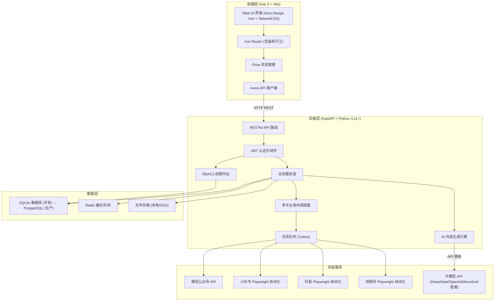
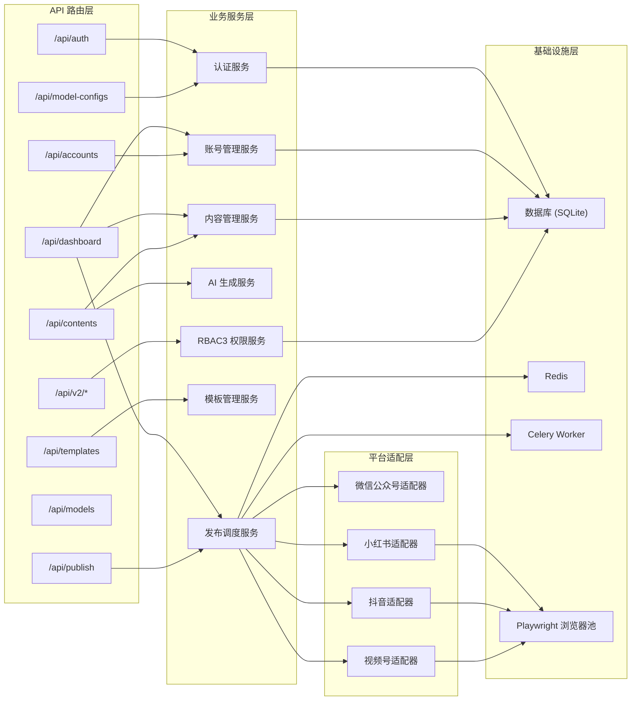

# 技术架构文档

## 1. 系统架构


```mermaid
flowchart TB
    subgraph Frontend["前端层 (Vue 3 + Vite)"]
        UI["Web UI 界面 (Arco Design Vue + TailwindCSS)"]
        Router["Vue Router (含鉴权守卫)"]
        Store["Pinia 状态管理"]
        APIClient["Axios API 客户端"]
    end

    subgraph Backend["后端层 (FastAPI + Python 3.11+)"]
        API["RESTful API 路由"]
        Auth["JWT 认证中间件"]
        Services["业务服务层"]
        AIEngine["AI 内容生成引擎"]
        Publisher["多平台发布调度器"]
        TaskQueue["任务队列 (Celery)"]
        RBAC3["RBAC3 权限中台"]
    end

    subgraph Data["数据层"]
        DB["SQLite 数据库 (开发) → PostgreSQL (生产)"]
        Redis["Redis 缓存/队列"]
        FileStorage["文件存储 (本地/OSS)"]
    end

    subgraph External["外部服务"]
        WeChatAPI["微信公众号 API"]
        XHSAuto["小红书 Playwright 自动化"]
        DouyinAuto["抖音 Playwright 自动化"]
        VCAuto["视频号 Playwright 自动化"]
        LLM["大模型 API (DeepSeek/OpenAI/Moonshot/智谱)"]
    end

    UI --> Router
    Router --> Store
    Store --> APIClient
    APIClient -->|HTTP REST| API
    API --> Auth
    Auth --> Services
    Auth --> RBAC3
    Services --> AIEngine
    Services --> Publisher
    AIEngine -->|API 调用| LLM
    Publisher --> TaskQueue
    TaskQueue --> WeChatAPI
    TaskQueue --> XHSAuto
    TaskQueue --> DouyinAuto
    TaskQueue --> VCAuto
    Services --> DB
    RBAC3 --> DB
    Services --> Redis
    Services --> FileStorage
```

## 2. 技术栈总览

| 层级 | 技术选型 |
|------|----------|
| **前端框架** | Vue 3 + TypeScript + Vite 8 |
| **UI 组件库** | Arco Design Vue + 自定义组件 |
| **状态管理** | Pinia |
| **HTTP 客户端** | Axios（JWT 拦截器 + 401 自动跳转） |
| **后端框架** | Python 3.11+ / FastAPI |
| **ORM** | SQLAlchemy 2.0（异步模式）+ Alembic |
| **数据库** | SQLite（开发）→ PostgreSQL（生产） |
| **数据库 ID 规范** | 所有表主键使用 UUID `VARCHAR(36)`，超级管理员用户 ID 固定为 `"1"` |
| **任务队列** | Celery + Redis |
| **缓存** | Redis |
| **浏览器自动化** | Playwright |
| **AI 接入** | OpenAI 兼容 API（DeepSeek / OpenAI / Moonshot / 智谱 AI / 自定义） |
| **权限模型** | RBAC3（角色继承 + 约束 + 会话级授权） |
| **容器化** | Docker + Docker Compose |

## 3. 前端路由定义

| 路由 | 名称 | 组件 | 鉴权 | 说明 |
|------|------|------|------|------|
| /login | Login | Login.vue | 公开 | 管理员登录页 |
| / | Dashboard | Dashboard.vue | 需鉴权 | 仪表盘（数据概览） |
| /accounts | Accounts | Accounts.vue | 需鉴权 | 平台账号管理 |
| /content | ContentList | ContentList.vue | 需鉴权 | 内容列表 |
| /content/create | ContentCreate | ContentCreate.vue | 需鉴权 | AI 内容生成 |
| /publish | Publish | Publish.vue | 需鉴权 | 发布管理中心 |
| /templates | Templates | Templates.vue | 需鉴权 | 模板中心 |
| /settings/token-plan | TokenPlan | TokenPlan.vue | 需鉴权 | AI 模型配置 |
| /developer/docs | ApiDocs | ApiDocs.vue | 需鉴权 | Swagger API 文档 |
| /developer/database | DatabaseConsole | DatabaseConsole.vue | 需鉴权 | 数据库控制台 |
| /review | Review | Review.vue | 需鉴权 | 内容审核 |
| /sql-review | SqlReview | SqlReview.vue | 需鉴权 | SQL 变更审核 |
| /settings/user-creation-review | UserCreationReview | UserCreationReview.vue | 需鉴权 | 用户注册审核 |
| /rbac/users | RBACUserManage | RBACUserManage.vue | 需鉴权 | RBAC3 用户管理 |
| /rbac/users/create | RBACUserCreate | RBACUserCreate.vue | 需鉴权 | 创建用户 |
| /rbac/users/:id/edit | RBACUserEdit | RBACUserEdit.vue | 需鉴权 | 编辑用户 |
| /rbac/users/:id/password | RBACUserPassword | RBACUserPassword.vue | 需鉴权 | 修改密码 |
| /rbac/users/:id/permissions | RBACUserPermissionCustomize | RBACUserPermissionCustomize.vue | 需鉴权 | 自定义权限 |
| /rbac/roles | RBACRoleManage | RBACRoleManage.vue | 需鉴权 | 角色管理 |
| /rbac/permissions | RBACPermissionManage | RBACPermissionManage.vue | 需鉴权 | 权限管理 |
| /rbac/permissions/enum | RBACPermissionEnumManage | RBACPermissionEnumManage.vue | 需鉴权 | 权限字典编辑 |
| /rbac/constraints | RBACConstraintManage | RBACConstraintManage.vue | 需鉴权 | 约束管理 |

### 3.1 路由守卫

- `router.beforeEach`：未登录用户访问需鉴权页面 → 重定向到 `/login`
- `router.beforeEach`：已登录用户访问 `/login` → 重定向到 `/`
- `hasPerm`：根据 `route.meta.permKey` 检查当前用户是否拥有对应权限
- 鉴权依据：`permissionStore.hasPermission(key)`（基于 `/api/v2/me/permissions` 返回的有效权限）

## 4. 后端 API 路由定义

### 4.1 路由模块总览

| 路由前缀 | 模块文件 | 说明 |
|----------|----------|------|
| /api/auth | routers/auth.py | 认证（登录、注册、用户信息） |
| /api/accounts | routers/accounts.py | 账号管理 CRUD + 状态检查 |
| /api/contents | routers/contents.py | 内容管理 CRUD + AI 生成 |
| /api/dashboard | routers/dashboard.py | 仪表盘聚合统计 |
| /api/model-configs | routers/model_configs.py | AI 模型配置管理 |
| /api/models | routers/models.py | 可用模型列表查询 |
| /api/publish | routers/publish.py | 发布任务管理 |
| /api/templates | routers/templates.py | 模板管理 |
| /api/notifications | routers/notifications.py | 通知消息管理 |
| /api/reviews | routers/reviews.py | 内容审核管理 |
| /api/db-changes | routers/db_changes.py | 数据库变更请求管理 |
| /api/user-creation-reviews | routers/user_creation_reviews.py | 用户创建审核 |
| /api/db | routers/db.py | SQL 执行与历史 |
| **/api/v2** | **RBAC3 中台** | **权限中台 v2 API** |
| /api/v2 | routers/rbac_users.py | RBAC3 用户管理 |
| /api/v2 | routers/rbac_roles.py | RBAC3 角色管理 |
| /api/v2 | routers/rbac_permissions.py | RBAC3 资源与权限管理 |
| /api/v2 | routers/rbac_constraints.py | RBAC3 约束管理 |

### 4.2 认证相关

| 方法 | 路径 | 说明 | 鉴权 |
|------|------|------|------|
| POST | /api/auth/login | 用户登录 | 否 |
| POST | /api/auth/register | 用户注册 | 否 |
| GET | /api/auth/me | 获取当前用户（含 roles、permissions 枚举） | 是 |

```typescript
interface LoginRequest {
  email: string
  password: string
}

interface LoginResponse {
  access_token: string
  token_type: string
  user: UserInfo
}

interface UserInfo {
  id: string
  email: string
  username: string
  nickname: string
  role: 'admin' | 'manager' | 'operator' | 'reviewer'
  avatar_url?: string | null
  created_at: string
}
```

### 4.3 RBAC3 用户管理（/api/v2）

| 方法 | 路径 | 说明 | 鉴权 |
|------|------|------|------|
| GET | /api/v2/users | 用户列表（含角色分配） | 是 |
| POST | /api/v2/users | 创建用户 | 是 |
| GET | /api/v2/users/{id} | 用户详情 | 是 |
| PUT | /api/v2/users/{id} | 更新用户 | 是 |
| PUT | /api/v2/users/{id}/password | 修改密码 | 是 |
| PUT | /api/v2/users/{id}/roles | 分配/替换角色 | 是 |
| GET | /api/v2/users/{id}/permissions | 用户有效权限 | 是 |
| GET | /api/v2/me/permissions | 当前用户有效权限（{key: name}） | 是 |

### 4.4 RBAC3 角色管理（/api/v2）

| 方法 | 路径 | 说明 | 鉴权 |
|------|------|------|------|
| GET | /api/v2/roles | 角色列表 | 是 |
| POST | /api/v2/roles | 创建角色 | 是 |
| PUT | /api/v2/roles/{id} | 更新角色 | 是 |
| DELETE | /api/v2/roles/{id} | 删除角色 | 是 |
| POST | /api/v2/roles/{id}/parents | 添加父角色 | 是 |
| DELETE | /api/v2/roles/{id}/parents/{parent_id} | 移除父角色 | 是 |
| GET | /api/v2/roles/{id}/permissions | 角色有效权限 | 是 |
| GET | /api/v2/roles/{id}/permissions/direct | 角色直接权限 | 是 |
| GET | /api/v2/roles/{id}/permissions/detail | 继承 + 直接权限（含 grant_type） | 是 |
| PUT | /api/v2/roles/{id}/permissions | 更新直接权限 | 是 |

### 4.5 RBAC3 资源与权限管理（/api/v2）

| 方法 | 路径 | 说明 | 鉴权 |
|------|------|------|------|
| GET | /api/v2/resources | 资源树 | 是 |
| POST | /api/v2/resources | 新增资源 | 是 |
| PUT | /api/v2/resources/{id} | 更新资源 | 是 |
| DELETE | /api/v2/resources/{id} | 删除资源 | 是 |
| GET | /api/v2/permissions | 权限列表 | 是 |
| GET | /api/v2/permission-enums | 权限枚举（key + name + description） | 是 |
| GET | /api/v2/permission-pages | 页面权限枚举 | 是 |
| POST | /api/v2/permissions | 新增权限 | 是 |
| PUT | /api/v2/permissions/{id} | 更新权限 | 是 |
| DELETE | /api/v2/permissions/{id} | 删除权限 | 是 |

### 4.6 RBAC3 约束管理（/api/v2）

| 方法 | 路径 | 说明 | 鉴权 |
|------|------|------|------|
| GET | /api/v2/constraints | 约束列表 | 是 |
| POST | /api/v2/constraints | 创建约束 | 是 |
| PUT | /api/v2/constraints/{id} | 更新约束 | 是 |
| DELETE | /api/v2/constraints/{id} | 删除约束 | 是 |

### 4.7 其他业务接口

| 模块 | 方法 | 路径 | 说明 |
|------|------|------|------|
| 仪表盘 | GET | /api/dashboard/stats | 获取仪表盘聚合统计 |
| 账号管理 | GET/POST | /api/accounts/ | 账号列表/创建 |
| 账号管理 | DELETE | /api/accounts/{id} | 删除账号 |
| 内容管理 | GET | /api/contents/ | 内容列表 |
| 内容管理 | POST | /api/contents/ai-generate | AI 生成内容 |
| 发布管理 | GET/POST | /api/publish/tasks | 发布任务列表/创建 |
| 发布管理 | POST | /api/publish/tasks/{id}/retry | 重试失败任务 |
| 模板管理 | GET | /api/templates/ | 模板列表 |
| 模型配置 | GET/POST | /api/model-configs | 配置列表/创建 |
| 模型配置 | PUT/DELETE | /api/model-configs/{id} | 更新/删除配置 |
| 可用模型 | GET | /api/models | 可用模型列表 |

## 5. 后端服务架构


```mermaid
flowchart LR
    subgraph API_Layer["API 路由层"]
        AuthRouter["/api/auth"]
        DashboardRouter["/api/dashboard"]
        AccountRouter["/api/accounts"]
        ContentRouter["/api/contents"]
        PublishRouter["/api/publish"]
        TemplateRouter["/api/templates"]
        ModelConfigRouter["/api/model-configs"]
        ModelsRouter["/api/models"]
        RBACRouter["/api/v2/*"]
    end

    subgraph Service_Layer["业务服务层"]
        AuthService["认证服务"]
        AccountService["账号管理服务"]
        ContentService["内容管理服务"]
        AIService["AI 生成服务"]
        PublishService["发布调度服务"]
        TemplateService["模板管理服务"]
        RBACService["RBAC3 权限服务"]
    end

    subgraph Adapter_Layer["平台适配层"]
        WeChatAdapter["微信公众号适配器"]
        XHSAdapter["小红书适配器"]
        DouyinAdapter["抖音适配器"]
        VideoAdapter["视频号适配器"]
    end

    subgraph Infra["基础设施层"]
        DB_Layer["数据库 (SQLite)"]
        Redis_Layer["Redis"]
        Celery_Layer["Celery Worker"]
        Playwright_Layer["Playwright 浏览器池"]
    end

    AuthRouter --> AuthService
    DashboardRouter --> AccountService
    DashboardRouter --> ContentService
    DashboardRouter --> PublishService
    AccountRouter --> AccountService
    ContentRouter --> ContentService
    ContentRouter --> AIService
    PublishRouter --> PublishService
    TemplateRouter --> TemplateService
    ModelConfigRouter --> AuthService
    RBACRouter --> RBACService

    PublishService --> WeChatAdapter
    PublishService --> XHSAdapter
    PublishService --> DouyinAdapter
    PublishService --> VideoAdapter

    AuthService --> DB_Layer
    AccountService --> DB_Layer
    ContentService --> DB_Layer
    RBACService --> DB_Layer
    PublishService --> Redis_Layer
    PublishService --> Celery_Layer
    XHSAdapter --> Playwright_Layer
    DouyinAdapter --> Playwright_Layer
    VideoAdapter --> Playwright_Layer
```

## 6. 数据模型

### 6.1 数据模型 ER 图


```mermaid
erDiagram
    users {
        string id PK "UUID（超级管理员='1'）"
        string username UK
        string email
        string hashed_password
        string nickname
        string role
        string avatar_url
        datetime created_at
        datetime updated_at
    }

    rbac_roles {
        string id PK "UUID"
        string name UK
        string display_name
        string description
        string role_type
        boolean is_super_admin
        boolean is_builtin
        datetime created_at
        datetime updated_at
    }

    rbac_resources {
        string id PK "UUID"
        string key UK
        string name
        string description
        string parent_id FK
        boolean is_active
        datetime created_at
    }

    rbac_permissions {
        string id PK "UUID"
        string resource_id FK
        string operation
        string key UK
        boolean is_active
        datetime created_at
    }

    rbac_role_hierarchy {
        string id PK "UUID"
        string parent_role_id FK
        string child_role_id FK
        datetime created_at
    }

    rbac_role_permissions {
        string id PK "UUID"
        string role_id FK
        string permission_id FK
        string grant_type
        datetime created_at
    }

    rbac_user_role_assignments {
        string id PK "UUID"
        string user_id FK
        string role_id FK
        string grant_type
        datetime valid_from
        datetime valid_until
        datetime created_at
    }

    rbac_user_permission_overrides {
        string id PK "UUID"
        string user_id FK
        string permission_key
        boolean granted
        datetime created_at
        datetime updated_at
    }

    rbac_constraints {
        string id PK "UUID"
        string name
        string description
        string constraint_type
        json config
        boolean is_active
        datetime created_at
    }

    rbac_constraint_role_associations {
        string id PK "UUID"
        string constraint_id FK
        string role_id FK
        string association_type
    }

    model_configs {
        string id PK "UUID"
        string user_id FK
        string name
        string display_name
        string provider
        string mode
        string api_format
        string api_key
        string base_url
        boolean full_url
        string model
        boolean multimodal
        string model_series
        int context_input
        int context_output
        int tool_call_rounds
        boolean enabled
        int monthly_quota
        int used_tokens
        datetime created_at
        datetime updated_at
    }

    accounts {
        string id PK "UUID"
        string user_id FK
        string platform
        string nickname
        string avatar_url
        string status
        text cookie_data
        string access_token
        datetime token_expires_at
        datetime last_check_at
        string error_message
        datetime created_at
        datetime updated_at
    }

    contents {
        string id PK "UUID"
        string user_id FK
        string title
        text body
        string platform
        string status
        text media_urls
        boolean ai_generated
        string original_content_id FK
        datetime created_at
        datetime updated_at
    }

    publish_tasks {
        string id PK "UUID"
        string content_id FK
        string account_id FK
        string status
        datetime scheduled_at
        datetime published_at
        text error_message
        int retry_count
        datetime created_at
        datetime updated_at
    }

    templates {
        string id PK "UUID"
        string name
        string platform
        string thumbnail_url
        text config
        datetime created_at
        datetime updated_at
    }

    notifications {
        string id PK "UUID"
        string user_id FK
        string type
        string title
        text content
        string related_id
        boolean is_read
        datetime created_at
    }

    ai_generations {
        string id PK "UUID"
        string user_id FK
        string topic
        string platform
        string plan_id
        string model
        string title
        text body
        text hashtags
        datetime created_at
    }

    sql_histories {
        string id PK "UUID"
        string user_id FK
        text sql_text
        string status
        text result
        datetime created_at
    }

    sql_change_requests {
        string id PK "UUID"
        string user_id FK
        string status
        text description
        text sql_text
        string reviewed_by FK
        datetime created_at
        datetime updated_at
    }

    users ||--o{ rbac_user_role_assignments : "分配"
    users ||--o{ rbac_user_permission_overrides : "覆盖"
    rbac_roles ||--o{ rbac_role_hierarchy : "父/子"
    rbac_roles ||--o{ rbac_role_permissions : "拥有"
    rbac_resources ||--o{ rbac_permissions : "关联"
    rbac_permissions ||--o{ rbac_role_permissions : "授权"
    rbac_constraints ||--o{ rbac_constraint_role_associations : "关联"
    rbac_roles ||--o{ rbac_constraint_role_associations : "受约束"
    users ||--o{ model_configs : "配置"
    users ||--o{ accounts : "管理"
    users ||--o{ contents : "创建"
    users ||--o{ ai_generations : "生成"
    users ||--o{ notifications : "接收"
    users ||--o{ sql_histories : "执行"
    users ||--o{ sql_change_requests : "提交"
    accounts ||--o{ publish_tasks : "执行"
    contents ||--o{ publish_tasks : "关联"
    contents ||--o| contents : "AI变体"
```

### 6.2 核心表 DDL

```sql
-- 数据库 ID 规范：所有主键使用 UUID VARCHAR(36)，唯一例外是超级管理员用户 ID 固定为 '1'

CREATE TABLE users (
    id VARCHAR(36) PRIMARY KEY,
    username VARCHAR(100) UNIQUE NOT NULL,
    email VARCHAR(255) UNIQUE,
    hashed_password VARCHAR(255) NOT NULL,
    nickname VARCHAR(100) NOT NULL,
    role VARCHAR(50) DEFAULT 'operator' NOT NULL,
    avatar_url VARCHAR(500),
    created_at TIMESTAMP DEFAULT CURRENT_TIMESTAMP,
    updated_at TIMESTAMP DEFAULT CURRENT_TIMESTAMP
);

-- RBAC3 角色表
CREATE TABLE rbac_roles (
    id VARCHAR(36) PRIMARY KEY,
    name VARCHAR(50) UNIQUE NOT NULL,
    display_name VARCHAR(100) NOT NULL,
    description TEXT,
    role_type VARCHAR(20) DEFAULT 'other',
    is_super_admin BOOLEAN DEFAULT FALSE,
    is_builtin BOOLEAN DEFAULT FALSE,
    created_at TIMESTAMP DEFAULT CURRENT_TIMESTAMP,
    updated_at TIMESTAMP DEFAULT CURRENT_TIMESTAMP
);

-- RBAC3 资源表
CREATE TABLE rbac_resources (
    id VARCHAR(36) PRIMARY KEY,
    key VARCHAR(100) UNIQUE NOT NULL,
    name VARCHAR(100) NOT NULL,
    description TEXT,
    parent_id VARCHAR(36) REFERENCES rbac_resources(id),
    is_active BOOLEAN DEFAULT TRUE,
    created_at TIMESTAMP DEFAULT CURRENT_TIMESTAMP
);

-- RBAC3 权限表
CREATE TABLE rbac_permissions (
    id VARCHAR(36) PRIMARY KEY,
    resource_id VARCHAR(36) NOT NULL REFERENCES rbac_resources(id),
    operation VARCHAR(50) NOT NULL,
    key VARCHAR(150) UNIQUE NOT NULL,
    is_active BOOLEAN DEFAULT TRUE,
    created_at TIMESTAMP DEFAULT CURRENT_TIMESTAMP
);

-- RBAC3 角色继承表
CREATE TABLE rbac_role_hierarchy (
    id VARCHAR(36) PRIMARY KEY,
    parent_role_id VARCHAR(36) NOT NULL REFERENCES rbac_roles(id),
    child_role_id VARCHAR(36) NOT NULL REFERENCES rbac_roles(id),
    created_at TIMESTAMP DEFAULT CURRENT_TIMESTAMP
);

-- RBAC3 角色权限表
CREATE TABLE rbac_role_permissions (
    id VARCHAR(36) PRIMARY KEY,
    role_id VARCHAR(36) NOT NULL REFERENCES rbac_roles(id),
    permission_id VARCHAR(36) NOT NULL REFERENCES rbac_permissions(id),
    grant_type VARCHAR(20) DEFAULT 'direct',
    created_at TIMESTAMP DEFAULT CURRENT_TIMESTAMP
);

-- RBAC3 用户角色分配表
CREATE TABLE rbac_user_role_assignments (
    id VARCHAR(36) PRIMARY KEY,
    user_id VARCHAR(36) NOT NULL REFERENCES users(id),
    role_id VARCHAR(36) NOT NULL REFERENCES rbac_roles(id),
    grant_type VARCHAR(20) DEFAULT 'direct',
    valid_from TIMESTAMP,
    valid_until TIMESTAMP,
    created_at TIMESTAMP DEFAULT CURRENT_TIMESTAMP
);

-- RBAC3 用户权限覆盖表
CREATE TABLE rbac_user_permission_overrides (
    id VARCHAR(36) PRIMARY KEY,
    user_id VARCHAR(36) NOT NULL REFERENCES users(id) ON DELETE CASCADE,
    permission_key VARCHAR(150) NOT NULL,
    granted BOOLEAN NOT NULL,
    created_at TIMESTAMP DEFAULT CURRENT_TIMESTAMP,
    updated_at TIMESTAMP DEFAULT CURRENT_TIMESTAMP,
    UNIQUE(user_id, permission_key)
);

-- RBAC3 约束表
CREATE TABLE rbac_constraints (
    id VARCHAR(36) PRIMARY KEY,
    name VARCHAR(100) NOT NULL,
    description TEXT,
    constraint_type VARCHAR(50) NOT NULL,
    config JSON DEFAULT '{}',
    is_active BOOLEAN DEFAULT TRUE,
    created_at TIMESTAMP DEFAULT CURRENT_TIMESTAMP
);

-- RBAC3 约束角色关联表
CREATE TABLE rbac_constraint_role_associations (
    id VARCHAR(36) PRIMARY KEY,
    constraint_id VARCHAR(36) NOT NULL REFERENCES rbac_constraints(id),
    role_id VARCHAR(36) NOT NULL REFERENCES rbac_roles(id),
    association_type VARCHAR(50) NOT NULL
);

-- 业务表（节选）
CREATE TABLE accounts (
    id VARCHAR(36) PRIMARY KEY,
    user_id VARCHAR(36) NOT NULL REFERENCES users(id),
    platform VARCHAR(50) NOT NULL,
    nickname VARCHAR(200) NOT NULL,
    avatar_url VARCHAR(500),
    status VARCHAR(20) DEFAULT 'active',
    cookie_data TEXT,
    access_token TEXT,
    token_expires_at TIMESTAMP,
    last_check_at TIMESTAMP,
    error_message TEXT,
    created_at TIMESTAMP DEFAULT CURRENT_TIMESTAMP,
    updated_at TIMESTAMP DEFAULT CURRENT_TIMESTAMP
);

CREATE TABLE contents (
    id VARCHAR(36) PRIMARY KEY,
    user_id VARCHAR(36) NOT NULL REFERENCES users(id),
    title VARCHAR(500) NOT NULL,
    body TEXT NOT NULL,
    platform VARCHAR(50) NOT NULL,
    status VARCHAR(20) DEFAULT 'draft',
    media_urls TEXT DEFAULT '[]',
    ai_generated BOOLEAN DEFAULT FALSE,
    original_content_id VARCHAR(36) REFERENCES contents(id),
    created_at TIMESTAMP DEFAULT CURRENT_TIMESTAMP,
    updated_at TIMESTAMP DEFAULT CURRENT_TIMESTAMP
);

CREATE TABLE publish_tasks (
    id VARCHAR(36) PRIMARY KEY,
    content_id VARCHAR(36) NOT NULL REFERENCES contents(id),
    account_id VARCHAR(36) NOT NULL REFERENCES accounts(id),
    status VARCHAR(20) DEFAULT 'pending',
    scheduled_at TIMESTAMP,
    published_at TIMESTAMP,
    error_message TEXT,
    retry_count INTEGER DEFAULT 0,
    created_at TIMESTAMP DEFAULT CURRENT_TIMESTAMP,
    updated_at TIMESTAMP DEFAULT CURRENT_TIMESTAMP
);

-- 索引
CREATE INDEX idx_accounts_user_id ON accounts(user_id);
CREATE INDEX idx_accounts_platform ON accounts(platform);
CREATE INDEX idx_contents_user_id ON contents(user_id);
CREATE INDEX idx_contents_platform ON contents(platform);
CREATE INDEX idx_contents_status ON contents(status);
CREATE INDEX idx_publish_tasks_status ON publish_tasks(status);
CREATE INDEX idx_publish_tasks_scheduled_at ON publish_tasks(scheduled_at);
CREATE INDEX idx_user_permissions_user_id ON rbac_user_permission_overrides(user_id);
CREATE INDEX idx_sql_change_requests_status ON sql_change_requests(status);
```

## 7. 前端架构

### 7.1 目录结构

```
frontend/src/
├── App.vue                     # 根组件（router-view）
├── main.ts                     # 应用入口（Pinia + Router + Arco Design）
├── style.css                   # 全局样式（TailwindCSS + 自定义动画）
├── router/
│   └── index.ts                # 路由定义 + beforeEach 守卫
├── stores/
│   ├── user.ts                 # 登录/用户信息状态管理
│   ├── tokenPlan.ts            # AI 模型配置状态管理
│   └── permission.ts           # RBAC3 权限状态管理
├── types/
│   └── index.ts                # 全局 TypeScript 类型定义
├── utils/
│   └── api.ts                  # Axios 实例（baseURL + 拦截器）
├── directives/
│   └── permission.ts           # v-perm 指令（权限控制显示/隐藏）
├── components/
│   ├── layout/
│   │   ├── AppLayout.vue       # 主布局（侧边栏 + 顶栏 + 内容区）
│   │   ├── AppHeader.vue       # 顶部导航（面包屑 + 搜索 + 通知）
│   │   ├── AppSidebar.vue      # 侧边导航（菜单 + 折叠/展开）
│   │   └── PageHeader.vue      # 页面标题组件
│   ├── shared/
│   │   ├── Modal.vue           # 通用弹窗组件
│   │   ├── PlatformIcon.vue    # 平台图标组件
│   │   ├── SegmentedControl.vue # 分段控制器组件
│   │   ├── StatCard.vue        # 统计卡片组件
│   │   └── StatusBadge.vue     # 状态标签组件
│   └── rbac/
│       └── ResourcePermissionCard.vue  # 权限卡片（继承/直接区分）
└── pages/
    ├── Login.vue               # 登录页
    ├── Dashboard.vue           # 仪表盘
    ├── Accounts.vue            # 平台账号管理
    ├── ContentCreate.vue       # AI 内容生成
    ├── ContentList.vue         # 内容列表
    ├── Publish.vue             # 发布管理
    ├── Templates.vue           # 模板中心
    ├── TokenPlan.vue           # 模型配置
    ├── Review.vue              # 内容审核
    ├── SqlReview.vue           # SQL 审核
    ├── UserCreationReview.vue  # 用户注册审核
    ├── DatabaseConsole.vue     # 数据库控制台
    ├── ApiDocs.vue             # API 文档
    ├── RBACUserManage.vue      # RBAC3 用户管理
    ├── RBACUserCreate.vue      # 创建用户
    ├── RBACUserEdit.vue        # 编辑用户
    ├── RBACUserPassword.vue    # 修改密码
    ├── RBACUserPermissionCustomize.vue  # 用户自定义权限
    ├── RBACRoleManage.vue      # 角色管理
    ├── RBACPermissionManage.vue        # 权限管理
    ├── RBACPermissionEnumManage.vue    # 权限字典编辑
    └── RBACConstraintManage.vue        # 约束管理
```

### 7.2 数据流

```
页面组件 (Pages)
    ├── 调用 api.get/post/delete (utils/api.ts)
    │       ├── 请求拦截器：注入 JWT token
    │       └── 响应拦截器：401 → 跳转登录页
    ├── 调用 Pinia Store (stores/*.ts)
    │       ├── user store：登录/用户信息/退出
    │       ├── tokenPlan store：模型配置 CRUD
    │       └── permission store：RBAC3 权限加载/校验
    └── 本地状态管理 (ref/reactive/computed)
            ├── 列表数据 (ref<T[]>)
            ├── 加载状态 (ref<boolean>)
            ├── 筛选/分页 (computed)
            └── 表单数据 (reactive)
```

### 7.3 权限状态管理（stores/permission.ts）

```typescript
export const usePermissionStore = defineStore('permission', () => {
  const permissions = ref<Record<string, string>>({})  // { key: name }
  const lastPermissionsUserId = ref<string | null>(null)

  function hasPermission(key: string): boolean {
    return key in permissions.value
  }

  async function loadPermissions(userId?: string) {
    const { data } = await api.get<Record<string, string>>('/api/v2/me/permissions')
    permissions.value = data || {}
    lastPermissionsUserId.value = userId ?? null
  }

  function clearPermissions() {
    permissions.value = {}
    lastPermissionsUserId.value = null
  }

  return { permissions, hasPermission, loadPermissions, clearPermissions, lastPermissionsUserId }
})
```

### 7.4 组件通讯模式

- **父 → 子**：Props（如 PageHeader 的 title/subtitle、StatCard 的 title/value/trend/icon/color）
- **子 → 父**：Emits（如 AppSidebar 的 toggle、Modal 的 update:visible）
- **跨层级**：Pinia Store（如 user token、tokenPlan 的 activePlan、permission store 的 permissions）
- **路由参数**：Vue Router（如 /content/create 依赖 tokenPlan.activePlan）

## 8. 部署架构

```yaml
# docker-compose.yml 服务拓扑
services:
  frontend:
    build: docker/frontend/Dockerfile
    ports: ["5173:5173"]
    volumes: ["./frontend:/app"]  # 热重载开发模式
    depends_on: [backend]

  backend:
    build: docker/backend/Dockerfile
    ports: ["8000:8000"]
    volumes: ["./backend:/app"]   # 热重载开发模式
    environment: [DATABASE_URL, REDIS_URL, ...]
    depends_on: [redis]

  redis:
    image: redis:7-alpine
    ports: ["6379:6379"]

  celery-worker:
    build: docker/backend/Dockerfile
    command: celery -A app.celery_app worker
    environment: [DATABASE_URL, REDIS_URL, ...]
    depends_on: [redis, backend]
```
